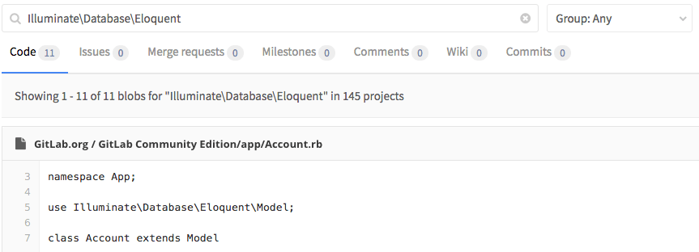

# Advanced Global Search **(STARTER ONLY)**

> - [Introduced](https://gitlab.com/gitlab-org/gitlab/-/merge_requests/109) in GitLab [Starter](https://about.gitlab.com/pricing/) 8.4.

NOTE: **Note**
Advanced Global Search (powered by Elasticsearch) is not yet available on GitLab.com. We are working on adding it.
[Follow this epic for the latest updates](https://gitlab.com/groups/gitlab-org/-/epics/153).

Leverage Elasticsearch for faster, more advanced code search across your entire
GitLab instance.

This is the user documentation. To install and configure Elasticsearch,
visit the [administrator documentation](../../integration/elasticsearch.md).

## Overview

The Advanced Global Search in GitLab is a powerful search service that saves
you time. Instead of creating duplicate code and wasting time, you can
now search for code within other teams that can help your own project.

GitLab leverages the search capabilities of [Elasticsearch](https://www.elastic.co/elasticsearch/) and enables it when
searching in:

- GitLab application
- Projects
- Repositories
- Commits
- Issues
- Merge requests
- Milestones
- Notes (comments)
- Snippets
- Wiki

## Use cases

The Advanced Global Search can be useful in various scenarios.

### Faster searches

If you are dealing with huge amount of data and want to keep GitLab's search
fast, the Advanced Global Search will help you achieve that.

### Promote innersourcing

Your company may consist of many different developer teams each of which has
their own group where the various projects are hosted. Some of your applications
may be connected to each other, so your developers need to instantly search
throughout the GitLab instance and find the code they search for.

## Searching globally

Just use the search as before and GitLab will show you matching code from each
project you have access to.

You can also use the [Advanced Syntax Search](advanced_search_syntax.md) which
provides some useful queries.

NOTE: **Note:**
Elasticsearch has only data for the default branch. That means that if you go
to the repository tree and switch the branch from the default to something else,
then the "Code" tab in the search result page will be served by the regular
search even if Elasticsearch is enabled.
