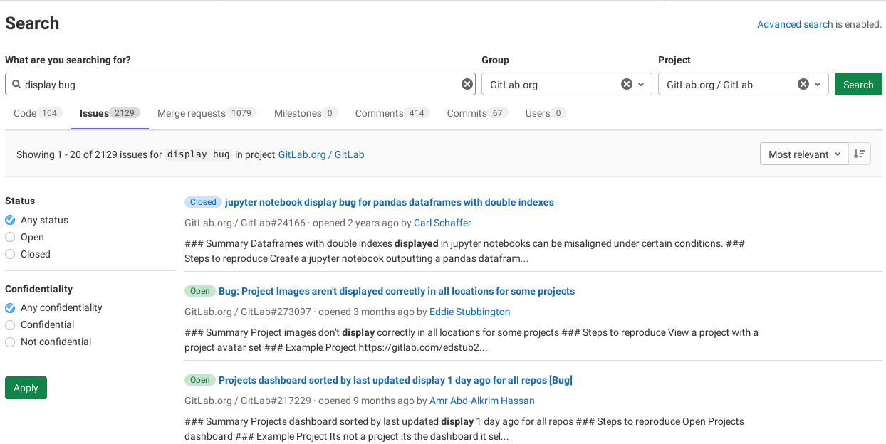

# GitLab Advanced Search **(PREMIUM)**

> - Moved to GitLab Premium in 13.9.

NOTE:
This is the user documentation. To configure the Advanced Search,
visit the [administrator documentation](../../integration/elasticsearch.md).
Advanced Search is enabled in GitLab.com.

GitLab Advanced Search expands on the Basic Search with an additional set of
features for faster, more advanced searches across the entire GitLab instance
when searching in:

- Projects
- Issues
- Merge requests
- Milestones
- Epics
- Comments
- Code
- Commits
- Wiki
- Users

The Advanced Search can be useful in various scenarios:

- **Faster searches:**
  Advanced Search is based on Elasticsearch, which is a purpose-built full
  text search engine that can be horizontally scaled so that it can provide
  search results in 1-2 seconds in most cases.
- **Code Maintenance:** 
  Finding all the code that needs to be updated at once across an entire 
  instance can save time spent maintaining code. 
  This is especially helpful for organizations with more than 10 active projects.
  This can also help build confidence is code refactoring to identify unknown impacts.
- **Promote innersourcing:**
  Your company may consist of many different developer teams each of which has
  their own group where the various projects are hosted. Some of your applications
  may be connected to each other, so your developers need to instantly search
  throughout the GitLab instance and find the code they search for.

## Use the Advanced Search syntax

Elasticsearch has only data for the default branch. That means that if you go
to the repository tree and switch the branch from the default to something else,
then the "Code" tab in the search result page will be served by the basic
search even if Elasticsearch is enabled.

The Advanced Search syntax supports fuzzy or exact search queries with prefixes,
boolean operators, and much more. Use the search as before and GitLab will show
you matching code from each project you have access to.

Full details can be found in the [Elasticsearch documentation](https://www.elastic.co/guide/en/elasticsearch/reference/5.3/query-dsl-simple-query-string-query.html#_simple_query_string_syntax), but
here's a quick guide:

- Searches look for all the words in a query, in any order - e.g.: searching
  issues for [`display bug`](https://gitlab.com/search?snippets=&scope=issues&repository_ref=&search=display+bug&group_id=9970&project_id=278964) and [`bug display`](https://gitlab.com/search?snippets=&scope=issues&repository_ref=&search=bug+Display&group_id=9970&project_id=278964) will return the same results.
- To find the exact phrase (stemming still applies), use double quotes: [`"display bug"`](https://gitlab.com/search?snippets=&scope=issues&repository_ref=&search=%22display+bug%22&group_id=9970&project_id=278964)
- To find bugs not mentioning display, use `-`: [`bug -display`](https://gitlab.com/search?snippets=&scope=issues&repository_ref=&search=bug+-display&group_id=9970&project_id=278964)
- To find a bug in display or banner, use `|`: [`bug display | banner`](https://gitlab.com/search?snippets=&scope=issues&repository_ref=&search=bug+display+%7C+banner&group_id=9970&project_id=278964)
- To group terms together, use parentheses: [`bug | (display +banner)`](https://gitlab.com/search?snippets=&scope=issues&repository_ref=&search=bug+%7C+%28display+%2Bbanner%29&group_id=9970&project_id=278964)
- To match a partial word, use `*`. In this example, I want to find bugs with any 500 errors. : [`bug error 50*`](https://gitlab.com/search?snippets=&scope=issues&repository_ref=&search=bug+error+50*&group_id=9970&project_id=278964)
- To use one of symbols above literally, escape the symbol with a preceding `\`: [`argument \-last`](https://gitlab.com/search?snippets=&scope=blobs&repository_ref=&search=argument+%5C-last&group_id=9970&project_id=278964)

## Syntax search filters

Advanced Search also supports the use of filters. The available filters are:

- `filename`: Filters by filename. You can use the glob (`*`) operator for fuzzy matching.
- `path`: Filters by path. You can use the glob (`*`) operator for fuzzy matching.
- `extension`: Filters by extension in the filename. Please write the extension without a leading dot. Exact match only.
- `blob`: Filters by Git `object ID`. Exact match only.

To use them, add them to your keyword in the format `<filter_name>:<value>` without
any spaces between the colon (`:`) and the value. When no keyword is provided, an asterisk (`*`) will be used as the keyword.

Examples:

- Finding a file with any content named `search_results.rb`: [`* filename:search_results.rb`](https://gitlab.com/search?snippets=&scope=blobs&repository_ref=&search=*+filename%3Asearch_results.rb&group_id=9970&project_id=278964)
- The leading asterisk (`*`) can be ignored in the case above: [`filename:search_results.rb`](https://gitlab.com/search?group_id=9970&project_id=278964&scope=blobs&search=filename%3Asearch_results.rb)
- Finding a file named `found_blob_spec.rb` with the text `CHANGELOG` inside of it: [`CHANGELOG filename:found_blob_spec.rb`](https://gitlab.com/search?snippets=&scope=blobs&repository_ref=&search=CHANGELOG+filename%3Afound_blob_spec.rb&group_id=9970&project_id=278964)
- Finding the text `EpicLinks` inside files with the `.rb` extension: [`EpicLinks extension:rb`](https://gitlab.com/search?snippets=&scope=blobs&repository_ref=&search=EpicLinks+extension%3Arb&group_id=9970&project_id=278964)
- Finding any file with the `.yaml` extension: [`extension:yaml`](https://gitlab.com/search?snippets=&scope=blobs&repository_ref=&search=extension%3Ayaml&group_id=9970&project_id=278964)
- Finding the text `Sidekiq` in a file, when that file is in a path that includes `elastic`: [`Sidekiq path:elastic`](https://gitlab.com/search?snippets=&scope=blobs&repository_ref=&search=Sidekiq+path%3Aelastic&group_id=9970&project_id=278964)
- Finding any file in a path that includes `elasticsearch`: [`path:elasticsearch`](https://gitlab.com/search?snippets=&scope=blobs&repository_ref=&search=path%3Aelasticsearch&group_id=9970&project_id=278964)
- Finding the files represented by the Git object ID `998707b421c89bd9a3063333f9f728ef3e43d101`: [`* blob:998707b421c89bd9a3063333f9f728ef3e43d101`](https://gitlab.com/search?snippets=false&scope=blobs&repository_ref=&search=*+blob%3A998707b421c89bd9a3063333f9f728ef3e43d101&group_id=9970)
- Syntax filters can be combined for complex filtering. Finding any file starting with `search` containing `eventHub` and with the `.js` extension: [`eventHub filename:search* extension:js`](https://gitlab.com/search?snippets=&scope=blobs&repository_ref=&search=eventHub+filename%3Asearch*+extension%3Ajs&group_id=9970&project_id=278964)

### Excluding filters

> [Introduced](https://gitlab.com/gitlab-org/gitlab/-/issues/31684) in GitLab 13.3.

Filters can be inverted to **filter out** results from the result set, by prefixing the filter name with a `-` (hyphen) character, such as:

- `-filename`
- `-path`
- `-extension`
- `-blob`

Examples:

- Finding `rails` in all files but `Gemfile.lock`: [`rails -filename:Gemfile.lock`](https://gitlab.com/search?snippets=&scope=blobs&repository_ref=&search=rails+-filename%3AGemfile.lock&group_id=9970&project_id=278964)
- Finding `success` in all files excluding `.po|pot` files: [`success -filename:*.po*`](https://gitlab.com/search?snippets=&scope=blobs&repository_ref=&search=success+-filename%3A*.po*&group_id=9970&project_id=278964)
- Finding `import` excluding minified JavaScript (`.min.js`) files: [`import -extension:min.js`](https://gitlab.com/search?snippets=&scope=blobs&repository_ref=&search=import+-extension%3Amin.js&group_id=9970&project_id=278964)
- Finding `docs` for all files outside the `docs/` folder: [`docs -path:docs/`](https://gitlab.com/search?snippets=&scope=blobs&repository_ref=&search=docs+-path%3Adocs%2F&group_id=9970&project_id=278964)

## Search by issue or merge request ID

You can search a specific issue or merge request by its ID with a special prefix.

- To search by issue ID, use prefix `#` followed by issue ID. For example, [#23456](https://gitlab.com/search?snippets=&scope=issues&repository_ref=&search=%2323456&group_id=9970&project_id=278964)
- To search by merge request ID, use prefix `!` followed by merge request ID. For example [!23456](https://gitlab.com/search?snippets=&scope=merge_requests&repository_ref=&search=%2123456&group_id=9970&project_id=278964)
