# Search through GitLab **(FREE)**

## Issues and merge requests

To search through issues and merge requests in multiple projects, use the **Issues** or **Merge Requests** links
in the top-right part of your screen. These instructions are valid for both.

The numbers in the right-hand side of the top menu indicate how many issues, merge requests,
and to-do items are assigned to you:

- **{issues}** **Issues**: The open issues assigned to you.
- **{merge-request-open}** **Merge requests**: The [merge requests](../project/merge_requests/index.md) assigned to you.
- **{todo-done}** **To-do items**: The [to-do items](../todos.md) assigned to you.

When you click **Issues**, GitLab shows the opened issues assigned to you:

You can search through **Open**, **Closed**, or **All** issues.

You can also filter the results using the search and filter field, as described below in
[Filtering issue and merge request lists](#filtering-issue-and-merge-request-lists).

### Issues and MRs assigned to you or created by you

GitLab shows shortcuts to issues and merge requests created by you or assigned to you
in the search field in the upper right corner:

### Filtering issue and merge request lists

> - Filtering by Epics was [introduced](https://gitlab.com/gitlab-org/gitlab/-/issues/195704) in GitLab Ultimate 12.9.
> - Filtering by child Epics was [introduced](https://gitlab.com/gitlab-org/gitlab/-/issues/9029) in GitLab Ultimate 13.0.
> - Filtering by Iterations was [introduced](https://gitlab.com/gitlab-org/gitlab/-/issues/118742) in GitLab 13.6. Moved to GitLab Premium in 13.9.

Follow these steps to filter the **Issues** and **Merge Requests** list pages in projects and
groups:

1. Click in the field **Search or filter results...**.
1. In the dropdown menu that appears, select the attribute you wish to filter by:
   - Author
   - Assignee
   - [Milestone](../project/milestones/index.md)
   - [Iteration](../group/iterations/index.md)
   - Release
   - [Label](../project/labels.md)
   - My-reaction
   - Confidential
   - [Epic and child Epic](../group/epics/index.md) (available only for the group the Epic was created, not for [higher group levels](https://gitlab.com/gitlab-org/gitlab/-/issues/233729)).
   - Search for this text
1. Select or type the operator to use for filtering the attribute. The following operators are
   available:
   - `=`: Is
   - `!=`: Is not ([Introduced](https://gitlab.com/gitlab-org/gitlab/-/issues/18059) in GitLab 12.7)
1. Enter the text to [filter the attribute by](#filters-autocomplete).
1. Repeat this process to filter by multiple attributes. Multiple attributes are joined by a logical
   `AND`.

For example, filtering by Author `=` Jane and Milestone `!=` 12.6 filters for the issues where Jane
is the author and the milestone is not 12.6.

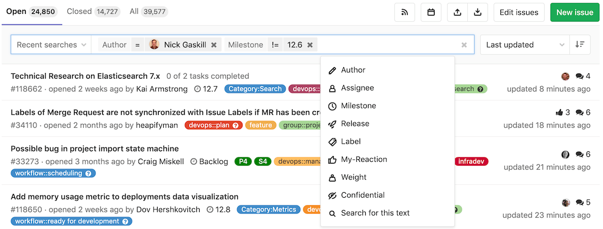

### Filtering by **None** / **Any**

Some filter fields like milestone and assignee, allow you to filter by **None** or **Any**.

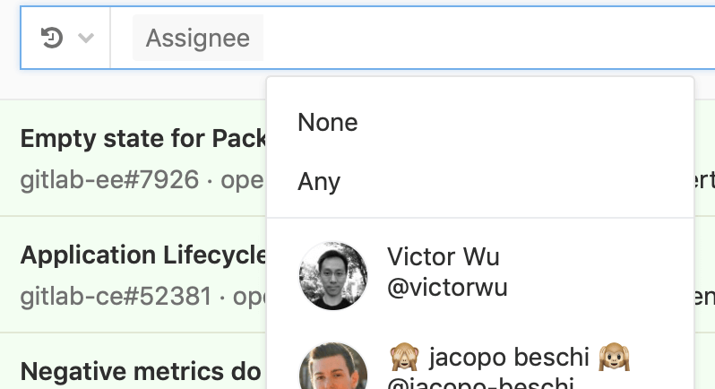

Selecting **None** returns results that have an empty value for that field. For example: no milestone, no assignee.

Selecting **Any** does the opposite. It returns results that have a non-empty value for that field.

### Searching for specific terms

You can filter issues and merge requests by specific terms included in titles or descriptions.

- Syntax
  - Searches look for all the words in a query, in any order. For example: searching
    issues for `display bug` returns all issues matching both those words, in any order.
  - To find the exact term, use double quotes: `"display bug"`
- Limitation
  - For performance reasons, terms shorter than 3 chars are ignored. For example: searching
    issues for `included in titles` is same as `included titles`
  - Search is limited to 4096 characters and 64 terms per query.

### Filtering by ID

> [Introduced](https://gitlab.com/gitlab-org/gitlab-foss/-/issues/39908) in GitLab 12.1.

You can filter the **Issues** list to individual instances by their ID. For example, enter filter `#10` to return only issue 10. The same applies to the **Merge Requests** list. Enter filter `#30` to return only merge request 30.

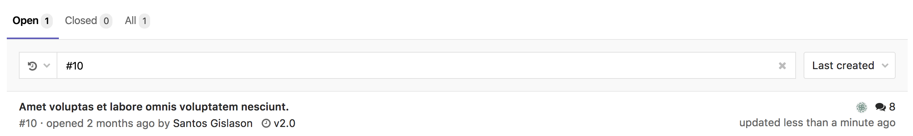

### Filtering merge requests by approvers **(PREMIUM)**

> - [Introduced](https://gitlab.com/gitlab-org/gitlab/-/merge_requests/9468) in GitLab 11.9.
> - Moved to GitLab Premium in 13.9.

To filter merge requests by an individual approver, you can type (or select from
the dropdown) **Approver** and select the user.

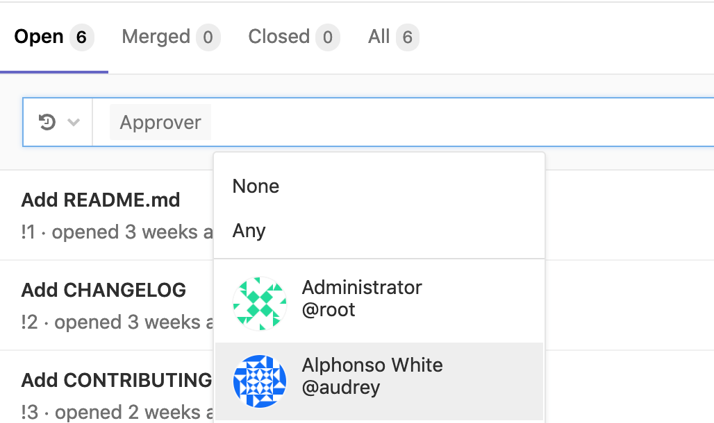

### Filtering merge requests by "approved by" **(PREMIUM)**

> - [Introduced](https://gitlab.com/gitlab-org/gitlab/-/merge_requests/30335) in GitLab 13.0.
> - Moved to GitLab Premium in 13.9.

To filter merge requests already approved by a specific individual, you can type (or select from
the dropdown) **Approved-By** and select the user.

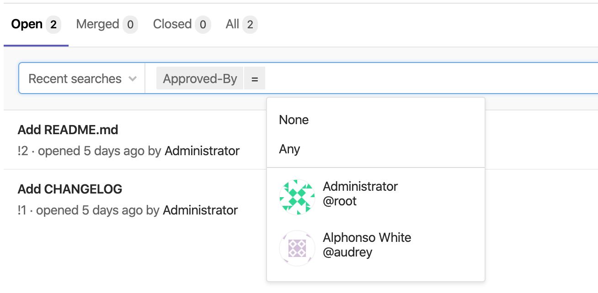

### Filtering merge requests by reviewer **(FREE)**

> [Introduced](https://gitlab.com/gitlab-org/gitlab/-/merge_requests/47605) in GitLab 13.7.

To filter review requested merge requests for a specific individual, you can type (or select from
the dropdown) **Reviewer** and select the user.

### Filtering merge requests by environment or deployment date **(FREE)**

> [Introduced](https://gitlab.com/gitlab-org/gitlab/-/merge_requests/44041) in GitLab 13.6.

To filter merge requests by deployment data, such as the environment or a date,
you can type (or select from the dropdown) the following:

- Environment
- Deployed-before
- Deployed-after

When filtering by an environment, a dropdown presents all environments that
you can choose from:

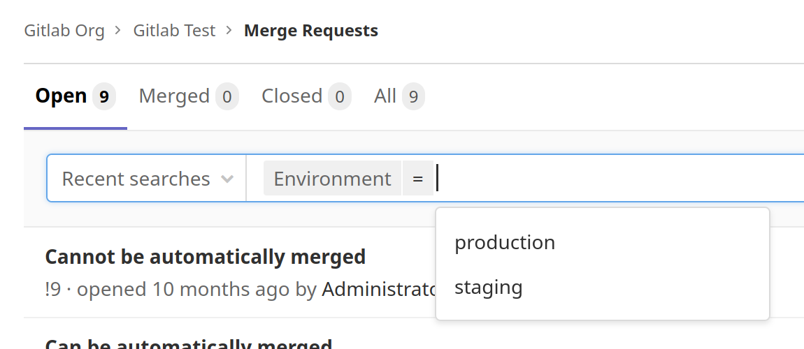

When filtering by a deploy date, you must enter the date manually. Deploy dates
use the format `YYYY-MM-DD`, and must be quoted if you wish to specify
both a date and time (`"YYYY-MM-DD HH:MM"`):

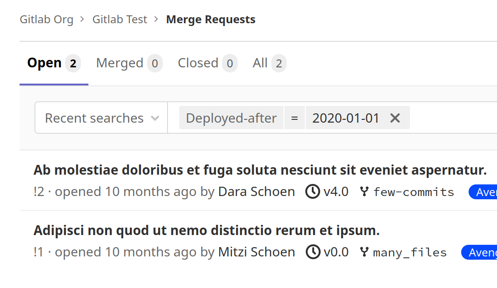

## Filters autocomplete

GitLab provides many filters across many pages (issues, merge requests, epics,
and pipelines among others) which you can use to narrow down your search. When
using the filter functionality, you can start typing characters to bring up
relevant users or other attributes.

For performance optimization, there is a requirement of a minimum of three
characters to begin your search. To search for issues with the assignee `Simone Presley`,
you must type at least `Sim` before autocomplete displays results.

## Search history

Search history is available for issues and merge requests, and is stored locally
in your browser. To run a search from history:

1. In the top menu, click **Issues** or **Merge requests**.
1. To the left of the search bar, click **Recent searches**, and select a search from the list.

## Removing search filters

Individual filters can be removed by clicking on the filter's (x) button or backspacing. The entire search filter can be cleared by clicking on the search box's (x) button or via <kbd>⌘</kbd> (Mac) + <kbd>⌫</kbd>.

To delete filter tokens one at a time, the <kbd>⌥</kbd> (Mac) / <kbd>Control</kbd> + <kbd>⌫</kbd> keyboard combination can be used.

## Filtering with multiple filters of the same type

Some filters can be added multiple times. These include but are not limited to assignees and labels. When you filter with these multiple filters of the same type, the `AND` logic is applied. For example, if you were filtering `assignee:@sam assignee:@sarah`, your results include only entries whereby the assignees are assigned to both Sam and Sarah are returned.

## To-Do List

Your [To-Do List](../todos.md#gitlab-to-do-list) can be searched by "to do" and "done".
You can [filter](../todos.md#filtering-your-to-do-list) them per project,
author, type, and action. Also, you can sort them by
[**Label priority**](../../user/project/labels.md#label-priority),
**Last created**, and **Oldest created**.

## Projects

You can search through your projects from the top bar, by selecting **Menu > Projects**.
On the field **Filter by name**, type the project or group name you want to find, and GitLab
filters them for you as you type.

You can also look for the projects you [starred](../project/working_with_projects.md#star-a-project) (**Starred projects**).
You can **Explore** all public and internal projects available in GitLab.com, from which you can filter by visibility,
through **Trending**, best rated with **Most stars**, or **All** of them.

You can also sort them by **Name**, **Last created**, **Oldest created**, **Last updated**,
**Oldest updated**, **Owner**, and choose to hide or show **archived projects**:

## Groups

Similarly to [projects search](#projects), you can search through your groups from
the left menu, by clicking the menu bar, then **Groups**.

On the field **Filter by name**, type the group name you want to find, and GitLab
filters them for you as you type.

You can also **Explore** all public and internal groups available in GitLab.com,
and sort them by **Last created**, **Oldest created**, **Last updated**, or **Oldest updated**.

## Issue Boards

From an [Issue Board](../../user/project/issue_board.md), you can filter issues by **Author**, **Assignee**, **Milestone**, and **Labels**.
You can also filter them by name (issue title), from the field **Filter by name**, which is loaded as you type.

To search for issues to add to lists present in your Issue Board, click
the button **Add issues** on the top-right of your screen, opening a modal window from which
you can, besides filtering them by **Name**, **Author**, **Assignee**, **Milestone**,
and **Labels**, select multiple issues to add to a list of your choice:

## Shortcut

To view issues and merge requests created or assigned to you in a project:

1. Go to your project.
1. In the top navigation bar, click the search box to display a list of issues and
   merge requests.
1. Select your desired issue or merge request:

   

### Autocomplete suggestions

You can also type in this search bar to see autocomplete suggestions for:

- Projects and groups
- Various help pages (try and type **API help**)
- Project feature pages (try and type **milestones**)
- Various settings pages (try and type **user settings**)
- Recently viewed issues (try and type some word from the title of a recently viewed issue)
- Recently viewed merge requests (try and type some word from the title of a recently viewed merge request)
- Recently viewed epics (try and type some word from the title of a recently viewed epic)
- [GitLab Flavored Markdown](../markdown.md#gitlab-specific-references) (GFM) for issues in a project (try and type a GFM reference for an issue)

## Basic search

The Basic search in GitLab enables you to search
across the entire GitLab instance, in a group, or in a single project. Basic search is
backed by the database and allows searching in:

- Projects
- Issues
- Merge requests
- Milestones
- Users
- Epics (Group only)
- Code (Project only)
- Comments (Project only)
- Commits (Project only)
- Wiki (Project only)

To start a search, type into the search bar on the top-right of the screen. You can always search
in all GitLab and may also see the options to search in a group or project if you are in the
group or project dashboard.

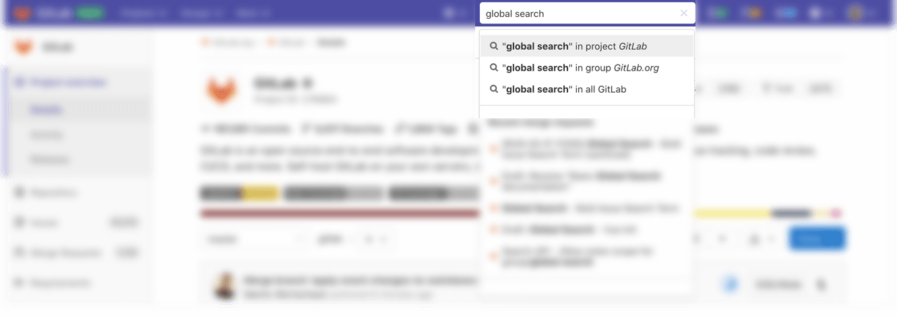

After the results are returned, you can modify the search, select a different type of data to
search, or choose a specific group or project.

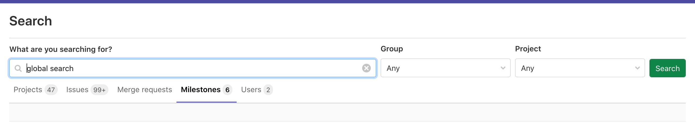

### Code search

To search through code or other documents in a single project, you can use
the search field on the top-right of your screen while the project page is open.

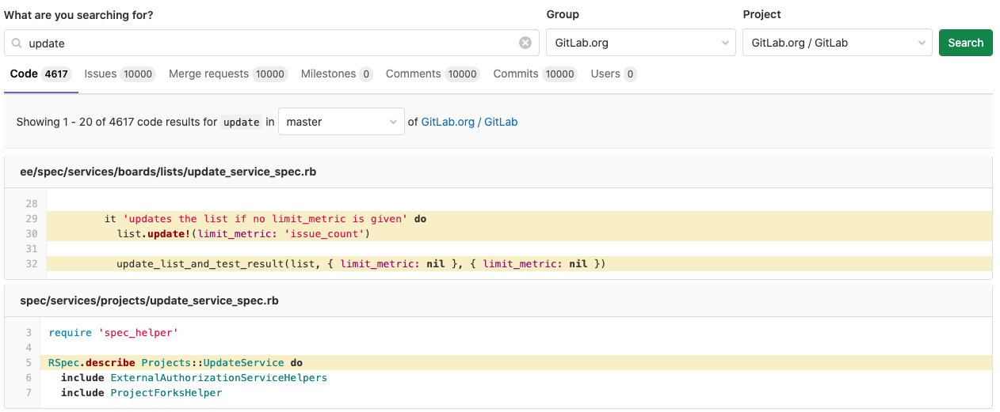

### SHA search

You can quickly access a commit from the project dashboard by entering the SHA
into the search field on the top right of the screen. If a single result is found, you are
redirected to the commit result and given the option to return to the search results page.

## Advanced Search **(PREMIUM)**

Leverage Elasticsearch for faster, more advanced code search across your entire
GitLab instance.

[Learn how to use the Advanced Search.](advanced_search.md)

## Search settings

> - [Introduced](https://gitlab.com/gitlab-org/gitlab/-/issues/292941) in GitLab 13.8 behind a feature flag, disabled by default.
> - [Added to Group, Admin, and User settings](https://gitlab.com/groups/gitlab-org/-/epics/4842) in GitLab 13.9.
> - [Enabled by default](https://gitlab.com/gitlab-org/gitlab/-/issues/294025) in GitLab 13.11.

You can search inside a Project, Group, Admin, or User's settings by entering
a search term in the search box located at the top of the page. The search results
appear highlighted in the sections that match the search term.

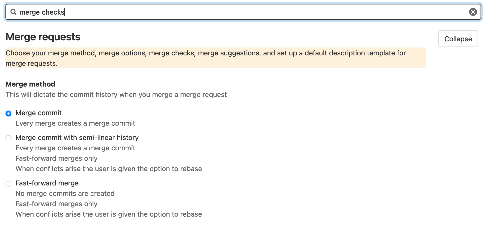
