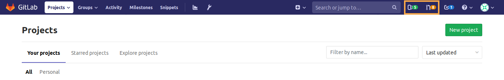
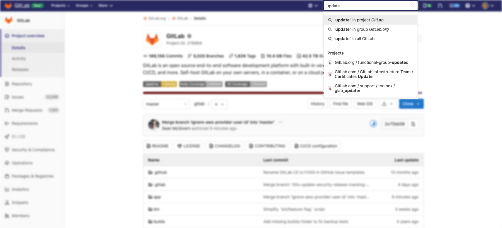

# Search through GitLab

## Issues and merge requests

To search through issues and merge requests in multiple projects, you can use the **Issues** or **Merge Requests** links
in the top-right part of your screen.

Both of them work in the same way, therefore, the following notes are valid for both.

The number displayed on their right represents the number of issues and merge requests assigned to you.

When you click **Issues**, you'll see the opened issues assigned to you straight away:

You can search through **Open**, **Closed**, or **All** issues.

You can also filter the results using the search and filter field, as described below in
[Filtering issue and merge request lists](#filtering-issue-and-merge-request-lists).

### Issues and MRs assigned to you or created by you

You'll also find shortcuts to issues and merge requests created by you or assigned to you
on the search field on the top-right of your screen:

### Filtering issue and merge request lists

Follow these steps to filter the **Issues** and **Merge Requests** list pages within projects and
groups:

1. Click in the field **Search or filter results...**.
1. In the dropdown menu that appears, select the attribute you wish to filter by:
   - Author
   - Assignee
   - [Milestone](../project/milestones/index.md)
   - [Iteration](../group/iterations/index.md) ([introduced](https://gitlab.com/gitlab-org/gitlab/-/issues/118742) in [GitLab Starter](https://about.gitlab.com/pricing/) 13.6)
   - Release
   - [Label](../project/labels.md)
   - My-reaction
   - Confidential
   - Epic ([introduced](https://gitlab.com/gitlab-org/gitlab/-/issues/195704) in GitLab 12.9),
     including [child epic](../group/epics/index.md#multi-level-child-epics)
     ([introduced](https://gitlab.com/gitlab-org/gitlab/-/issues/9029) in
     [GitLab Ultimate](https://about.gitlab.com/pricing/) 13.0)
   - Search for this text
1. Select or type the operator to use for filtering the attribute. The following operators are
   available:
   - `=`: Is
   - `!=`: Is not ([Introduced](https://gitlab.com/gitlab-org/gitlab/-/issues/18059) in GitLab 12.7)
1. Enter the text to [filter the attribute by](#filters-autocomplete).
1. Repeat this process to filter by multiple attributes. Multiple attributes are joined by a logical
   `AND`.

For example, filtering by Author `=` Jane and Milestone `!=` 12.6 filters for the issues where Jane
is the author and the milestone is not 12.6.

### Filtering by **None** / **Any**

Some filter fields like milestone and assignee, allow you to filter by **None** or **Any**.

Selecting **None** returns results that have an empty value for that field. E.g.: no milestone, no assignee.

Selecting **Any** does the opposite. It returns results that have a non-empty value for that field.

### Searching for specific terms

You can filter issues and merge requests by specific terms included in titles or descriptions.

- Syntax
  - Searches look for all the words in a query, in any order. E.g.: searching
    issues for `display bug` will return all issues matching both those words, in any order.
  - To find the exact term, use double quotes: `"display bug"`
- Limitation
  - For performance reasons, terms shorter than 3 chars are ignored. E.g.: searching
    issues for `included in titles` is same as `included titles`
  - Search is limited to 4096 characters and 64 terms per query.

### Filtering by ID

> [Introduced](https://gitlab.com/gitlab-org/gitlab-foss/-/issues/39908) in GitLab 12.1.

You can filter the **Issues** list to individual instances by their ID. For example, enter filter `#10` to return only issue 10. The same applies to the **Merge Requests** list. Enter filter `#30` to return only merge request 30.

### Filtering merge requests by approvers **(STARTER)**

> [Introduced](https://gitlab.com/gitlab-org/gitlab/-/merge_requests/9468) in [GitLab Starter](https://about.gitlab.com/pricing/) 11.9.

To filter merge requests by an individual approver, you can type (or select from
the dropdown) **Approver** and select the user.

### Filtering merge requests by "approved by" **(STARTER)**

> [Introduced](https://gitlab.com/gitlab-org/gitlab/-/merge_requests/30335) in [GitLab Starter](https://about.gitlab.com/pricing/) 13.0.

To filter merge requests already approved by a specific individual, you can type (or select from
the dropdown) **Approved-By** and select the user.

### Filtering merge requests by environment or deployment date **(CORE)**

> [Introduced](https://gitlab.com/gitlab-org/gitlab/-/merge_requests/44041) in GitLab 13.6.

To filter merge requests by deployment data, such as the environment or a date,
you can type (or select from the dropdown) the following:

- Environment
- Deployed-before
- Deployed-after

When filtering by an environment, a dropdown presents all environments that
you can choose from:

When filtering by a deploy date, you must enter the date manually. Deploy dates
use the format `YYYY-MM-DD`, and must be quoted if you wish to specify
both a date and time (`"YYYY-MM-DD HH:MM"`):

## Filters autocomplete

GitLab provides many filters across many pages (issues, merge requests, epics,
and pipelines among others) which you can use to narrow down your search. When
using the filter functionality, you can start typing characters to bring up
relevant users or other attributes.

For performance optimization, there is a requirement of a minimum of three
characters to begin your search. For example, if you want to search for
issues that have the assignee "Simone Presley", you'll need to type at
least "Sim" before autocomplete gives any relevant results.

## Search history

You can view recent searches by clicking on the little arrow-clock icon, which is to the left of the search input. Click the search entry to run that search again. This feature is available for issues and merge requests. Searches are stored locally in your browser.

## Removing search filters

Individual filters can be removed by clicking on the filter's (x) button or backspacing. The entire search filter can be cleared by clicking on the search box's (x) button or via <kbd>⌘</kbd> (Mac) + <kbd>⌫</kbd>.

To delete filter tokens one at a time, the <kbd>⌥</kbd> (Mac) / <kbd>Ctrl</kbd> + <kbd>⌫</kbd> keyboard combination can be used.

## Filtering with multiple filters of the same type

Some filters can be added multiple times. These include but are not limited to assignees and labels. When you filter with these multiple filters of the same type, the AND logic is applied. For example, if you were filtering `assignee:@sam assignee:@sarah`, your results will only include entries whereby the assignees are assigned to both Sam and Sarah are returned.

## To-Do List

Your [To-Do List](../todos.md#gitlab-to-do-list) can be searched by "to do" and "done".
You can [filter](../todos.md#filtering-your-to-do-list) them per project,
author, type, and action. Also, you can sort them by
[**Label priority**](../../user/project/labels.md#label-priority),
**Last created**, and **Oldest created**.

## Projects

You can search through your projects from the left menu, by clicking the menu bar, then **Projects**.
On the field **Filter by name**, type the project or group name you want to find, and GitLab
will filter them for you as you type.

You can also look for the projects you [starred](../project/index.md#star-a-project) (**Starred projects**), and **Explore** all
public and internal projects available in GitLab.com, from which you can filter by visibility,
through **Trending**, best rated with **Most stars**, or **All** of them.

You can also sort them by **Name**, **Last created**, **Oldest created**, **Last updated**,
**Oldest updated**, **Owner**, and choose to hide or show **archived projects**:

## Groups

Similarly to [projects search](#projects), you can search through your groups from
the left menu, by clicking the menu bar, then **Groups**.

On the field **Filter by name**, type the group name you want to find, and GitLab
will filter them for you as you type.

You can also **Explore** all public and internal groups available in GitLab.com,
and sort them by **Last created**, **Oldest created**, **Last updated**, or **Oldest updated**.

## Issue Boards

From an [Issue Board](../../user/project/issue_board.md), you can filter issues by **Author**, **Assignee**, **Milestone**, and **Labels**.
You can also filter them by name (issue title), from the field **Filter by name**, which is loaded as you type.

When you want to search for issues to add to lists present in your Issue Board, click
the button **Add issues** on the top-right of your screen, opening a modal window from which
you'll be able to, besides filtering them by **Name**, **Author**, **Assignee**, **Milestone**,
and **Labels**, select multiple issues to add to a list of your choice:

## Shortcut

You'll find a shortcut on the search field on the top-right of the project's dashboard to
quickly access issues and merge requests created or assigned to you within that project:

### Autocomplete suggestions

You can also type in this search bar to see autocomplete suggestions for:

- Projects and groups
- Various help pages (try and type **API help**)
- Project feature pages (try and type **milestones**)
- Various settings pages (try and type **user settings**)
- Recently viewed issues (try and type some word from the title of a recently viewed issue)
- Recently viewed merge requests (try and type some word from the title of a recently viewed merge request)
- Recently viewed epics (try and type some word from the title of a recently viewed epic)
- [GitLab Flavored Markdown](../markdown.md#special-gitlab-references) (GFM) for issues within a project (try and type a GFM reference for an issue)

## Basic search

The Basic search in GitLab is a global search service that allows you to search
across the entire GitLab instance, within a group, or a single project. Basic search is
backed by the database and allows searching in:

- Projects
- Issues
- Merge requests
- Milestones
- Users
- Epics (Group only)
- Code (Project only)
- Comments (Project only)
- Commits (Project only)
- Wiki (Project only)

To start a search, type into the search bar on the top-right of the screen. You can always search
in all GitLab and may also see the options to search within a group or project if you are in the
group or project dashboard.

Once the results are returned, you can modify the search, select a different type of data to
search, or choose a specific group or project.

### Code search

To search through code or other documents in a single project, you can use
the search field on the top-right of your screen while the project page is open.

### SHA search

You can quickly access a commit from within the project dashboard by entering the SHA
into the search field on the top right of the screen. If a single result is found, you will be
redirected to the commit result and given the option to return to the search results page.

## Advanced Search **(STARTER)**

Leverage Elasticsearch for faster, more advanced code search across your entire
GitLab instance.

[Learn how to use the Advanced Search.](advanced_global_search.md)

## Advanced Search Syntax **(STARTER)**

Use advanced queries for more targeted search results.

[Learn how to use the Advanced Search Syntax.](advanced_search_syntax.md)
