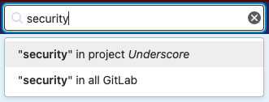
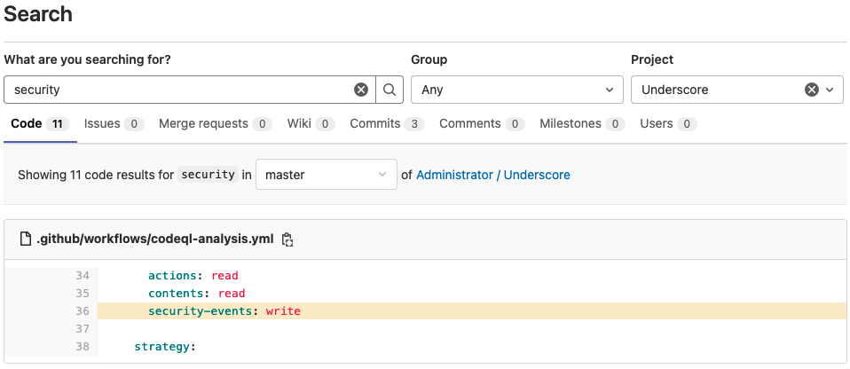

# Searching in GitLab **(FREE)**

GitLab has two types of searches available: _basic_ and _advanced_.

Both types of search are the same, except when you are searching through code.

- When you use basic search to search code, your search includes one project at a time.
- When you use [advanced search](advanced_search.md) to search code, your search includes all projects at once.

## Basic search

Use basic search to find:

- Projects
- Issues
- Merge requests
- Milestones
- Users
- Epics (when searching in a group only)
- Code
- Comments
- Commits
- Wiki

## Perform a search

To start a search, type your search query in the search bar on the top-right of the screen.
You must type at least two characters.

After the results are displayed, you can modify the search, select a different type of data to
search, or choose a specific group or project.

## Search in code

To search through code or other documents in a project:

1. On the top bar, select **Main menu > Projects** and find your project.
1. On the top bar, in the search field, type the string you want to search for.
1. Press **Enter**.

Code search shows only the first result in the file.

To search across all of GitLab, ask your administrator to enable [advanced search](advanced_search.md).

### View Git blame from code search

> [Introduced](https://gitlab.com/gitlab-org/gitlab/-/issues/327052) in GitLab 14.7.

After you find search results, you can view who made the last change to the line
where the results were found.

1. From the code search result, hover over the line number.
1. On the left, select **View blame**.

   

## Search for a SHA

You can search for a commit SHA.

1. On the top bar, select **Main menu > Projects** and find your project.
1. On the top bar, in the search field, type the SHA.

If a single result is returned, GitLab redirects to the commit result
and gives you the option to return to the search results page.

## Searching for specific terms

You can filter issues and merge requests by specific terms included in titles or descriptions.

- Syntax
  - Searches look for all the words in a query, in any order. For example: searching
    issues for `display bug` returns all issues matching both those words, in any order.
  - To find the exact term, use double quotes: `"display bug"`
- Limitation
  - For performance reasons, terms shorter than 3 chars are ignored. For example: searching
    issues for `included in titles` is same as `included titles`
  - Search is limited to 4096 characters and 64 terms per query.

## Retrieve search results as feed

> Feeds for merge requests were [introduced](https://gitlab.com/gitlab-org/gitlab/-/merge_requests/66336) in GitLab 14.3.

GitLab provides RSS feeds of search results for your project. To subscribe to the
RSS feed of search results:

1. Go to your project's page.
1. On the left sidebar, select **Issues** or **Merge requests**.
1. Perform a search.
1. Select the feed symbol **{rss}** to display the results as an RSS feed in Atom format.

The URL of the result contains both a feed token, and your search query.
You can add this URL to your feed reader.

## Search history

Search history is available for issues and merge requests, and is stored locally
in your browser. To run a search from history:

1. In the top menu, select **Issues** or **Merge requests**.
1. To the left of the search bar, select **Recent searches**, and select a search from the list.

## Removing search filters

Individual filters can be removed by clicking on the filter's (x) button or backspacing. The entire search filter can be cleared by clicking on the search box's (x) button or via <kbd>⌘</kbd> (Mac) + <kbd>⌫</kbd>.

To delete filter tokens one at a time, the <kbd>⌥</kbd> (Mac) / <kbd>Control</kbd> + <kbd>⌫</kbd> keyboard combination can be used.

## Autocomplete suggestions

In the search bar, you can view autocomplete suggestions for:

- Projects and groups
- Various help pages (try and type **API help**)
- Project feature pages (try and type **milestones**)
- Various settings pages (try and type **user settings**)
- Recently viewed issues (try and type some word from the title of a recently viewed issue)
- Recently viewed merge requests (try and type some word from the title of a recently viewed merge request)
- Recently viewed epics (try and type some word from the title of a recently viewed epic)
- [GitLab Flavored Markdown](../markdown.md#gitlab-specific-references) (GLFM) for issues in a project (try and type a GLFM reference for an issue)

## Search settings

> - [Introduced](https://gitlab.com/gitlab-org/gitlab/-/issues/292941) in GitLab 13.8 [with a flag](../../administration/feature_flags.md) named `search_settings_in_page`. Disabled by default.
> - [Added](https://gitlab.com/groups/gitlab-org/-/epics/4842) to Group, Administrator, and User settings in GitLab 13.9.
> - [Feature flag `search_settings_in_page` removed](https://gitlab.com/gitlab-org/gitlab/-/issues/294025) in GitLab 13.11.
> - [Generally available](https://gitlab.com/gitlab-org/gitlab/-/issues/294025) in GitLab 13.11.

You can search inside a Project, Group, Administrator, or User's settings by entering
a search term in the search box located at the top of the page. The search results
appear highlighted in the sections that match the search term.

