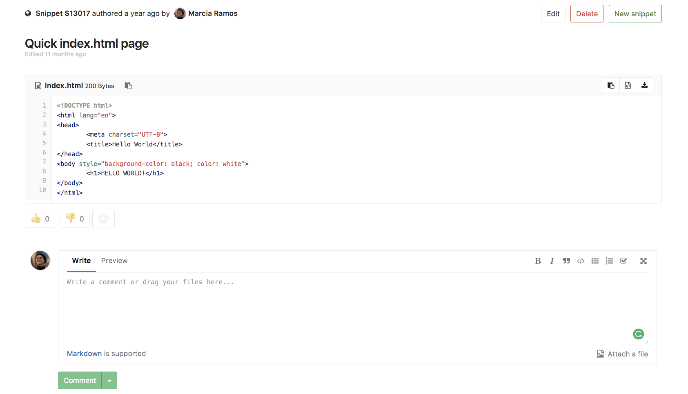

# Snippets

Snippets are little bits of code or text.

There are 2 types of snippets - project snippets and personal snippets.

## Comments

With GitLab Snippets you engage in a conversation about that piece of code,
facilitating the collaboration among users.

> **Note:**
Comments on snippets was [introduced](https://gitlab.com/gitlab-org/gitlab-ce/issues/12910) in [GitLab Community Edition 9.2](https://about.gitlab.com/2017/05/22/gitlab-9-2-released/#comments-for-personal-snippets).

## Project snippets

Project snippets are always related to a specific project - see [Project's features](project/index.md#project-39-s-features) for more information.

## Personal snippets

Personal snippets are not related to any project and can be created completely independently. There are 3 visibility levels that can be set (public, internal, private - see [Public Access](../public_access/public_access.md) for more information).

## Downloading snippets

You can download the raw content of a snippet.

By default snippets will be downloaded with Linux-style line endings (`LF`). If you want to preserve the original line endings you need to add a parameter `line_ending=raw` (eg. `https://gitlab.com/snippets/SNIPPET_ID/raw?line_ending=raw`). In case a snippet was created using the GitLab web interface the original line ending is Windows-like (`CRLF`).
