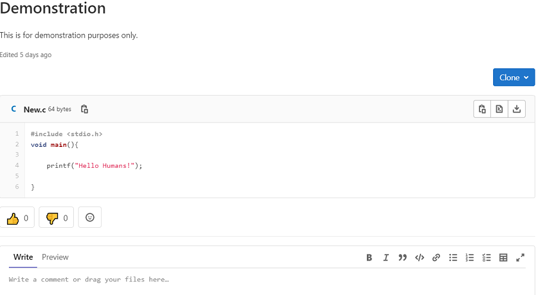
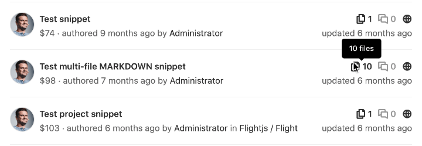
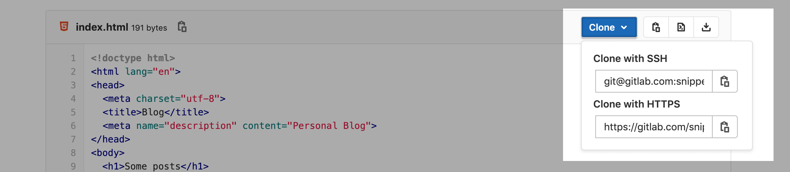

# Snippets **(FREE)**

With GitLab snippets, you can store and share bits of code and text with other users.
You can [comment on](#comment-on-snippets), [clone](#clone-snippets), and
[use version control](#versioned-snippets) in snippets. They can
[contain multiple files](#add-or-remove-multiple-files). They also support
[syntax highlighting](#filenames), [embedding](#embed-snippets), [downloading](#download-snippets),
and you can maintain your snippets with the [snippets API](../api/snippets.md).



GitLab provides two types of snippets:

- **Personal snippets**: Created independent of any project.
  You can set a [visibility level](../public_access/public_access.md)
  for your snippet: public, internal, or private.
- **Project snippets**: Always related to a specific project.
  Project snippets can be visible publicly or to only group members.

## Create snippets

You can create snippets in multiple ways, depending on whether you want to create a personal or project snippet:

1. Select the kind of snippet you want to create:
   - **To create a personal snippet**: On the
     [Snippets dashboard](https://gitlab.com/dashboard/snippets), click
     **New snippet**, or:
     - *If you're on a project's page,* select the plus icon (**{plus-square-o}**)
       in the top navigation bar, and then select **New snippet** from the
       **GitLab** (GitLab SaaS) or **Your Instance** (self-managed) section
       of the same dropdown menu.
     - *For all other pages,* select the plus icon (**{plus-square-o}**)
       in the top navigation bar, then select **New snippet** from the dropdown
       menu.
   - **To create a project snippet**: Go to your project's page. Select the
     plus icon (**{plus-square-o}**), and then select **New snippet** from the
     **This project** section of the dropdown menu.
1. Add a **Title** and **Description**.
1. Name your **File** with an appropriate extension, such as `example.rb` or `index.html`.
   Filenames with appropriate extensions display [syntax highlighting](#filenames).
   Failure to add a filename can cause a known
   [copy-pasting bug](https://gitlab.com/gitlab-org/gitlab/-/issues/22870). If you don't provide a filename, GitLab [creates a name for you](#filenames).
1. (Optional) Add [multiple files](#add-or-remove-multiple-files) to your snippet.
1. Select a visibility level, and select **Create snippet**.

After you create a snippet, you can still [add more files to it](#add-or-remove-multiple-files).
In GitLab versions 13.0 and later, snippets are [versioned by default](#versioned-snippets).

## Discover snippets

To discover all snippets visible to you in GitLab, you can:

- **View all snippets visible to you**: On the top bar of your GitLab
  instance, select **Menu > Snippets** to view your snippets dashboard.
- **Visit [GitLab snippets](https://gitlab.com/dashboard/snippets)** for your snippets on GitLab.com.
- **Explore all public snippets**: On the top bar of your GitLab
  instance, select **Menu > Snippets** and select **Explore snippets** to view
  [all public snippets](https://gitlab.com/explore/snippets).
- **View a project's snippets**: In your project,
  go to **Snippets**.

## Change default visibility of snippets

Project snippets are enabled and available by default. To change their
default visibility:

1. In your project,
   go to **Settings**.
1. Expand the **Visibility, project features, permissions** section, and scroll to **Snippets**.
1. Toggle the default visibility, and select whether snippets can be viewed by
   everyone, or only project members.
1. Select **Save changes**.

## Versioned snippets

> [Introduced](https://gitlab.com/groups/gitlab-org/-/epics/239) in GitLab 13.0.

In GitLab versions 13.0 and later, snippets (both personal and project snippets)
have version control enabled by default.

This means that all snippets get their own underlying repository initialized with
a default branch at the moment the snippet is created. Whenever a change to the snippet is saved, a
new commit to the default branch is recorded. Commit messages are automatically
generated. The snippet's repository has only one branch. You can't delete this branch,
or create other branches.

Existing snippets were automatically migrated in 13.0. Their current
content was saved as the initial commit to the snippets' repository.

## Filenames

Snippets support syntax highlighting based on the filename and
extension provided for them. While you can submit a snippet
without a filename and extension, it needs a valid name so the
content can be created as a file in the snippet's repository.

If you don't give a snippet a filename and extension,
GitLab adds a filename in the format `snippetfile<x>.txt`
where `<x>` represents a number added to the file, starting with 1. This
number increments if you add more unnamed snippets.

When upgrading from an earlier version of GitLab to 13.0, existing snippets
without a supported filename are renamed to a compatible format. For
example, if the snippet's filename is `http://a-weird-filename.me` it is
changed to `http-a-weird-filename-me` to be included in the snippet's
repository. As snippets are stored by ID, changing their filenames breaks
direct or embedded links to the snippet.

## Add or remove multiple files

> [Introduced](https://gitlab.com/groups/gitlab-org/-/epics/2829) in GitLab 13.5.

A single snippet can support up to 10 files, which helps keep related files together, such as:

- A snippet that includes a script and its output.
- A snippet that includes HTML, CSS, and JavaScript code.
- A snippet with a `docker-compose.yml` file and its associated `.env` file.
- A `gulpfile.js` file and a `package.json` file, which together can be
  used to bootstrap a project and manage its dependencies.

If you need more than 10 files for your snippet, we recommend you create a
[wiki](project/wiki/index.md) instead. Wikis are available for projects at all
subscription levels, and [groups](project/wiki/index.md#group-wikis) for
[GitLab Premium](https://about.gitlab.com/pricing/).

Snippets with multiple files display a file count in the [snippet list](https://gitlab.com/dashboard/snippets):



You can manage snippets with Git (because they're [versioned](#versioned-snippets)
by a Git repository), through the [Snippets API](../api/snippets.md), and in the GitLab UI.

To add a new file to your snippet through the GitLab UI:

1. Go to your snippet in the GitLab UI.
1. Select **Edit** in the top right corner.
1. Select **Add another file**.
1. Add your content to the file in the form fields provided.
1. Select **Save changes**.

To delete a file from your snippet through the GitLab UI:

1. Go to your snippet in the GitLab UI.
1. Select **Edit** in the top right corner.
1. Select **Delete file** alongside the filename of each file
you wish to delete.
1. Select **Save changes**.

## Clone snippets

Instead of copying a snippet to a local file, you may want to clone a snippet to
preserve its relationship with the repository, so you can receive or make updates
as needed. Select the **Clone** button on a snippet to display the URLs to clone with SSH or HTTPS:



You can commit changes to a cloned snippet, and push the changes to GitLab.

## Embed snippets

Public snippets can be shared and embedded on any website. You can reuse a GitLab snippet in multiple places, and any change to the source
is reflected in the embedded snippets. When embedded, users can download it, or view the snippet in raw format.

To embed a snippet:

1. Confirm your snippet is publicly visible:
   - *If it's a project snippet*, the project must be public.
   - The snippet is publicly visible.
   - In **Project > Settings > Permissions**, the snippets
     permissions are set to **Everyone with access**.
1. In your snippet's **Embed** section, select **Copy** to copy a one-line script you can add to any website or blog post. For example:

   ```html
   <script src="https://gitlab.com/namespace/project/snippets/SNIPPET_ID.js"></script>
   ```

1. Add your script to your file.

Embedded snippets display a header that shows:

- The filename, if defined.
- The snippet size.
- A link to GitLab.
- The actual snippet content.

For example:

<script src="https://gitlab.com/gitlab-org/gitlab-foss/snippets/1717978.js"></script>

## Download snippets

You can download the raw content of a snippet. By default, they download with Linux-style line endings (`LF`). If
you want to preserve the original line endings you need to add a parameter `line_ending=raw`
(For example: `https://gitlab.com/snippets/SNIPPET_ID/raw?line_ending=raw`). In case a
snippet was created using the GitLab web interface the original line ending is Windows-like (`CRLF`).

## Comment on snippets

With snippets, you engage in a conversation about that piece of code,
which can encourage user collaboration.

## Troubleshooting

### Snippet limitations

- Binary files are not supported.
- Creating or deleting branches is not supported. Only the default branch is used.
- Git tags are not supported in snippet repositories.
- Snippets' repositories are limited to 10 files. Attempting to push more
  than 10 files results in an error.
- Revisions are not visible to the user on the GitLab UI, but this feature is planned
  in future iterations. See the [revisions tab issue](https://gitlab.com/gitlab-org/gitlab/-/issues/39271)
  for updates.
- The [maximum size for a snippet](../administration/snippets/index.md#snippets-content-size-limit)
  is 50 MB, by default.
- Git LFS is not supported.

### Reduce snippets repository size

Because versioned snippets are considered as part of the [namespace storage size](../user/admin_area/settings/account_and_limit_settings.md),
it's recommended to keep snippets' repositories as compact as possible.

For more information about tools to compact repositories,
see the documentation on [reducing repository size](../user/project/repository/reducing_the_repo_size_using_git.md).
