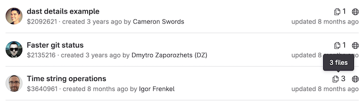

DETAILS:
**Tier:** Free, Premium, Ultimate
**Offering:** GitLab.com, GitLab Self-Managed, GitLab Dedicated

With GitLab snippets, you can store and share bits of code and text with other users.
You can [comment on](#comment-on-snippets), [clone](#clone-snippets), and
[use version control](#versioned-snippets) in snippets. They can
[contain multiple files](#add-or-remove-multiple-files). They also support
[syntax highlighting](#filenames), [embedding](#embed-snippets), [downloading](#download-snippets),
and you can maintain your snippets with the [snippets API](../api/snippets.md).

You can create and manage your snippets with:

- The GitLab user interface.
- The [GitLab Workflow extension for VS Code](../editor_extensions/visual_studio_code/_index.md#create-a-snippet).
- The [`glab` CLI](../editor_extensions/gitlab_cli/_index.md).


GitLab provides two types of snippets:

- **Personal snippets**: Created independent of any project.
  You can set a [visibility level](public_access.md)
  for your snippet: public or private.
- **Project snippets**: Always related to a specific project.
  Project snippets can be visible publicly, or to only project members.

NOTE:
From July 2019, the `Internal` visibility setting is disabled for new projects, groups,
and snippets on GitLab.com. Existing snippets using the `Internal`
visibility setting keep this setting. You can read more about the change in the
[relevant issue](https://gitlab.com/gitlab-org/gitlab/-/issues/12388).

## Create snippets

You can create snippets in multiple ways, depending on whether you want to create a personal or project snippet:

1. Select the kind of snippet you want to create:
   - **To create a personal snippet**, do one of the following:
     - On the [Snippets dashboard](https://gitlab.com/dashboard/snippets), select
       **New snippet**.
     - From a project: On the left sidebar, select **Create new** (**{plus}**). Below **In GitLab**, select **New snippet**.
     - From any other page: On the left sidebar, select **Create new** (**{plus}**) and then **New snippet**.
     - From the `glab` CLI, using the
       [`glab snippet create`](https://gitlab.com/gitlab-org/cli/-/blob/main/docs/source/snippet/create.md) command.
       For full instructions, see the command's documentation.
     - If you installed the [GitLab Workflow extension for VS Code](../editor_extensions/visual_studio_code/_index.md),
       use the [`Gitlab: Create snippet` command](https://marketplace.visualstudio.com/items?itemName=GitLab.gitlab-workflow#create-snippet).
   - **To create a project snippet**: Go to your project's page. Select
     **Create new** (**{plus}**). Below **In this project**, select **New snippet**.
1. In **Title**, add a title.
1. Optional. In **Description**, describe the snippet.
1. In **Files**, give your file an appropriate name and extension, such as `example.rb` or `index.html`.
   Filenames with appropriate extensions display [syntax highlighting](#filenames).
   Failure to add a filename can cause a known
   [copy-pasting bug](https://gitlab.com/gitlab-org/gitlab/-/issues/22870).
   If you do not provide a filename, GitLab [creates a name for you](#filenames).
1. Optional. Add [multiple files](#add-or-remove-multiple-files) to your snippet.
1. Select a visibility level, and select **Create snippet**.

After you create a snippet, you can still [add more files to it](#add-or-remove-multiple-files).
Snippets are [versioned by default](#versioned-snippets).

## Discover snippets

To discover all snippets visible to you in GitLab, you can:

- **View a project's snippets**:
  1. On the left sidebar, select **Search or go to** and find your project.
  1. Select **Code > Snippets**.
- **View all the snippets you created**:
  1. On the left sidebar, select **Search or go to**.
  1. Select **Your work**.
  1. Select **Snippets**.

  On GitLab.com, you can also visit your [snippets directly](https://gitlab.com/dashboard/snippets).

- **Explore all public snippets**:
  1. On the left sidebar, select **Search or go to**.
  1. Select **Explore**.
  1. Select **Snippets**.

  On GitLab.com, you can also visit [all public snippets directly](https://gitlab.com/explore/snippets).

## Change default visibility of snippets

Project snippets are enabled and available by default. To change their
default visibility:

1. In your project, go to **Settings > General**.
1. Expand the **Visibility, project features, permissions** section, and scroll to **Snippets**.
1. Toggle the default visibility, and select whether snippets can be viewed by
   everyone, or only project members.
1. Select **Save changes**.

## Versioned snippets

Both personal and project snippets use version control by default.

This means that all snippets get their own underlying repository initialized with
a default branch at the moment the snippet is created. Whenever a change to the snippet is saved, a
new commit to the default branch is recorded. Commit messages are automatically
generated. The snippet's repository has only one branch. You can't delete this branch,
or create other branches.

## Filenames

Snippets support syntax highlighting based on the filename and
extension provided for them. You can submit a snippet
without a filename and extension, but a valid name is required for
creating content as a file in the repository.

If no filename and extension are provided for the snippet,
GitLab adds a filename in the format `snippetfile<x>.txt`
where `<x>` represents a number added to the file, starting with 1. This
number increments if you add more unnamed snippets.

When upgrading from an earlier version of GitLab to 13.0, existing snippets
without a supported filename are renamed to a compatible format. For
example, if the snippet's filename is `http://a-weird-filename.me` it is
changed to `http-a-weird-filename-me` to be included in the snippet's
repository. As snippets are stored by ID, changing their filenames breaks
direct or embedded links to the snippet.

## Add or remove multiple files

A single snippet can support up to 10 files, which helps keep related files together, such as:

- A snippet that includes a script and its output.
- A snippet that includes HTML, CSS, and JavaScript code.
- A snippet with a `docker-compose.yml` file and its associated `.env` file.
- A `gulpfile.js` file and a `package.json` file, which together can be
  used to bootstrap a project and manage its dependencies.

If you need more than 10 files for your snippet, you should create a
[wiki](project/wiki/_index.md) instead. Wikis are available for projects at all
subscription levels, and [groups](project/wiki/group.md) for
[GitLab Premium](https://about.gitlab.com/pricing/).

Snippets with multiple files display a file count in the [snippet list](https://gitlab.com/dashboard/snippets):



You can manage snippets with Git (because they're [versioned](#versioned-snippets)
by a Git repository), through the [Snippets API](../api/snippets.md), and in the GitLab UI.

To add a new file to your snippet through the GitLab UI:

1. Go to your snippet in the GitLab UI.
1. Select **Edit** in the upper-right corner.
1. Select **Add another file**.
1. Add your content to the file in the form fields provided.
1. Select **Save changes**.

To delete a file from your snippet through the GitLab UI:

1. Go to your snippet in the GitLab UI.
1. Select **Edit** in the upper-right corner.
1. Select **Delete file** alongside the filename of each file you wish to delete.
1. Select **Save changes**.

## Clone snippets

To ensure you receive updates, clone the snippet instead of copying it locally. Cloning
maintains the snippet's connection with the repository.

To clone a snippet:

- Select **Clone**, then copy the URL to clone with SSH or HTTPS.

You can commit changes to a cloned snippet, and push the changes to GitLab.

## Embed snippets

Public snippets can be shared and embedded on any website. You can reuse a GitLab snippet in multiple places, and any change to the source
is reflected in the embedded snippets. When embedded, users can download it, or view the snippet in raw format.

To embed a snippet:

1. Confirm your snippet is publicly visible:
   - *If it's a project snippet*, the project must be public.
   - The snippet is publicly visible.
   - In your project, go to **Settings > General**. Expand the **Visibility, project features, permissions**
     section, and scroll to **Snippets**. Set the snippet permission to **Everyone with access**.
1. In your snippet's **Embed** section, select **Copy** to copy a one-line script
   you can add to any website or blog post. For example:

   ```html
   <script src="https://gitlab.com/namespace/project/snippets/SNIPPET_ID.js"></script>
   ```

1. Add your script to your file.

Embedded snippets display a header that shows:

- The filename, if defined.
- The snippet size.
- A link to GitLab.
- The actual snippet content.

For example:

<script src="https://gitlab.com/gitlab-org/gitlab-foss/snippets/1717978.js"></script>

## Download snippets

You can download the raw content of a snippet. By default, they download with Linux-style line endings (`LF`). If
you want to preserve the original line endings you must add a parameter `line_ending=raw`
(For example: `https://gitlab.com/snippets/SNIPPET_ID/raw?line_ending=raw`). In case a
snippet was created using the GitLab web interface the original line ending is Windows-like (`CRLF`).

## Comment on snippets

With snippets, you engage in a conversation about that piece of code,
which can encourage user collaboration.

## Mark snippet as spam

DETAILS:
**Tier:** Free, Premium, Ultimate
**Offering:** GitLab Self-Managed, GitLab Dedicated

Administrators on GitLab Self-Managed can mark snippets as spam.

Prerequisites:

- You must be the administrator for your instance.
- [Akismet](../integration/akismet.md) spam protection must be enabled on the instance.

To do this task:

1. On the left sidebar, select **Search or go to** and find your project.
1. Select **Code > Snippets**.
1. Select the snippet you want to report as spam.
1. Select **Submit as spam**.

GitLab forwards the spam to Akismet.

## Troubleshooting

### Snippet limitations

- No limits exist as to how many snippets you can create.
- Binary files are not supported.
- Creating or deleting branches is not supported. Only the default branch is used.
- Git tags are not supported in snippet repositories.
- Snippets' repositories are limited to 10 files. Attempting to push more
  than 10 files results in an error.
- Revisions are not visible to the user on the GitLab UI, but [an issue exists](https://gitlab.com/gitlab-org/gitlab/-/issues/39271)
  for updates.
- The default [maximum size for a snippet](../administration/snippets/_index.md) and current (as of 2024-04-17) is 50 MB.
- Git LFS is not supported.

### Reduce snippets repository size

Because versioned snippets are considered as part of the [namespace storage size](../administration/settings/account_and_limit_settings.md),
it's recommended to keep snippets' repositories as compact as possible.

For more information about tools to compact repositories,
see the documentation on [reducing repository size](project/repository/repository_size.md#methods-to-reduce-repository-size).

### Cannot enter text into the snippet text box

If the text area after the filename field is disabled and prevents you from
creating a new snippet, use this workaround:

1. Enter a title for your snippet.
1. Scroll to the bottom of the **Files** field, then select
   **Add another file**. GitLab displays a second set of fields to add a second file.
1. In the filename field for the second file, enter a filename to avoid a [known copy-pasting bug](https://gitlab.com/gitlab-org/gitlab/-/issues/22870).
1. Enter any string into the text area for the second file.
1. Scroll back to the first filename, and select **Delete file**.
1. Create the rest of your file, and select **Create snippet** when done.

## Related topics

- [Configure snippet settings](../administration/snippets/_index.md) on GitLab Self-Managed
