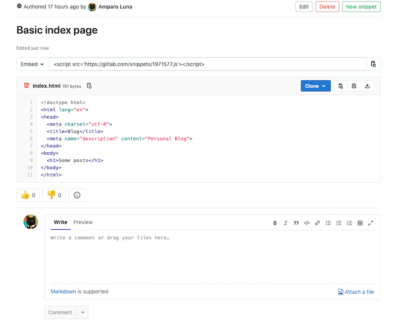
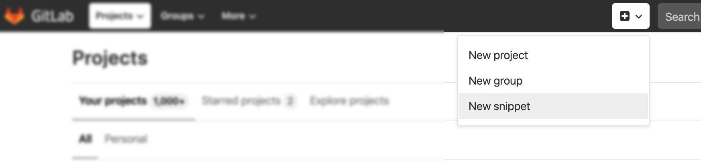
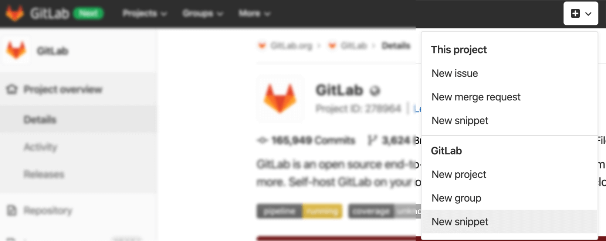

# Snippets

With GitLab Snippets you can store and share bits of code and text with other users.



Snippets can be maintained using [snippets API](../api/snippets.md).

There are two types of snippets:

- Personal snippets.
- Project snippets.

## Versioned Snippets

> [Introduced](https://gitlab.com/groups/gitlab-org/-/epics/239) in GitLab 13.0.

Starting in 13.0, snippets (both personal and project snippets)
have version control enabled by default.

This means that all snippets get their own underlying repository initialized with
a `master` branch at the moment the snippet is created. Whenever a change to the snippet is saved, a
new commit to the master branch is recorded. Commit messages are automatically
generated. The snippet's repository has only one branch (master) by default, deleting
it or creating other branches is not supported.

Existing snippets will be automatically migrated in 13.0. Their current
content will be saved as the initial commit to the snippets' repository.

### File names

Snippets support syntax highlighting based on the filename and
extension provided for them. While it is possible to submit a snippet
without specifying a filename and extension, it needs a valid name so the
content can be created as a file in the snippet's repository.

In case the user does not attribute a filename and extension to a snippet,
GitLab automatically adds a filename in the format `snippetfile<x>.txt`
where `<x>` represents a number added to the file, starting with 1. This
number increases incrementally when more snippets without an attributed
filename are added.

When upgrading from an earlier version of GitLab to 13.0, existing snippets
without a supported filename will be renamed to a compatible format. For
example, if the snippet's filename is `http://a-weird-filename.me` it will
be changed to `http-a-weird-filename-me` to be included in the snippet's
repository. As snippets are stored by ID, changing their filenames will not break
direct or embedded links to the snippet.

### Cloning snippets

Snippets can be cloned as a regular Git repository using SSH or HTTPS. Click the **Clone**
button above the snippet content to copy the URL of your choice.


This allows you to have a local copy of the snippet's repository and make
changes as needed. You can commit those changes and push them to the remote
master branch.

### Limitations

- Binary files are not supported.
- Creating or deleting branches is not supported. Only a default *master*
branch is used.
- Git tags are not supported in snippet repositories.
- Snippets' repositories are limited to one file. Attempting to push more
than one file will result in an error.
- Revisions are not *yet* visible to the user on the GitLab UI, but
it's planned to be added in future iterations. See the [revisions tab issue](https://gitlab.com/gitlab-org/gitlab/-/issues/39271)
for updates.
- The [maximum size for a snippet](../administration/snippets/index.md#snippets-content-size-limit)
is 50MB, by default.

## Personal snippets

Personal snippets are not related to any project and can be created completely
independently. There are 3 visibility levels that can be set, public, internal
and private. See [Public access](../public_access/public_access.md) for more information.

## Project snippets

Project snippets are always related to a specific project.
See [Project features](project/index.md#project-features) for more information.

## Create a snippet

To create a personal snippet, click the plus icon (**{plus-square-o}**)
on the top navigation and select **New snippet** from the dropdown menu:



If you're on a project's page but you want to create a new personal snippet,
click the plus icon (**{plus-square-o}**) and select **New snippet** from the
lower part of the dropdown (**GitLab** on GitLab.com; **Your Instance** on
self-managed instances):



To create a project snippet, navigate to your project's page and click the
plus icon (**{plus-square-o}**), then select **New snippet** from the upper
part of the dropdown (**This project**).


From there, add the **Title**, **Description**, and a **File** name with the
appropriate extension (for example, `example.rb`, `index.html`).

CAUTION: **Warning:**
Make sure to add the file name to get code highlighting and to avoid this
[copy-pasting bug](https://gitlab.com/gitlab-org/gitlab/-/issues/22870).

## Discover snippets

There are two main ways of how you can discover snippets in GitLab.

For exploring all snippets that are visible to you, you can go to the Snippets
dashboard of your GitLab instance via the top navigation. For GitLab.com you can
find it [here](https://gitlab.com/dashboard/snippets). This navigates you to an
overview that shows snippets you created and allows you to explore all snippets.

If you want to discover snippets that belong to a specific project, you can navigate
to the Snippets page via the left side navigation on the project page.
Project snippets are enabled and available by default, but they can
be disabled by navigating to your project's **Settings**, expanding
**Visibility, project features, permissions** and scrolling down to
**Snippets**. From there, you can toggle to disable them or select a
different visibility level from the dropdown menu.

## Snippet comments

> [Introduced](https://gitlab.com/gitlab-org/gitlab-foss/issues/12910) in GitLab 9.2.

With GitLab Snippets you engage in a conversation about that piece of code,
facilitating the collaboration among users.

## Downloading snippets

You can download the raw content of a snippet.

By default snippets will be downloaded with Linux-style line endings (`LF`). If
you want to preserve the original line endings you need to add a parameter `line_ending=raw`
(e.g., `https://gitlab.com/snippets/SNIPPET_ID/raw?line_ending=raw`). In case a
snippet was created using the GitLab web interface the original line ending is Windows-like (`CRLF`).

## Embedded snippets

> Introduced in GitLab 10.8.

Public snippets can not only be shared, but also embedded on any website. This
allows to reuse a GitLab snippet in multiple places and any change to the source
is automatically reflected in the embedded snippet.

To embed a snippet, first make sure that:

- The project is public (if it's a project snippet)
- The snippet is public
- In **Project > Settings > Permissions**, the snippets permissions are
  set to **Everyone with access**

Once the above conditions are met, the "Embed" section will appear in your
snippet where you can simply click on the "Copy" button. This copies a one-line
script that you can add to any website or blog post.

Here's how an example code looks like:

```html
<script src="https://gitlab.com/namespace/project/snippets/SNIPPET_ID.js"></script>
```

Here's how an embedded snippet looks like:

<script src="https://gitlab.com/gitlab-org/gitlab-foss/snippets/1717978.js"></script>

Embedded snippets are displayed with a header that shows the file name if defined,
the snippet size, a link to GitLab, and the actual snippet content. Actions in
the header allow users to see the snippet in raw format and download it.
