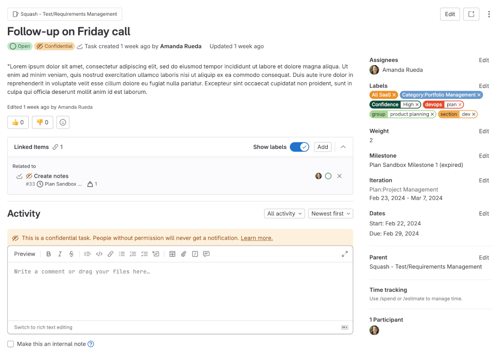

DETAILS:
**Tier:** Free, Premium, Ultimate
**Offering:** GitLab.com, GitLab Self-Managed

> - [Introduced](https://gitlab.com/gitlab-org/gitlab/-/issues/334812) in GitLab 14.5 [with a flag](../administration/feature_flags.md) named `work_items`. Disabled by default.
> - Creating, editing, and deleting tasks [introduced](https://gitlab.com/groups/gitlab-org/-/epics/7169) in GitLab 15.0.
> - [Enabled on GitLab.com and GitLab Self-Managed](https://gitlab.com/gitlab-org/gitlab/-/issues/334812) in GitLab 15.3.

FLAG:
The availability of this feature is controlled by a feature flag.
For more information, see the history.

A task in GitLab is a planning item that can be created in an issue.
Use tasks to break down user stories captured in [issues](project/issues/_index.md) into
smaller, trackable items.

When planning an issue, you need a way to capture and break down technical
requirements or steps necessary to complete it. An issue with related tasks is better defined,
and so you can provide a more accurate issue weight and completion criteria.

For the latest updates, check the [Tasks roadmap](https://gitlab.com/groups/gitlab-org/-/epics/7103).

Tasks are a type of work item, a step towards [default issue types](https://gitlab.com/gitlab-org/gitlab/-/issues/323404)
in GitLab.
For the roadmap of migrating issues and [epics](group/epics/_index.md)
to work items and adding custom work item types, see
[epic 6033](https://gitlab.com/groups/gitlab-org/-/epics/6033) or the
[Plan direction page](https://about.gitlab.com/direction/plan/).

## View tasks

View tasks in issues, in the **Child items** section.

You can also [filter the list of issues](project/issues/managing_issues.md#filter-the-list-of-issues)
for `Type = task`.

If you select a task from an issue, it opens in a dialog window.
If you select a task to open in a new browser tab, or select it from the issue list,
the task opens in a full-page view.

## Create a task

> - Option to select the project where tasks are created [introduced](https://gitlab.com/gitlab-org/gitlab/-/issues/436255) in GitLab 17.1.
> - [Changed](https://gitlab.com/gitlab-org/gitlab/-/merge_requests/169256) the minimum user role from Reporter to Planner in GitLab 17.7.

Prerequisites:

- You must have at least the Planner role for the project, or the project must be public.

To create a task:

1. On the left sidebar, select **Search or go to** and find your project.
1. Select **Plan > Issues**, then select your issue to view it.
1. In the issue description, in the **Child items** section, select **Add**.
1. Select **New task**.
1. Enter the task title.
1. Select the [project](project/organize_work_with_projects.md) to create the new task in.
1. Select **Create task**.

### From a task list item

> - [Introduced](https://gitlab.com/gitlab-org/gitlab/-/issues/377307) in GitLab 15.9.
> - [Changed](https://gitlab.com/gitlab-org/gitlab/-/merge_requests/169256) the minimum user role from Reporter to Planner in GitLab 17.7.

Prerequisites:

- You must have at least the Planner role for the project.

1. On the left sidebar, select **Search or go to** and find your project.
1. Select **Plan > Issues**, then select your issue to view it.
1. In the issue description, hover over a task list item and select the options menu (**{ellipsis_v}**).
1. Select **Convert to task**.

The task list item is removed from the issue description and a task is created in the tasks widget from its contents.
Any nested task list items are moved up a nested level.

## Add existing tasks to an issue

> - [Introduced](https://gitlab.com/gitlab-org/gitlab/-/issues/381868) in GitLab 15.6.

Prerequisites:

- You must have at least the Guest role for the project, or the project must be public.

To add a task:

1. On the left sidebar, select **Search or go to** and find your project.
1. Select **Plan > Issues**, then select your issue to view it.
1. In the issue description, in the **Child items** section, select **Add**.
1. Select **Existing task**.
1. Search tasks by title.
1. Select one or multiple tasks to add to the issue.
1. Select **Add task**.

## Edit a task

> - [Changed](https://gitlab.com/gitlab-org/gitlab/-/merge_requests/169256) the minimum user role from Reporter to Planner in GitLab 17.7.

Prerequisites:

- You must have at least the Planner role for the project.

To edit a task:

1. On the left sidebar, select **Search or go to** and find your project.
1. Select **Plan > Issues**, then select your issue to view it.
1. In the issue description, in the **Child items** section, select the task you want to edit.
   The task window opens.
1. Optional. To edit the title, select it and make your changes.
1. Optional. To edit the description, select the edit icon (**{pencil}**), make your changes, and
   select **Save**.
1. Select the close icon (**{close}**).

### Using the rich text editor

> - Rich text editing in the dialog view [introduced](https://gitlab.com/gitlab-org/gitlab/-/issues/363007) in GitLab 15.6 [with a flag](../administration/feature_flags.md) named `work_items_mvc`. Disabled by default.
> - Rich text editing in the full page view [introduced](https://gitlab.com/gitlab-org/gitlab/-/merge_requests/104533) in GitLab 15.7.
> - [Generally available](https://gitlab.com/groups/gitlab-org/-/epics/10378) in GitLab 16.2. Feature flag `work_items_mvc` removed.
> - [Changed](https://gitlab.com/gitlab-org/gitlab/-/merge_requests/169256) the minimum user role from Reporter to Planner in GitLab 17.7.

Use a rich text editor to edit a task's description.

Prerequisites:

- You must have at least the Planner role for the project.

To edit the description of a task:

1. On the left sidebar, select **Search or go to** and find your project.
1. Select **Plan > Issues**, then select your issue to view it.
1. In the issue description, in the **Child items** section, select the title of the task you want to edit.
   The task window opens.
1. Next to **Description**, select the edit icon (**{pencil}**). The description text box appears.
1. Above the text box, select **Rich text**.
1. Make your changes, and select **Save**.

## Promote a task to an issue

> - [Introduced](https://gitlab.com/gitlab-org/gitlab/-/issues/412534) in GitLab 16.1.
> - [Changed](https://gitlab.com/gitlab-org/gitlab/-/merge_requests/169256) the minimum user role from Reporter to Planner in GitLab 17.7.

Prerequisites:

- You must have at least the Planner role for the project.

To promote a task to an issue:

1. On the left sidebar, select **Search or go to** and find your project.
1. Select **Plan > Issues**, then select your issue to view it.
1. In the issue description, in the **Child items** section, select the task you want to edit.
   The task window opens.
1. Unlink the parent issue and promote the task: In the task window, use these two
   [quick actions](project/quick_actions.md) in separate comments:

   ```plaintext
   /remove_parent
   ```

   ```plaintext
   /promote_to issue
   ```

The task is converted to an issue and gets a new URL with `/issues/`.
The previous URL with `/work_items/` still works.

## Convert a task into another item type

DETAILS:

> - [Introduced](https://gitlab.com/gitlab-org/gitlab/-/issues/385131) in GitLab 17.8 [with a flag](../administration/feature_flags.md) named `work_items_beta`. Disabled by default.
> - [Moved](https://gitlab.com/gitlab-org/gitlab/-/issues/385131) [to the flag](../administration/feature_flags.md) named `okrs_mvc`. For current flag state, see the top of this page.

Convert a task into another item type, such as:

- Issue
- Objective
- Key result

WARNING:
Changing the type might result in data loss if the target type does not support all fields from the original type.

Prerequisites:

- The task you want to convert must not have a parent item assigned.

To convert a task into another item type:

1. On the left sidebar, select **Search or go to** and find your project.
1. Select **Plan > Issues**.
1. In the issue list, find your task.
1. Optional. If the task has a parent issue assigned, remove it.
   Add a comment to the task with the `/remove_parent` quick action.
1. In the upper-right corner, select **More actions** (**{ellipsis_v}**), then select **Change type**.
1. Select the desired item type.
1. If all conditions are met, select **Change type**.

Alternatively, you can use the `/type` [quick action](project/quick_actions.md#work-items), followed
by `issue`, `objective` or `key result` in a comment.

## Remove a task from an issue

> - Minimum required role [changed](https://gitlab.com/gitlab-org/gitlab/-/issues/404799) from Reporter to Guest in GitLab 17.0.

Prerequisites:

- You must have at least the Guest role for the project.

You can remove a task from an issue. The task is not deleted, but the two are no longer connected.
It's not possible to connect them again.

To remove a task from an issue:

1. On the left sidebar, select **Search or go to** and find your project.
1. Select **Plan > Issues**, then select your issue to view it.
1. In the issue description, in the **Child items** section, select the options menu (**{ellipsis_v}**)
   next to the task you want to remove.
1. Select **Remove task**.

## Delete a task

> - [Changed](https://gitlab.com/gitlab-org/gitlab/-/merge_requests/169256) the minimum user role from Owner to Planner in GitLab 17.7.

Prerequisites:

- You must either:
  - Be the author of the task and have at least the Guest role for the project.
  - Have the Planner or Owner role for the project.

To delete a task:

1. On the left sidebar, select **Search or go to** and find your project.
1. Select **Plan > Issues**, then select your issue to view it.
1. In the issue description, in the **Child items** section, select the task you want to edit.
1. In the task window, in the options menu (**{ellipsis_v}**), select **Delete task**.
1. Select **OK**.

## Reorder tasks

> - [Introduced](https://gitlab.com/gitlab-org/gitlab/-/issues/385887) in GitLab 16.0.
> - [Changed](https://gitlab.com/gitlab-org/gitlab/-/merge_requests/169256) the minimum user role from Reporter to Planner in GitLab 17.7.

Prerequisites:

- You must have at least the Planner role for the project.

By default, tasks are ordered by creation date.
To reorder them, drag them around.

## Assign users to a task

> - [Introduced](https://gitlab.com/gitlab-org/gitlab/-/issues/334810) in GitLab 15.4.
> - [Changed](https://gitlab.com/gitlab-org/gitlab/-/merge_requests/169256) the minimum user role from Reporter to Planner in GitLab 17.7.

To show who is responsible for a task, you can assign users to it.

Users on GitLab Free can assign one user per task.
Users on GitLab Premium and Ultimate can assign multiple users to a single task.
See also [multiple assignees for issues](project/issues/multiple_assignees_for_issues.md).

Prerequisites:

- You must have at least the Planner role for the project.

To change the assignee on a task:

1. On the left sidebar, select **Search or go to** and find your project.
1. Select **Plan > Issues**, then select your issue to view it.
1. In the issue description, in the **Child items** section, select the title of the task you want to edit.
   The task window opens.
1. Next to **Assignees**, select **Add assignees**.
1. From the dropdown list, select the users to add as an assignee.
1. Select any area outside the dropdown list.

## Assign labels to a task

> - [Introduced](https://gitlab.com/gitlab-org/gitlab/-/issues/339756) in GitLab 15.5.
> - [Changed](https://gitlab.com/gitlab-org/gitlab/-/merge_requests/169256) the minimum user role from Reporter to Planner in GitLab 17.7.

Prerequisites:

- You must have at least the Planner role for the project.

To add [labels](project/labels.md) to a task:

1. On the left sidebar, select **Search or go to** and find your project.
1. Select **Plan > Issues**, then select your issue to view it.
1. In the issue description, in the **Child items** section, select the title of the task you want to edit. The task window opens.
1. Next to **Labels**, select **Add labels**.
1. From the dropdown list, select the labels to add.
1. Select any area outside the dropdown list.

## Set a start and due date

> - [Introduced](https://gitlab.com/gitlab-org/gitlab/-/issues/365399) in GitLab 15.4 [with a flag](../administration/feature_flags.md) named `work_items_mvc_2`. Disabled by default.
> - [Generally available](https://gitlab.com/gitlab-org/gitlab/-/issues/365399) in GitLab 15.5. Feature flag `work_items_mvc_2` removed.
> - [Changed](https://gitlab.com/gitlab-org/gitlab/-/merge_requests/169256) the minimum user role from Reporter to Planner in GitLab 17.7.

You can set a [start and due date](project/issues/due_dates.md) on a task.

Prerequisites:

- You must have at least the Planner role for the project.

You can set start and due dates on a task to show when work should begin and end.

To set a due date:

1. On the left sidebar, select **Search or go to** and find your project.
1. Select **Plan > Issues**, then select your issue to view it.
1. In the issue description, in the **Child items** section, select the title of the task you want to edit.
   The task window opens.
1. If the task already has a due date next to **Due date**, select it. Otherwise, select **Add due date**.
1. In the date picker, select the desired due date.

To set a start date:

1. In the issue description, in the **Child items** section, select the title of the task you want to edit.
   The task window opens.
1. If the task already has a start date next to **Start date**, select it. Otherwise, select **Add start date**.
1. In the date picker, select the desired due date.

   The due date must be the same or later than the start date.
   If you select a start date to be later than the due date, the due date is then changed to the same day.

## Add a task to a milestone

> - [Introduced](https://gitlab.com/gitlab-org/gitlab/-/issues/367463) in GitLab 15.5 [with a flag](../administration/feature_flags.md) named `work_items_mvc_2`. Disabled by default.
> - [Moved](https://gitlab.com/gitlab-org/gitlab/-/issues/367463) to feature flag named `work_items_mvc` in GitLab 15.7. Disabled by default.
> - [Generally available](https://gitlab.com/gitlab-org/gitlab/-/issues/367463) in GitLab 15.7. Feature flag `work_items_mvc` removed.
> - [Changed](https://gitlab.com/gitlab-org/gitlab/-/merge_requests/169256) the minimum user role from Reporter to Planner in GitLab 17.7.

You can add a task to a [milestone](project/milestones/_index.md).
You can see the milestone title when you view a task.
If you create a task for an issue that already belongs to a milestone,
the new task inherits the milestone.

Prerequisites:

- You must have at least the Planner role for the project.

To add a task to a milestone:

1. On the left sidebar, select **Search or go to** and find your project.
1. Select **Plan > Issues**, then select your issue to view it.
1. In the issue description, in the **Child items** section, select the title of the task you want to edit.
   The task window opens.
1. Next to **Milestone**, select **Add to milestone**.
   If a task already belongs to a milestone, the dropdown list shows the current milestone.
1. From the dropdown list, select the milestone to be associated with the task.

## Set task weight

DETAILS:
**Tier:** Premium, Ultimate
**Offering:** GitLab.com, GitLab Self-Managed, GitLab Dedicated

> - [Introduced](https://gitlab.com/gitlab-org/gitlab/-/issues/362550) in GitLab 15.3.
> - Edit button [introduced](https://gitlab.com/gitlab-org/gitlab/-/issues/429137) in GitLab 16.7.

Prerequisites:

- You must have at least the Reporter role for the project.

You can set weight on each task to show how much work it needs.
This value is visible only when you view a task.

To set issue weight of a task:

1. On the left sidebar, select **Search or go to** and find your project.
1. Select **Plan > Issues**, then select your issue to view it.
1. In the issue description, in the **Child items** section, select the title of the task you want to edit.
   The task window opens.
1. Next to **Weight**, select **Edit**.
1. Enter a whole, positive number.
1. Select **Apply** or press <kbd>Enter</kbd>.

## Add a task to an iteration

DETAILS:
**Tier:** Premium, Ultimate

> - [Introduced](https://gitlab.com/gitlab-org/gitlab/-/issues/367456) in GitLab 15.5 [with a flag](../administration/feature_flags.md) named `work_items_mvc_2`. Disabled by default.
> - [Moved](https://gitlab.com/gitlab-org/gitlab/-/issues/367456) to feature flag named `work_items_mvc` in GitLab 15.7. Disabled by default.
> - [Generally available](https://gitlab.com/gitlab-org/gitlab/-/issues/367456) in GitLab 15.7. Feature flag `work_items_mvc` removed.

You can add a task to an [iteration](group/iterations/_index.md).
You can see the iteration title and period only when you view a task.

Prerequisites:

- You must have at least the Reporter role for the project.

To add a task to an iteration:

1. On the left sidebar, select **Search or go to** and find your project.
1. Select **Plan > Issues**, then select your issue to view it.
1. In the issue description, in the **Child items** section, select the title of the task you want to edit.
   The task window opens.
1. Next to **Iteration**, select **Add to iteration**.
1. From the dropdown list, select the iteration to be associated with the task.

## Estimate and track spent time

> - [Introduced](https://gitlab.com/gitlab-org/gitlab/-/issues/438577) in GitLab 17.0.

You can estimate and track the time you spend on a task.

For more information, see [Time tracking](project/time_tracking.md).

## View task system notes

> - [Introduced](https://gitlab.com/gitlab-org/gitlab/-/issues/378949) in GitLab 15.7 [with a flag](../administration/feature_flags.md) named `work_items_mvc_2`. Disabled by default.
> - [Moved](https://gitlab.com/gitlab-org/gitlab/-/issues/378949) to feature flag named `work_items_mvc` in GitLab 15.8. Disabled by default.
> - Changing activity sort order [introduced](https://gitlab.com/gitlab-org/gitlab/-/issues/378949) in GitLab 15.8.
> - Filtering activity [introduced](https://gitlab.com/gitlab-org/gitlab/-/issues/389971) in GitLab 15.10.
> - [Generally available](https://gitlab.com/gitlab-org/gitlab/-/issues/334812) in GitLab 15.10. Feature flag `work_items_mvc` removed.

You can view all the system notes related to the task. By default they are sorted by **Oldest first**.
You can always change the sorting order to **Newest first**, which is remembered across sessions.
You can also filter activity by **Comments only** and **History only** in addition to the default **All activity** which is remembered across sessions.

## Comments and threads

You can add [comments](discussions/_index.md) and reply to threads in tasks.

## Copy task reference

> - [Introduced](https://gitlab.com/gitlab-org/gitlab/-/issues/396553) in GitLab 16.1.

To refer to a task elsewhere in GitLab, you can use its full URL or a short reference, which looks like
`namespace/project-name#123`, where `namespace` is either a group or a username.

To copy the task reference to your clipboard:

1. On the left sidebar, select **Search or go to** and find your project.
1. Select **Plan > Issues**, then select your issue to view it.
1. In the issue description, in the **Child items** section, select your task.
1. In the upper-right corner, select the vertical ellipsis (**{ellipsis_v}**), then select **Copy Reference**.

You can now paste the reference into another description or comment.

For more information about task references, see [GitLab-Flavored Markdown](markdown.md#gitlab-specific-references).

## Copy task email address

> - [Introduced](https://gitlab.com/gitlab-org/gitlab/-/issues/396553) in GitLab 16.1.

You can create a comment in a task by sending an email.
Sending an email to this address creates a comment that contains the email body.

For more information about creating comments by sending an email and the necessary configuration, see
[Reply to a comment by sending email](discussions/_index.md#reply-to-a-comment-by-sending-email).

To copy the task's email address:

1. On the left sidebar, select **Search or go to** and find your project.
1. Select **Plan > Issues**, then select your issue to view it.
1. In the upper-right corner, select the vertical ellipsis (**{ellipsis_v}**), then select **Copy task email address**.

## Set an issue as a parent

> - [Introduced](https://gitlab.com/groups/gitlab-org/-/epics/11198) in GitLab 16.5.

Prerequisites:

- You must have at least the Guest role for the project.
- The issue and task must belong to the same project.

To set an issue as a parent of a task:

1. On the left sidebar, select **Search or go to** and find your project.
1. Select **Plan > Issues**, then select your issue to view it.
1. In the issue description, in the **Child items** section, select the title of the task you want to edit.
   The task window opens.
1. Next to **Parent**, from the dropdown list, select the parent to add.
1. Select any area outside the dropdown list.

To remove the parent item of the task,
next to **Parent**, select the dropdown list and then select **Unassign**.

## Confidential tasks

> - [Introduced](https://gitlab.com/groups/gitlab-org/-/epics/8410) in GitLab 15.3.

Confidential tasks are tasks visible only to members of a project with
[sufficient permissions](#who-can-see-confidential-tasks).
You can use confidential tasks to keep security vulnerabilities private or prevent surprises from
leaking out.

### Make a task confidential

By default, tasks are public.
You can make a task confidential when you create or edit it.

Prerequisites:

- You must have at least the Reporter role for the project.
- If the task has a parent issue which is non-confidential, and you want to make the issue confidential,
  you must first make all the child tasks confidential.
  A [confidential issue](project/issues/confidential_issues.md) can have only confidential children.

#### In a new task

When you create a new task, a checkbox right below the text area is available to mark the
task as confidential.

Check that box and select **Create task**.

#### In an existing task

To change the confidentiality of an existing task:

1. [Open the task](#view-tasks).
1. In the upper-right corner, select the vertical ellipsis (**{ellipsis_v}**).
1. Select **Turn on confidentiality**.

### Who can see confidential tasks

When a task is made confidential, only users with at least the Reporter role for the project have
access to the task.
Users with Guest or [Minimal](permissions.md#users-with-minimal-access) roles can't access
the task even if they were actively participating before the change.

However, a user with the **Guest role** can create confidential tasks, but can only view the ones
that they created themselves.

Users with the Guest role or non-members can read the confidential task if they are assigned to the task.
When a Guest user or non-member is unassigned from a confidential task, they can no longer view it.

Confidential tasks are hidden in search results for users without the necessary permissions.

### Confidential task indicators

Confidential tasks are visually different from regular tasks in a few ways.
Wherever tasks are listed, you can see the confidential (**{eye-slash}**) icon
next to the tasks that are marked as confidential.

If you don't have [enough permissions](#who-can-see-confidential-tasks),
you cannot see confidential tasks at all.

Likewise, while inside the task, you can see the confidential (**{eye-slash}**) icon right next to
the breadcrumbs.

Every change from regular to confidential and vice versa, is indicated by a
system note in the task's comments, for example:

> - **{eye-slash}** Jo Garcia made the issue confidential 5 minutes ago
> - **{eye}** Jo Garcia made the issue visible to everyone just now

## Lock discussion

DETAILS:
**Status:** Beta

> - [Introduced](https://gitlab.com/gitlab-org/gitlab/-/issues/398649) in GitLab 16.9 [with a flag](../administration/feature_flags.md) named `work_items_beta`. Disabled by default.

FLAG:
The availability of this feature is controlled by a feature flag.
For more information, see the history.
This feature is available for testing, but not ready for production use.

You can prevent public comments in a task.
When you do, only project members can add and edit comments.

Prerequisites:

- You must have at least the Reporter role.

To lock a task:

1. In the upper-right corner, select the vertical ellipsis (**{ellipsis_v}**).
1. Select **Lock discussion**.

A system note is added to the page details.

If a task is closed with a locked discussion, then you cannot reopen it until the discussion is unlocked.

## Two-column layout

DETAILS:
**Status:** Beta

> - [Introduced](https://gitlab.com/gitlab-org/gitlab/-/issues/415077) in GitLab 16.2 [with a flag](../administration/feature_flags.md) named `work_items_mvc_2`. Disabled by default. This feature is in [beta](../policy/development_stages_support.md).
> - [Moved](https://gitlab.com/gitlab-org/gitlab/-/issues/446064) to feature flag named `work_items_beta` in GitLab 16.10. Disabled by default.

FLAG:
The availability of this feature is controlled by a feature flag.
For more information, see the history.
This feature is available for testing, but not ready for production use.

When enabled, tasks use a two-column layout, similar to issues.
The description and threads are on the left, and attributes, such as labels
or assignees, on the right.

This feature is in [beta](../policy/development_stages_support.md).
If you find a bug, [comment on the feedback issue](https://gitlab.com/gitlab-org/gitlab/-/issues/442090).



## Linked items in tasks

> - [Introduced](https://gitlab.com/gitlab-org/gitlab/-/issues/416558) in GitLab 16.5 [with a flag](../administration/feature_flags.md) named `linked_work_items`. Disabled by default.
> - [Enabled on GitLab.com and GitLab Self-Managed](https://gitlab.com/gitlab-org/gitlab/-/merge_requests/139394) in GitLab 16.7.
> - Adding related items by entering their URLs and IDs [introduced](https://gitlab.com/gitlab-org/gitlab/-/issues/427594) in GitLab 16.8.
> - [Generally available](https://gitlab.com/gitlab-org/gitlab/-/merge_requests/150148) in GitLab 17.0. Feature flag `linked_work_items` removed.
> - [Changed](https://gitlab.com/groups/gitlab-org/-/epics/10267) minimum required role from Reporter (if true) to Guest in GitLab 17.0.

Linked items are a bi-directional relationship and appear in a block below
the emoji reactions section. You can link an objective, key result, or a task in the same project with each other.

The relationship only shows up in the UI if the user can see both items.

### Add a linked item

Prerequisites:

- You must have at least the Guest role for the project.

To link an item to a task:

1. On the left sidebar, select **Search or go to** and find your project.
1. Select **Plan > Issues**, then select your issue to view it.
1. In the issue description, in the **Child items** section, select your task.
1. In the **Linked items** section of a task,
   select **Add**.
1. Select the relationship between the two items. Either:
   - **relates to**
   - **blocks**
   - **is blocked by**
1. Enter the search text of the item, URL, or its reference ID.
1. When you have added all the items to be linked, select **Add** below the search box.

When you have finished adding all linked items, you can see
them categorized so their relationships can be better understood visually.


### Remove a linked item

Prerequisites:

- You must have at least the Guest role for the project.

1. On the left sidebar, select **Search or go to** and find your project.
1. Select **Plan > Issues**, then select your issue to view it.
1. In the issue description, in the **Child items** section, select your task.
1. In the **Linked items** section of a task, next to each item, select the vertical
   ellipsis (**{ellipsis_v}**) and then select **Remove**.

Due to the bi-directional relationship, the relationship no longer appears in either item.

### Add a merge request and automatically close tasks

> - [Introduced](https://gitlab.com/gitlab-org/gitlab/-/issues/440851) in GitLab 17.3.

You can set a task to close when a merge request merges.

Prerequisites:

- You must have at least a Developer role for the project containing the merge request.
- You must have at least a Reporter role for the project containing the task.

1. Edit your merge request.
1. In the **Description** box, find and add the task.
   - Use the [closing pattern](project/issues/managing_issues.md#closing-issues-automatically) that you would for adding a merge request to an issue.
   - If your task is in the same project as your merge request, you can search for your task by typing <kbd>#</kbd> followed by the task's ID or title.
   - If your task is in a different project, with a task open, copy the URL from the browser or
     copy the task's reference by selecting the vertical ellipsis (**{ellipsis_v}**) in the upper-right corner, then **Copy Reference**.

The merge requests are now visible in the main body, in the **Development** section.

You must use the exact closing pattern to add the merge request to the task. Other text will not work.

If [automatic issue closing](project/issues/managing_issues.md#disable-automatic-issue-closing) is enabled in your project settings, the task will be automatically closed when either:

- The added merge request is merged.
- A commit referencing a task with the closing pattern is committed to your project's default branch.

## Related topics

- [Create a merge request from a task](project/merge_requests/creating_merge_requests.md#from-a-task)
