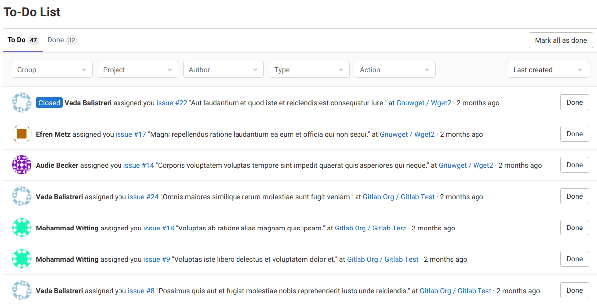
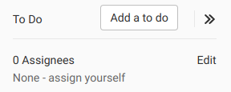
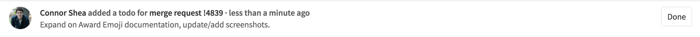
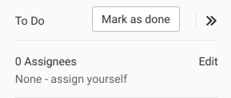

# GitLab To-Do List **(FREE)**

> [Introduced](https://gitlab.com/gitlab-org/gitlab-foss/-/merge_requests/2817) in GitLab 8.5.

When you sign in to GitLab, you normally want to determine where you should
spend your time. This can include taking an action, or keeping track of things
(without having to read lots of email notifications). Because GitLab is where you
do your work, being able to get started quickly is important.

Your *To-Do List* offers a chronological list of items waiting for your input
(known as *to-do items*) in a single dashboard.

The To-Do List supports tracking [actions](#what-triggers-a-to-do-item) related to
the following:

- [Issues](project/issues/index.md)
- [Merge requests](project/merge_requests/index.md)
- [Epics](group/epics/index.md)
- [Designs](project/issues/design_management.md)



You can access your To-Do List by clicking the To-Do List icon (**{task-done}**)
next to the search bar in the top navigation. If the to-do item count is:

- *Less than 100*, the number in blue is the number of to-do items.
- *100 or more*, the number displays as 99+. The exact number displays in the
  To-Do List.

## What triggers a to-do item

A to-do item appears on your To-Do List when:

- An issue or merge request is assigned to you.
- You're `@mentioned` in the description or comment of an issue or merge request
  (or epic).
- You are `@mentioned` in a comment on a:
  - Commit
  - Design
- The CI/CD pipeline for your merge request failed.
- An open merge request becomes unmergeable due to conflict, and one of the
  following is true:
  - You're the author.
  - You're the user that set the merge request to automatically merge after a
    pipeline succeeds.
- [In GitLab 13.2](https://gitlab.com/gitlab-org/gitlab/-/issues/12136) and later, a
  merge request is removed from a
  [merge train](../ci/pipelines/merge_trains.md),
  and you're the user that added it.

When several trigger actions occur for the same user on the same object (for
example, an issue), GitLab displays only the first action as a single to-do
item.

To-do item triggers aren't affected by [GitLab notification email settings](profile/notifications.md).

NOTE:
When a user no longer has access to a resource related to a to-do item (such as
an issue, merge request, epic, project, or group), for security reasons GitLab
deletes any related to-do items within the next hour. Deletion is delayed to
prevent data loss, in the case where a user's access is accidentally revoked.

### Directly addressing a to-do item

> [Introduced](https://gitlab.com/gitlab-org/gitlab-foss/-/merge_requests/7926) in GitLab 9.0.

If you're mentioned at the start of a line, the to-do item you receive is
listed as *directly addressed*. For example, in the following comment:

```markdown
@alice What do you think? cc: @bob

- @carol can you please have a look?

>>>
@dan what do you think?
>>>

@erin @frank thank you!
```

The people receiving directly addressed to-do items are `@alice`, `@erin`, and
`@frank`. Directly addressed to-do items only differ from mentions in their type
for filtering purposes; otherwise, they appear as normal.

### Manually creating a to-do item

You can also add the following to your To-Do List by clicking the **Add a to do** button on:

- [Issues](project/issues/index.md)
- [Merge requests](project/merge_requests/index.md)
- [Epics](group/epics/index.md)
- [Designs](project/issues/design_management.md)



## Marking a to-do item as done

Any action to an issue, merge request, or epic marks its
corresponding to-do item as done.

Actions that dismiss to-do items include:

- Changing the assignee
- Changing the milestone
- Adding/removing a label
- Commenting on the issue
- Resolving a [design discussion thread](project/issues/design_management.md#resolve-design-threads)

Your To-Do List is personal, and items are only marked as done if you take
action. If you close the issue or merge request, your to-do item is marked as
done.

To prevent other users from closing issues without you being notified, if
someone else closes, merges, or takes action on an issue, merge request, or
epic, your to-do item remains pending.

There's just one to-do item for each of these, so mentioning a user many times
in an issue only triggers one to-do item.

If no action is needed, you can manually mark the to-do item as done by
clicking its corresponding **Done** button to have GitLab remove the item from
your To-Do List.



You can also mark a to-do item as done by clicking the **Mark as done** button
in the sidebar of an issue, merge request, or epic.



You can mark all your to-do items as done at once by clicking the
**Mark all as done** button.

## Filtering your To-Do List

You can use the following types of filters with your To-Do List:

| Filter  | Description                                                      |
| ------- | ---------------------------------------------------------------- |
| Project | Filter by project.                                               |
| Group   | Filter by group.                                                 |
| Author  | Filter by the author that triggered the to-do item.              |
| Type    | Filter by issue, merge request, design, or epic.                 |
| Action  | Filter by the action that triggered the to-do item.              |

You can also filter by more than one of these at the same time. The previously
described [triggering actions](#what-triggers-a-to-do-item) include:

- Any action
- Assigned
- Mentioned
- Added
- Pipelines
- Directly addressed
