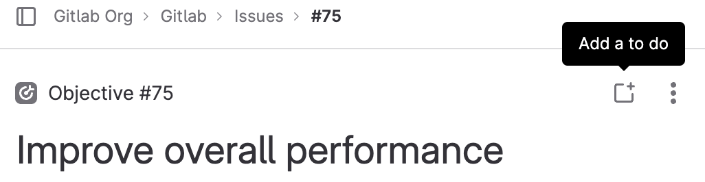
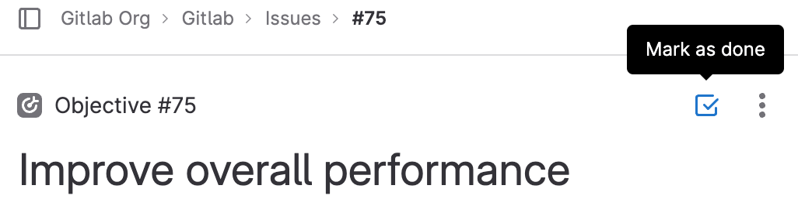

# To-Do List **(FREE)**

Your *To-Do List* is a chronological list of items waiting for your input.
The items are known as *to-do items*.

You can use the To-Do List to track [actions](#actions-that-create-to-do-items) related to:

- [Issues](project/issues/index.md)
- [Merge requests](project/merge_requests/index.md)
- [Epics](group/epics/index.md)
- [Designs](project/issues/design_management.md)

## Access the To-Do List

To access your To-Do List:

On the top bar, in the upper-right corner, select the To-Do List (**{task-done}**).

## Search the To-Do List

You can search your To-Do List by `to do` and `done`.

You can filter to-do items per project, author, type, and action.
Also, you can sort them by [**Label priority**](project/labels.md#set-label-priority),
**Last created**, and **Oldest created**.

## Actions that create to-do items

Many to-do items are created automatically.
Some of the actions that add a to-do item to your To-Do List:

- An issue or merge request is assigned to you.
- A [merge request review](project/merge_requests/reviews/index.md) is requested.
- You're [mentioned](discussions/index.md#mentions) in the description or
  comment of an issue, merge request, or epic.
- You're mentioned in a comment on a commit or design.
- The CI/CD pipeline for your merge request fails.
- An open merge request cannot be merged due to conflict, and one of the
  following is true:
  - You're the author.
  - You're the user that set the merge request to automatically merge after a
    pipeline succeeds.
- [In GitLab 13.2](https://gitlab.com/gitlab-org/gitlab/-/issues/12136) and later, a
  merge request is removed from a
  [merge train](../ci/pipelines/merge_trains.md),
  and you're the user that added it.
- [In GitLab 15.8](https://gitlab.com/gitlab-org/gitlab/-/issues/374725) and later,
  a member access request is raised for a group or project you're an owner of.

When several actions occur for the same user on the same object,
GitLab displays the first action as a single to-do item.
To change this behavior, enable
[multiple to-do items per object](#multiple-to-do-items-per-object).

To-do items aren't affected by [GitLab notification email settings](profile/notifications.md).

### Multiple to-do items per object **(FREE SELF)**

<!-- When the feature flag is removed, integrate this topic into the one above. -->

> - [Introduced](https://gitlab.com/gitlab-org/gitlab/-/issues/28355) in GitLab 13.8 [with a flag](../administration/feature_flags.md) named `multiple_todos`. Disabled by default.
> - [Introduced](https://gitlab.com/gitlab-org/gitlab/-/merge_requests/82470) in GitLab 14.9: only mentions create multiple to-do items.

FLAG:
On self-managed GitLab, by default this feature is not available. To make it available per user,
ask an administrator to [enable the feature flag](../administration/feature_flags.md) named `multiple_todos`.
On GitLab.com, this feature is not available.
The feature is not ready for production use.

When you enable this feature:

- Every time you're mentioned, GitLab creates a new to-do item for you.
- Other [actions that create to-do items](#actions-that-create-to-do-items)
  create one to-do item per action type on the issue, MR, and so on.

## Create a to-do item

> [Introduced](https://gitlab.com/gitlab-org/gitlab/-/issues/390549) in objectives, key results and, tasks in GitLab 16.0.

You can manually add an item to your To-Do List.

1. Go to your:

   - [Issue](project/issues/index.md)
   - [Merge request](project/merge_requests/index.md)
   - [Epic](group/epics/index.md)
   - [Design](project/issues/design_management.md)
   - [Incident](../operations/incident_management/incidents.md)
   - [Objective or key result](../user/okrs.md)
   - [Task](tasks.md)

1. In the upper-right corner, select  **Add a to do** (**{todo-add}**).

   

   

## Create a to-do item by mentioning someone

You can create a to-do item by mentioning someone anywhere except for a code block. Mentioning a user many times in one message only creates one to-do item.

For example, from the following comment, everyone except `frank` gets a to-do item created for them:

````markdown
@alice What do you think? cc: @bob

- @carol can you please have a look?

> @dan what do you think?

Hey @erin, this is what they said:

```
Hi, please message @frank :incoming_envelope:
```
````

## Actions that mark a to-do item as done

Various actions on the to-do item object (like issue, merge request, or epic) mark its
corresponding to-do item as done.

To-do items are marked as done if you:

- Add an emoji reaction to the description or comment.
- Add or remove a label.
- Change the assignee.
- Change the milestone.
- Close the to-do item's object.
- Create a comment.
- Edit the description.
- Resolve a [design discussion thread](project/issues/design_management.md#resolve-a-discussion-thread-on-a-design).
- Accept or deny a project or group membership request.

To-do items are **not** marked as done if you:

- Add a linked item (like a [linked issue](project/issues/related_issues.md)).
- Add a child item (like [child epic](group/epics/manage_epics.md#multi-level-child-epics) or [task](tasks.md)).
- Add a [time entry](project/time_tracking.md).
- Assign yourself.
- Change the [health status](project/issues/managing_issues.md#health-status).

If someone else closes, merges, or takes action on an issue, merge request, or
epic, your to-do item remains pending.

## Mark a to-do item as done

You can manually mark a to-do item as done.

There are two ways to do this:

- In the To-Do List, to the right of the to-do item, select **Mark as done** (**{check}**).
- In the upper-right corner of the resource (for example, issue or merge request), select **Mark as done** (**{todo-done}**).

  

  

## Mark all to-do items as done

You can mark all your to-do items as done at the same time.

In the To-Do List, in the upper-right corner, select **Mark all as done**.

## How a user's To-Do List is affected when their access changes

For security reasons, GitLab deletes to-do items when a user no longer has access to a related resource.
For example, if the user no longer has access to an issue, merge request, epic, project, or group,
GitLab deletes the related to-do items.

This process occurs in the hour after their access changes. Deletion is delayed to
prevent data loss, in case the user's access was accidentally revoked.
