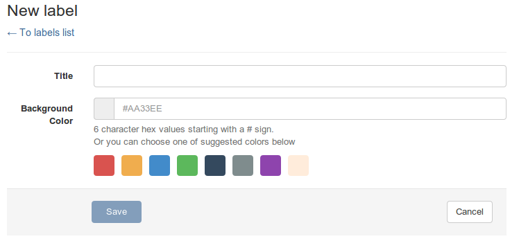
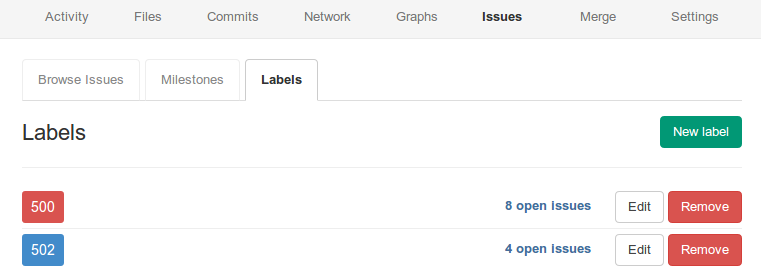

# Labels

In GitLab, you can easily tag issues and Merge Requests. If you have permission level `Developer` or higher, you can manage labels. To create, edit or delete a label, go to a project and then to `Issues` and then `Labels`.

Here you can create a new label.

You can choose to set a color.

If you want to change an existing label, press edit next to the listed label.
You will be presented with the same form as when creating a new label.

You can add labels to Merge Requests when you create or edit them.
