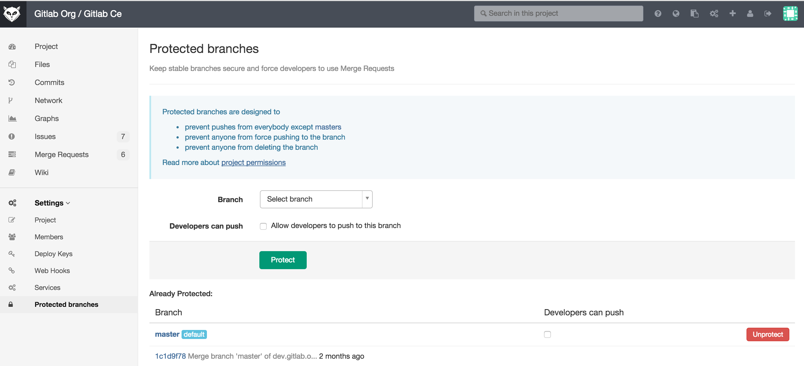
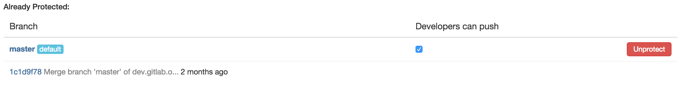

# Protected branches

Permissions in GitLab are fundamentally defined around the idea of having read or write permission to the repository and branches.

To prevent people from messing with history or pushing code without review, we've created protected branches.

A protected branch does three simple things:

* it prevents pushes from everybody except users with Master permission
* it prevents anyone from force pushing to the branch
* it prevents anyone from deleting the branch

You can make any branch a protected branch. GitLab makes the master branch a protected branch by default.

To protect a branch, user needs to have at least a Master permission level, see [permissions document](../permissions/permissions.md).

Navigate to project settings page and select `protected branches`. From the `Branch` dropdown menu select the branch you want to protect.

Some workflows, like [GitLab workflow](gitlab_flow.md), require all users with write access to submit a Merge request in order to get the code into a protected branch.

Since Masters and Owners can already push to protected branches, that means Developers cannot push to protected branch and need to submit a Merge request.

However, there are workflows where that is not needed and only protecting from force pushes and branch removal is useful.

For those workflows, you can allow everyone with write access to push to a protected branch by selecting `Developers can push` check box.

On already protected branches you can also allow developers to push to the repository by selecting the `Developers can push` check box.

