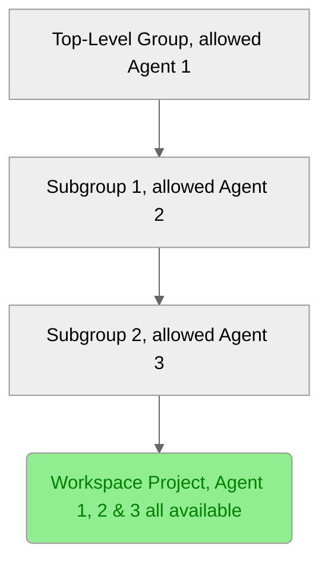

DETAILS:
**Tier:** Premium, Ultimate
**Offering:** GitLab.com, GitLab Self-Managed, GitLab Dedicated

> - [Introduced](https://gitlab.com/gitlab-org/gitlab/-/merge_requests/112397) in GitLab 15.11 [with a flag](../../administration/feature_flags.md) named `remote_development_feature_flag`. Disabled by default.
> - [Enabled on GitLab.com and GitLab Self-Managed](https://gitlab.com/gitlab-org/gitlab/-/issues/391543) in GitLab 16.0.
> - [Generally available](https://gitlab.com/gitlab-org/gitlab/-/merge_requests/136744) in GitLab 16.7. Feature flag `remote_development_feature_flag` removed.

When you [set up workspace infrastructure](configuration.md#set-up-workspace-infrastructure), you must configure a GitLab agent to support workspaces. This guide assumes that a GitLab agent is already installed in the Kubernetes cluster.

Prerequisites:

- You must complete the setup steps in [Tutorial: Set up GitLab agent and proxies](set_up_gitlab_agent_and_proxies.md).
- The agent configuration must have the `remote_development` module enabled, and the required fields of this module must be correctly set. For more information, see [workspace settings](settings.md).
- The agent must be **allowed** in a group for the purpose of creating workspaces. During workspace creation, users can select allowed agents that are associated with any parent group of the workspace project.
- The workspace creator must have the Developer role to the project of the agent.

## Agent authorization in a group for creating workspaces

> - New authorization strategy [introduced](https://gitlab.com/groups/gitlab-org/-/epics/14025) in GitLab 17.2.

With the new authorization strategy that replaces the [legacy authorization strategy](#legacy-agent-authorization-strategy), group owners and administrators can control which cluster agents can be used for hosting workspaces in a group.

For example, if the path to your workspace project is `top-level-group/subgroup-1/subgroup-2/workspace-project`, you can use any configured agent for either `top-level-group`, `subgroup-1` or `subgroup-2` group.

If you allow a cluster agent for a specific group, for example, `subgroup-1`,
it is available to create workspaces in all projects under that group.
Consider the scope of the allowed group carefully, as it determines where the cluster agent can
host workspaces.

## Allow a cluster agent for workspaces in a group

Prerequisites:

- You must [set up workspace infrastructure](configuration.md#set-up-workspace-infrastructure).
- You must have administrator access to the instance or the Owner role for the group.

To allow a cluster agent for workspaces in a group:

1. On the left sidebar, select **Search or go to** and find your group.
1. On the left sidebar, select **Settings > Workspaces**.
1. In the **Group agents** section, select the **All agents** tab.
1. From the list of available agents, find the agent with status **Blocked**, and select **Allow**.
1. On the confirmation dialog, select **Allow agent**.

GitLab updates the status of the selected agent to **Allowed**, and displays the agent in the **Allowed agents** tab.

## Remove an allowed cluster agent for workspaces in a group

Prerequisites:

- You must [set up workspace infrastructure](configuration.md#set-up-workspace-infrastructure).
- You must have administrator access to the instance or the Owner role for the group.

To remove an allowed cluster agent from a group:

1. On the left sidebar, select **Search or go to** and find your group.
1. On the left sidebar, select **Settings > Workspaces**.
1. In the **Group agents** section, select the **Allowed agents** tab.
1. From the list of allowed agents, find the agent you want to remove, and select **Block**.
1. On the confirmation dialog, select **Block agent**.

GitLab updates the status of the selected agent to **Blocked**, and removes the agent from the **Allowed agents** tab.

Removing an allowed cluster agent from a group does not immediately stop running workspaces using this agent.
Running workspaces stop when they are automatically terminated or manually stopped.

## Legacy agent authorization strategy

In GitLab 17.1 and earlier, the availability of an agent in a group was not a prerequisite for
creating workspaces.
You can use any agent in the top-level group of a workspace project to create a workspace,
if both of the following are true:

- The remote development module is enabled.
- You have at least the Developer role for the top-level group.

For example, if the path to your workspace project is `top-level-group/subgroup-1/subgroup-2/workspace-project`,
you can use any configured agent in `top-level-group` and in any of its subgroups.

## Configuring user access with remote development

You can configure the `user_access` module to access the connected Kubernetes cluster with your GitLab credentials.
This module is configured and runs independently of the `remote_development` module.

Be careful when configuring both `user_access` and `remote_development` in the same GitLab agent.
The `remote_development` clusters manage user credentials (such as personal access tokens) as Kubernetes Secrets.
Any misconfiguration in `user_access` might cause this private data to be accessible over the Kubernetes API.

For more information about configuring `user_access`, see
[Configure Kubernetes access](../clusters/agent/user_access.md#configure-kubernetes-access).

## Related topics

- [Tutorial: Set up GitLab agent and proxies](set_up_gitlab_agent_and_proxies.md)
- [Workspace settings](settings.md)
- [Workspace configuration](configuration.md)
- [Troubleshooting Workspaces](workspaces_troubleshooting.md)
