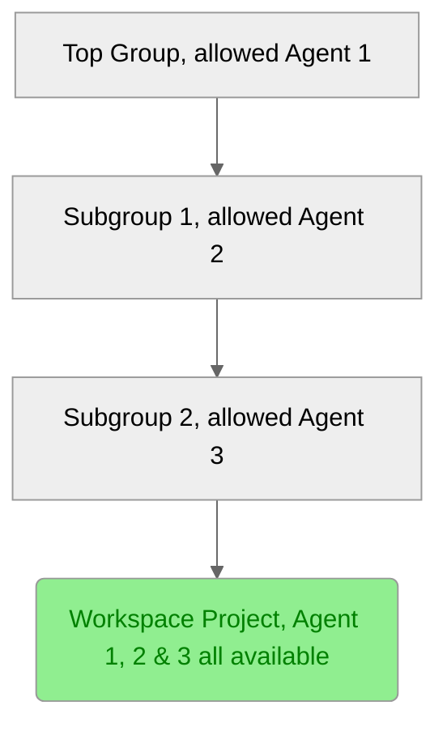

# GitLab agent configuration

DETAILS:
**Tier:** Premium, Ultimate
**Offering:** GitLab.com, Self-managed, GitLab Dedicated

> - [Introduced](https://gitlab.com/gitlab-org/gitlab/-/merge_requests/112397) in GitLab 15.11 [with a flag](../../administration/feature_flags.md) named `remote_development_feature_flag`. Disabled by default.
> - [Enabled on GitLab.com and self-managed](https://gitlab.com/gitlab-org/gitlab/-/issues/391543) in GitLab 16.0.
> - [Generally available](https://gitlab.com/gitlab-org/gitlab/-/merge_requests/136744) in GitLab 16.7. Feature flag `remote_development_feature_flag` removed.

When you [set up workspace infrastructure](configuration.md#set-up-workspace-infrastructure), you must configure a GitLab agent to support workspaces. This guide assumes that a GitLab agent is already installed in the Kubernetes cluster.

Prerequisites:

- The agent configuration must have the `remote_development` module enabled, and the required fields of this module must be correctly set. For more information, see [workspace settings](#workspace-settings).
- The agent must be **allowed** in a group for the purpose of creating workspaces. During workspace creation, users can select allowed agents that are associated with any parent group of the workspace project.
- The workspace creator must have the Developer role to the project of the agent.

## Agent authorization in a group for creating workspaces

> - New authorization strategy [introduced](https://gitlab.com/groups/gitlab-org/-/epics/14025) in GitLab 17.2.

With the new authorization strategy that replaces the [legacy authorization strategy](#legacy-agent-authorization-strategy), group owners and administrators can control which cluster agents can be used for hosting workspaces in a group.

For example, if the path to your workspace project is `top-group/subgroup-1/subgroup-2/workspace-project`, you can use any configured agent for either `top-group`, `subgroup-1` or `subgroup-2` group.



If a cluster agent is allowed for one group, for example `subgroup-1`, then the cluster agent is available for all projects under `subgroup-1` (including nested projects) to create a workspace. Therefore, you must consider the group where a cluster agent is allowed, as it might affect the scope within which a cluster agent may be available for hosting workspaces.

## Allow a cluster agent for workspaces in a group

Prerequisites:

- The [workspace infrastructure](configuration.md#set-up-workspace-infrastructure) must be set up.
- You must be an administrator or group owner.

To allow a cluster agent for workspaces in a group:

1. On the left sidebar, select **Search or go to** and find your group.
1. On the left sidebar, select **Settings > Workspaces**.
1. In the **Group agents** section, select the **All agents** tab.
1. From the list of available agents, find the agent with status **Blocked**, and select **Allow**.
1. On the confirmation dialog, select **Allow agent**.

The status of the selected agent is updated to **Allowed**, and the agent is displayed in the **Allowed agents** tab.

## Remove an allowed cluster agent for workspaces within a group

Prerequisites:

- The [workspace infrastructure](configuration.md#set-up-workspace-infrastructure) must be set up.
- You must be an administrator or group owner.

To remove an allowed cluster agent from a group:

1. On the left sidebar, select **Search or go to** and find your group.
1. On the left sidebar, select **Settings > Workspaces**.
1. In the **Group agents** section, select the **Allowed agents** tab.
1. From the list of allowed agents, find the agent you want to remove, and select **Block**.
1. On the confirmation dialog, select **Block agent**.

The status of the selected agent is updated to **Blocked**, and the agent is removed from the **Allowed agents** tab.

Removing an allowed cluster agent from a group does not immediately stop running workspaces using this agent.
Running workspaces stop when they are automatically terminated or manually stopped.

## Legacy agent authorization strategy

In GitLab 17.1 and earlier, an agent doesn't have to be allowed to be available in a group for creating workspaces. You can use an agent present anywhere in the top-level group (or the root group) of a workspace project to create a workspace, as long as the remote development module is enabled and you have at least the Developer role for the root group.
For example, if the path to your workspace project is `top-group/subgroup-1/subgroup-2/workspace-project`,
you can use any configured agent in `top-group` and in any of its subgroups.

## Workspace settings

| Setting                                                                                   | Required | Default value                           | Description |
|-------------------------------------------------------------------------------------------|----------|-----------------------------------------|-------------|
| [`enabled`](#enabled)                                                                     | Yes      | `false`                                 | Indicates whether remote development is enabled for the GitLab agent. |
| [`dns_zone`](#dns_zone)                                                                   | Yes      | None                                    | DNS zone where workspaces are available. |
| [`gitlab_workspaces_proxy`](#gitlab_workspaces_proxy)                                     | No       | `gitlab-workspaces`                     | Namespace where [`gitlab-workspaces-proxy`](set_up_workspaces_proxy.md) is installed. |
| [`network_policy`](#network_policy)                                                       | No       | See [`network_policy`](#network_policy) | Firewall rules for workspaces. |
| [`default_resources_per_workspace_container`](#default_resources_per_workspace_container) | No       | `{}`                                    | Default requests and limits for CPU and memory per workspace container. |
| [`max_resources_per_workspace`](#max_resources_per_workspace)                             | No       | `{}`                                    | Maximum requests and limits for CPU and memory per workspace. |
| [`workspaces_quota`](#workspaces_quota)                                                   | No       | `-1`                                    | Maximum number of workspaces for the GitLab agent. |
| [`workspaces_per_user_quota`](#workspaces_per_user_quota)                                 | No       | `-1`                                    | Maximum number of workspaces per user. |

NOTE:
If a setting has an invalid value, it's not possible to update any setting until you fix that value.

### `enabled`

Use this setting to define whether:

- The GitLab agent can communicate with the GitLab instance.
- You can [create a workspace](configuration.md#create-a-workspace) with the GitLab agent.

The default value is `false`.

To enable remote development in the agent configuration, set `enabled` to `true`:

```yaml
remote_development:
  enabled: true
```

If remote development is disabled, an administrator must manually delete any
running workspaces to remove those workspaces from the Kubernetes cluster.

### `dns_zone`

Use this setting to define the DNS zone of the URL where workspaces are available.

**Example configuration:**

```yaml
remote_development:
  dns_zone: "<workspaces.example.dev>"
```

### `gitlab_workspaces_proxy`

Use this setting to define the namespace where
[`gitlab-workspaces-proxy`](set_up_workspaces_proxy.md) is installed.
The default value for `gitlab_workspaces_proxy.namespace` is `gitlab-workspaces`.

**Example configuration:**

```yaml
remote_development:
  gitlab_workspaces_proxy:
    namespace: "<custom-gitlab-workspaces-proxy-namespace>"
```

### `network_policy`

Use this setting to define the network policy for each workspace.
This setting controls network traffic for workspaces.

The default value is:

```yaml
remote_development:
  network_policy:
    enabled: true
    egress:
      - allow: "0.0.0.0/0"
        except:
          - "10.0.0.0/8"
          - "172.16.0.0/12"
          - "192.168.0.0/16"
```

In this configuration:

- The network policy is generated for each workspace because `enabled` is `true`.
- The egress rules allow all traffic to the internet (`0.0.0.0/0`) except to the
  IP CIDR ranges `10.0.0.0/8`, `172.16.0.0/12`, and `192.168.0.0/16`.

The behavior of the network policy depends on the Kubernetes network plugin.
For more information, see the [Kubernetes documentation](https://kubernetes.io/docs/concepts/services-networking/network-policies/).

#### `network_policy.enabled`

Use this setting to define whether the network policy is generated for each workspace.
The default value for `network_policy.enabled` is `true`.

#### `network_policy.egress`

> - [Introduced](https://gitlab.com/groups/gitlab-org/-/epics/11629) in GitLab 16.7.

Use this setting to define a list of IP CIDR ranges to allow as egress destinations from a workspace.

Define egress rules when:

- The GitLab instance is on a private IP range.
- The workspace must access a cloud resource on a private IP range.

Each element of the list defines an `allow` attribute with an optional `except` attribute.
`allow` defines an IP range to allow traffic from.
`except` lists IP ranges to exclude from the `allow` range.

**Example configuration:**

```yaml
remote_development:
  network_policy:
    egress:
      - allow: "0.0.0.0/0"
        except:
          - "10.0.0.0/8"
          - "172.16.0.0/12"
          - "192.168.0.0/16"
      - allow: "172.16.123.1/32"
```

In this example, traffic from the workspace is allowed if:

- The destination IP is any range except `10.0.0.0/8`, `172.16.0.0/12`, or `192.168.0.0/16`.
- The destination IP is `172.16.123.1/32`.

### `default_resources_per_workspace_container`

> - [Introduced](https://gitlab.com/groups/gitlab-org/-/epics/11625) in GitLab 16.8.

Use this setting to define the default [requests and limits](https://kubernetes.io/docs/concepts/configuration/manage-resources-containers/#requests-and-limits)
for CPU and memory per workspace container.
Any resources you define in your [devfile](index.md#devfile) override this setting.

For `default_resources_per_workspace_container`, `requests` and `limits` are required.
For more information about possible CPU and memory values, see [Resource units in Kubernetes](https://kubernetes.io/docs/concepts/configuration/manage-resources-containers/#resource-units-in-kubernetes).

When you change any of these values, existing workspaces restart immediately for the changes to take effect.

**Example configuration:**

```yaml
remote_development:
  default_resources_per_workspace_container:
    requests:
      cpu: "0.5"
      memory: "512Mi"
    limits:
      cpu: "1"
      memory: "1Gi"
```

### `max_resources_per_workspace`

> - [Introduced](https://gitlab.com/groups/gitlab-org/-/epics/11625) in GitLab 16.8.

Use this setting to define the maximum [requests and limits](https://kubernetes.io/docs/concepts/configuration/manage-resources-containers/#requests-and-limits)
for CPU and memory per workspace.

For `max_resources_per_workspace`, `requests` and `limits` are required.
For more information about possible CPU and memory values, see:

- [Resource units in Kubernetes](https://kubernetes.io/docs/concepts/configuration/manage-resources-containers/#resource-units-in-kubernetes)
- [Resource quotas](https://kubernetes.io/docs/concepts/policy/resource-quotas/)

When you change any of these values, existing workspaces restart immediately for the changes to take effect.
Workspaces fail when they exceed the values you set for `requests` and `limits`.

**Example configuration:**

```yaml
remote_development:
  max_resources_per_workspace:
    requests:
      cpu: "1"
      memory: "1Gi"
    limits:
      cpu: "2"
      memory: "2Gi"
```

The maximum resources you define must include any resources required for init containers
to perform bootstrapping operations such as cloning the project repository.

### `workspaces_quota`

> - [Introduced](https://gitlab.com/groups/gitlab-org/-/epics/11586) in GitLab 16.9.

Use this setting to set the maximum number of workspaces for the GitLab agent.

You cannot create new workspaces for an agent when:

- The number of workspaces for the agent has reached the defined `workspaces_quota`.
- `workspaces_quota` is set to `0`.

This setting does not affect existing workspaces for the agent.

The default value is `-1` (unlimited).
Possible values are greater than or equal to `-1`.

**Example configuration:**

```yaml
remote_development:
  workspaces_quota: 10
```

### `workspaces_per_user_quota`

> - [Introduced](https://gitlab.com/groups/gitlab-org/-/epics/11586) in GitLab 16.9.

Use this setting to set the maximum number of workspaces per user.

You cannot create new workspaces for a user when:

- The number of workspaces for the user has reached the defined `workspaces_per_user_quota`.
- `workspaces_per_user_quota` is set to `0`.

This setting does not affect existing workspaces for the user.

The default value is `-1` (unlimited).
Possible values are greater than or equal to `-1`.

**Example configuration:**

```yaml
remote_development:
  workspaces_per_user_quota: 3
```

## Configuring user access with remote development

You can configure the `user_access` module to access the connected Kubernetes cluster with your GitLab credentials.
This module is configured and runs independently of the `remote_development` module.

Be careful when configuring both `user_access` and `remote_development` in the same GitLab agent.
The `remote_development` clusters manage user credentials (such as personal access tokens) as Kubernetes Secrets.
Any misconfiguration in `user_access` might cause this private data to be accessible over the Kubernetes API.

For more information about configuring `user_access`, see
[Configure Kubernetes access](../../user/clusters/agent/user_access.md#configure-kubernetes-access).
