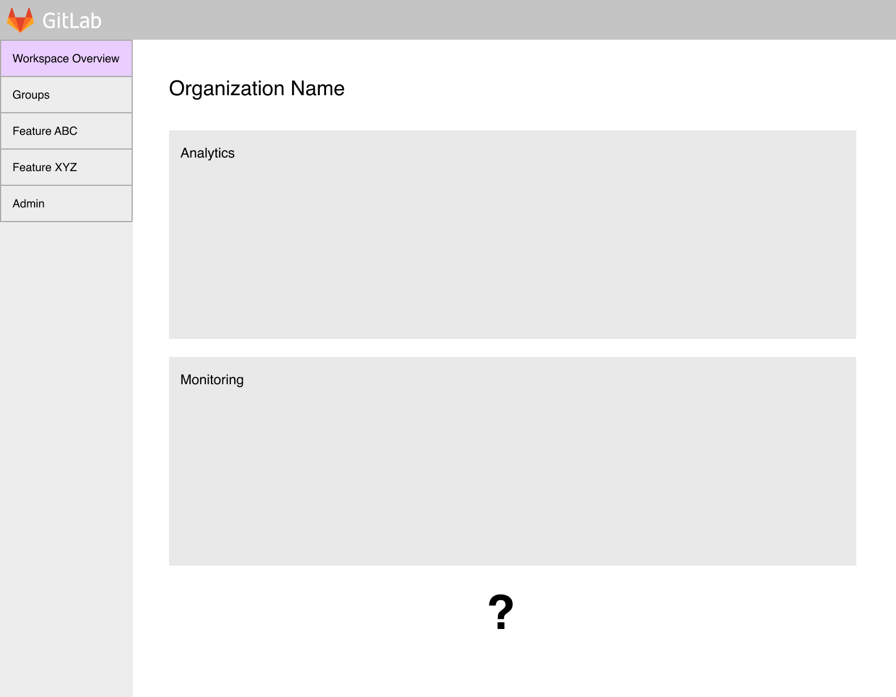
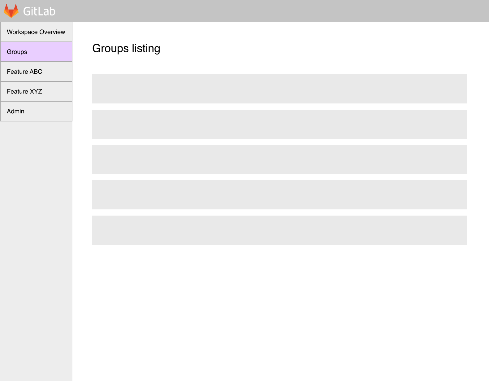
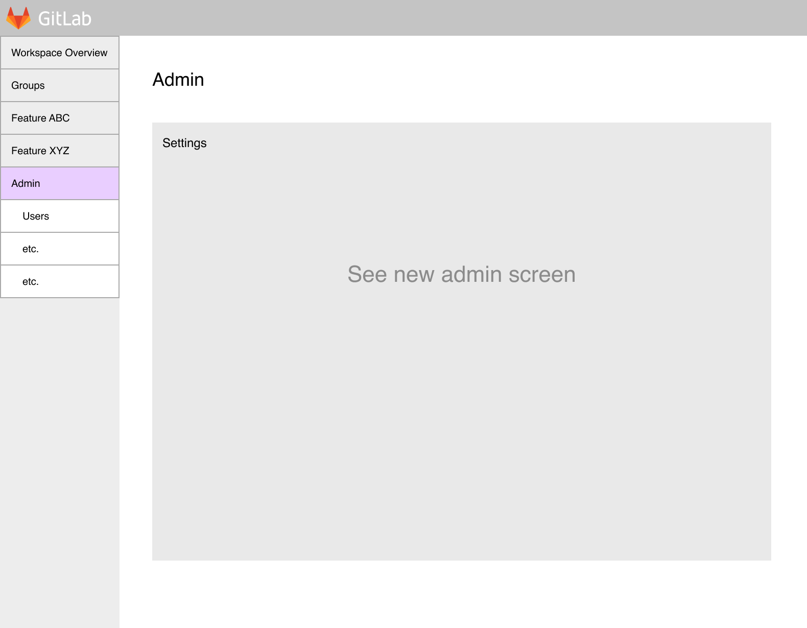
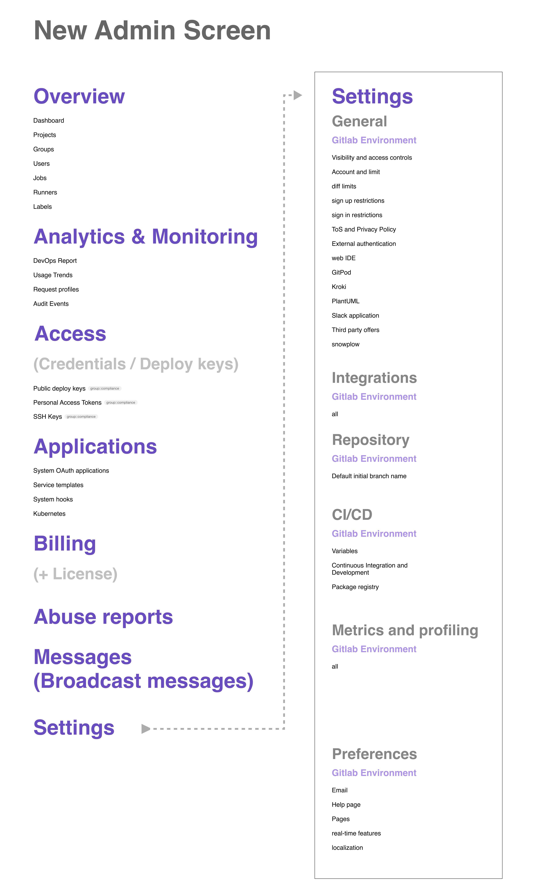
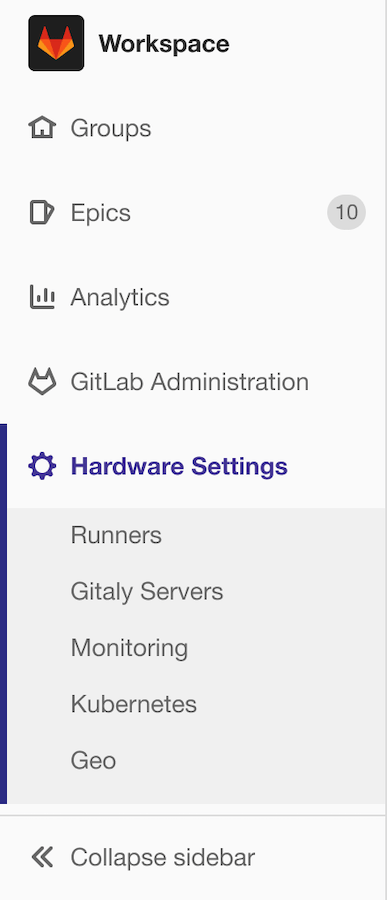

# Workspace

Workspace will be the top [namespace](../group/index.md#namespaces) for you to manage
everything GitLab, including:

- Defining and applying settings to all of your groups, subgroups, and projects.
- Aggregating data from all your groups, subgroups, and projects.

Workspace will take many of the features from the
[Admin Area](../admin_area/index.md) and will:

- Enable a top namespace for GitLab.com.
- Eventually replace the instance level for self-managed installations.

Our goal is to reach feature parity between SaaS and self-managed installations, with one
exception: **Hardware Controls** will appear **only** on self-managed installations.

NOTE:
Workspace is currently in development.

## Concept previews

The following provide a preview to the Workspace concept.

