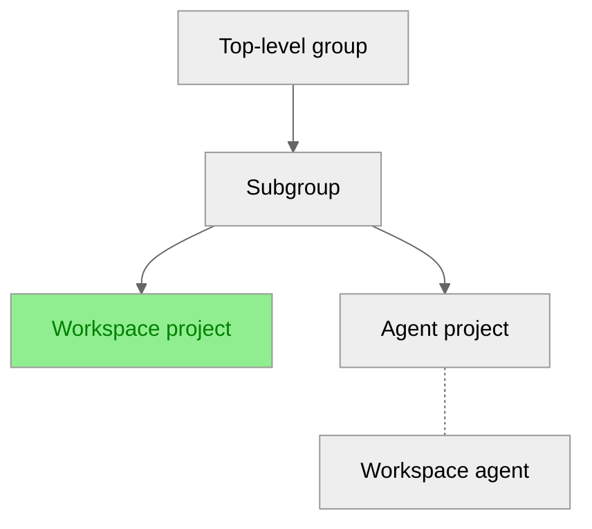

# Tutorial: Set up the GitLab agent

This tutorial shows you how to set up the GitLab agent so users
can create and manage workspaces in a project.
For this tutorial, the following hierarchy is used:



To set up the GitLab agent, you're going to:

1. [Configure the `remote_development` module in the agent project](#configure-the-remote_development-module-in-the-agent-project).
1. [Allow the GitLab agent in a group](#allow-the-gitlab-agent-in-a-group).
1. [Grant workspace users the necessary permissions](#grant-workspace-users-the-necessary-permissions).

## Prerequisites

- You must [set up workspace infrastructure](configuration.md#set-up-workspace-infrastructure).
- You must have administrator access to the instance or the Owner role for the group.

## Configure the `remote_development` module in the agent project

To configure the `remote_development` module in the agent project:

1. On the left sidebar, select **Search or go to** and find your project.
1. In your project, create a `.gitlab/agents/<agentName>/config.yaml` file.
   `agentName` is the name of the agent you configured when you set up workspace infrastructure.
1. In `config.yaml`, use the following configuration for [workspace settings](gitlab_agent_configuration.md#workspace-settings):

   ```yaml
   remote_development:
     enabled: true
     dns_zone: "<workspaces.example.dev>" # DNS zone of the URL where workspaces are available
   ```

Next, you'll allow the GitLab agent in a group.

## Allow the GitLab agent in a group

When you allow an agent in a group, the group and its subgroups can use that agent.
Carefully consider the group where you allow the GitLab agent.

To allow the GitLab agent in a group:

1. On the left sidebar, select **Search or go to** and find your group.
1. On the left sidebar, select **Settings > Workspaces**.
1. In the **Group agents** section, select the **All agents** tab.
1. For the GitLab agent, select **Allow**.
1. On the confirmation dialog, select **Allow agent**.

Now it's time to grant workspace users the necessary permissions to create and manage workspaces.

## Grant workspace users the necessary permissions

You can grant users with at least the Developer role for the workspace and agent projects
the necessary permissions to create and manage workspaces.

To grant workspace users the necessary permissions, see:

- [Add users to a project](../project/members/index.md#add-users-to-a-project).
- [Add users to a group](../group/index.md#add-users-to-a-group).

You've done it! Users can now create and manage workspaces in a project.
