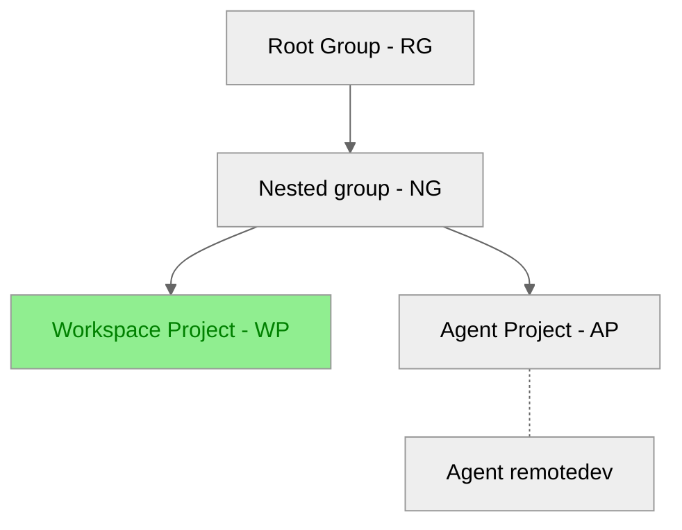

# Tutorial: Set up the GitLab agent for the group

DETAILS:
**Tier:** Premium, Ultimate
**Offering:** GitLab.com, Self-managed, GitLab Dedicated

> - [Introduced](https://gitlab.com/gitlab-org/gitlab/-/merge_requests/112397) in GitLab 15.11 [with a flag](../../administration/feature_flags.md) named `remote_development_feature_flag`. Disabled by default.
> - [Enabled on GitLab.com and self-managed](https://gitlab.com/gitlab-org/gitlab/-/issues/391543) in GitLab 16.0.
> - [Generally available](https://gitlab.com/gitlab-org/gitlab/-/merge_requests/136744) in GitLab 16.7. Feature flag `remote_development_feature_flag` removed.

In this tutorial, you'll learn how to set up a cluster agent for remote development workspace.

The goal is to configure the workspace project (WP) with the agent project (AP), so that users in a root group (RG) or nested group (NG) can create and manage workspaces.
For this use, we'll use the group/project layout illustrated in the diagram below.



To set up the agent for the workspace project, you have to:

1. [Configure the `remote_development` module in the AP](#configure-the-remote_development-module-in-ap)
1. [Allow the AP for workspace use in the NG](#allow-the-ap-for-workspace-use-in-the-ng)
1. [Grant workspace users necessary permissions](#grant-workspace-users-necessary-permissions)

## Prerequisites

- The [workspace infrastructure](configuration.md#set-up-workspace-infrastructure) must be set up.
- You must be an administrator or group owner.

## Configure the `remote_development` module in AP

1. On the left sidebar, select **Search or go to** and find the AP.
1. In the project, create a file `.gitlab/agents/{agentName}/config.yaml` (where `agentName` is the name of the agent created when setting up the workspace infrastructure).
1. In the `config.yaml` file, use the following configuration for [workspace settings](gitlab_agent_configuration.md#workspace-settings):

```yaml
remote_development:
  enabled: true
  # reference only, please update to actual dns_zone to the load balancer exposed by the Ingress controller.
  dns_zone: workspaces.localdev.me
```

## Allow the AP for workspace use in the NG

When the agent has the `remote_development` module configured, the next step is to allow the agent for workspace creation in a parent group of the workspace project.

With the current design, allowing the AP with either the NG or RG (any parent group of the WP), would both make the agent available for the WP. Why should we choose NG over RG?

Because any nested projects under the selected group can use the agent after configuration, so you must carefully consider the group where you allow an agent for workspaces.

To allow NG with AP:

1. On the left sidebar, select **Search or go to** and find the NG group.
1. On the left sidebar, select **Settings > Workspaces**.
1. In the **Group agents** section, select the **All agents** tab.
1. From the list of available agents, find the agent with status **Blocked**, and select **Allow**.
1. On the confirmation dialog, select **Allow agent**.

## Grant workspace users necessary permissions

One final step is to grant users, who would create and manage WP workspaces, necessary permissions.

To manage WP workspaces by using AP as the agent, users must have at least the Developer role for both AP and WP. For more information about [user roles](../permissions.md) and [how to add users to a project](../project/members/index.md#add-users-to-a-project), or [how to add users to a group](../group/index.md#add-users-to-a-group).

You're all set! WP is allowed with AP. Users with necessary permissions can go to the WP workspaces tab and create or manage workspaces as they like.
