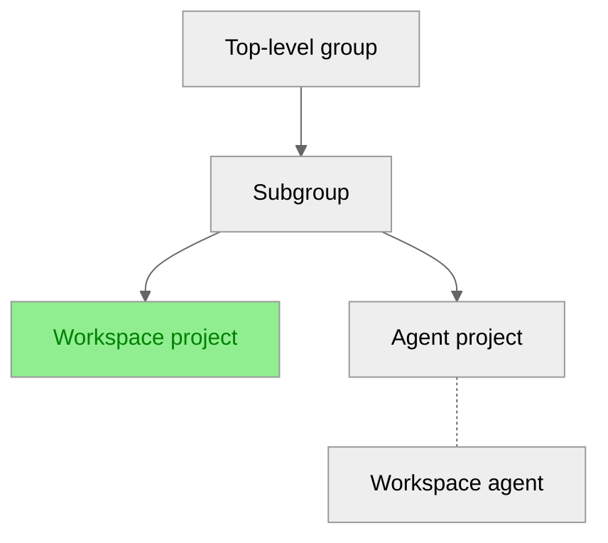

This tutorial shows you how to:

- Set up the GitLab agent so users can create and manage workspaces in a project.
- Set up the GitLab workspaces proxy to authenticate and authorize [workspaces](_index.md)
  in your cluster.

NOTE:
You must complete the setup steps in this tutorial before you can configure a GitLab agent to support workspaces.
After completing the tutorial, use [GitLab agent configuration](gitlab_agent_configuration.md) to configure
your GitLab agent.

## Before you begin

Before starting this tutorial, you must have:

- Administrator access to your GitLab instance or the Owner role for your group.
- An installed Ingress controller.
- A running Kubernetes cluster.
- `helm` 3.11.0 or later and `kubectl` on your local machine.
- The GitLab agent installed in your cluster.
  For installation instructions, see [set up workspace infrastructure](configuration.md#set-up-workspace-infrastructure).
- Access to configure a wildcard domain in your DNS provider.
  For example, `*.workspaces.example.dev` is required for workspace access.

For this tutorial, the following hierarchy is used:



## Configure the GitLab agent for workspaces

To configure the `remote_development` module in the agent project:

1. On the left sidebar, select **Search or go to** and find your project.
1. In your project, create a `.gitlab/agents/<agentName>/config.yaml` file.
   `agentName` is the name of the agent you configured when you set up workspace infrastructure.
1. In `config.yaml`, use the following configuration for workspace settings:

   ```yaml
   remote_development:
     enabled: true
     dns_zone: "<workspaces.example.dev>" # DNS zone of the URL where workspaces are available
   ```

## Allow the GitLab agent in your group

When you allow an agent in a group, the group and its subgroups can use that agent.
Carefully consider the group where you allow the GitLab agent.

To allow your GitLab agent in a group and its subgroups:

1. On the left sidebar, select **Search or go to** and find your group.
1. Select **Settings > Workspaces**.
1. In the **Group agents** section, select the **All agents** tab.
1. For the GitLab agent, select **Allow**.
1. On the confirmation dialog, select **Allow agent**.

## Grant workspace permissions

Grant users with at least the Developer role for the workspace and agent projects
the necessary permissions to create and manage workspaces. You can:

- [Add users to a project](../project/members/_index.md#add-users-to-a-project)
- [Add users to a group](../group/_index.md#add-users-to-a-group)

## Generate TLS certificates

A wildcard domain is required for workspace access because each workspace gets its own subdomain.
You must generate TLS certificates for:

- The domain `gitlab-workspaces-proxy` listens on (`GITLAB_WORKSPACES_PROXY_DOMAIN`).
- The wildcard domain where workspaces are available (`GITLAB_WORKSPACES_WILDCARD_DOMAIN`).

For example, if your base domain is `workspaces.example.dev`:

- The `GITLAB_WORKSPACES_PROXY_DOMAIN` is `workspaces.example.dev`.
- The `GITLAB_WORKSPACES_WILDCARD_DOMAIN` is `*.workspaces.example.dev`.
- Individual workspaces are available at URLs like `workspace-1.workspaces.example.dev`.

You can generate certificates from any certificate authority.
If [`cert-manager`](https://cert-manager.io/docs/) is configured for your Kubernetes cluster,
you can use it to create and renew TLS certificates automatically.

To generate certificates manually:

1. Install [Certbot](https://certbot.eff.org/) to enable HTTPS:

   ```shell
   brew install certbot
   ```

1. Generate Let's Encrypt certificates with ACME DNS and create `TXT` records in your DNS provider:

   ```shell
   export EMAIL="YOUR_EMAIL@example.dev"
   export GITLAB_WORKSPACES_PROXY_DOMAIN="workspaces.example.dev"
   export GITLAB_WORKSPACES_WILDCARD_DOMAIN="*.workspaces.example.dev"

   certbot -d "${GITLAB_WORKSPACES_PROXY_DOMAIN}" \
     -m "${EMAIL}" \
     --config-dir ~/.certbot/config \
     --logs-dir ~/.certbot/logs \
     --work-dir ~/.certbot/work \
     --manual \
     --preferred-challenges dns certonly

   certbot -d "${GITLAB_WORKSPACES_WILDCARD_DOMAIN}" \
     -m "${EMAIL}" \
     --config-dir ~/.certbot/config \
     --logs-dir ~/.certbot/logs \
     --work-dir ~/.certbot/work \
     --manual \
     --preferred-challenges dns certonly
   ```

1. Set the following environment variables with the certificate directories from the output:

   ```shell
   export WORKSPACES_DOMAIN_CERT="${HOME}/.certbot/config/live/${GITLAB_WORKSPACES_PROXY_DOMAIN}/fullchain.pem"
   export WORKSPACES_DOMAIN_KEY="${HOME}/.certbot/config/live/${GITLAB_WORKSPACES_PROXY_DOMAIN}/privkey.pem"
   export WILDCARD_DOMAIN_CERT="${HOME}/.certbot/config/live/${GITLAB_WORKSPACES_PROXY_DOMAIN}-0001/fullchain.pem"
   export WILDCARD_DOMAIN_KEY="${HOME}/.certbot/config/live/${GITLAB_WORKSPACES_PROXY_DOMAIN}-0001/privkey.pem"
   ```

   Depending on your environment, the `certbot` command might save the certificate and key on a different path.
   To get the exact path, run:

   ```shell
   certbot certificates \
     --config-dir ~/.certbot/config \
     --logs-dir ~/.certbot/logs \
     --work-dir ~/.certbot/work
   ```

NOTE:
You must renew your certificates when they expire.
For example, Let's Encrypt certificates expire after three months.
To automatically renew certificates, see [`cert-manager`](https://cert-manager.io/docs/).

## Register a GitLab OAuth application

To register an application on your GitLab instance:

1. [Configure GitLab as an OAuth 2.0 identity provider](../../integration/oauth_provider.md).
1. Set the redirect URI to `https://${GITLAB_WORKSPACES_PROXY_DOMAIN}/auth/callback`.
1. Select the **Trusted** checkbox.
1. Set the scopes to `api`, `read_user`, `openid`, and `profile`.
1. Export your configuration values:

   ```shell
   export GITLAB_URL="https://gitlab.com"
   export CLIENT_ID="your_application_id"
   export CLIENT_SECRET="your_application_secret"
   export REDIRECT_URI="https://${GITLAB_WORKSPACES_PROXY_DOMAIN}/auth/callback"
   export SIGNING_KEY="make_up_a_random_key_consisting_of_letters_numbers_and_special_chars"
   ```

1. Store the client ID and generated secret securely. For examples, in 1Password.

## Generate an SSH host key

To generate an RSA key:

```shell
ssh-keygen -f ssh-host-key -N '' -t rsa
export SSH_HOST_KEY=$(pwd)/ssh-host-key
```

As an alternative, you can also generate an ECDSA key.

## Create Kubernetes secrets

To create Kubernetes secrets:

```shell
kubectl create namespace gitlab-workspaces

kubectl create secret generic gitlab-workspaces-proxy-config \
  --namespace="gitlab-workspaces" \
  --from-literal="auth.client_id=${CLIENT_ID}" \
  --from-literal="auth.client_secret=${CLIENT_SECRET}" \
  --from-literal="auth.host=${GITLAB_URL}" \
  --from-literal="auth.redirect_uri=${REDIRECT_URI}" \
  --from-literal="auth.signing_key=${SIGNING_KEY}" \
  --from-literal="ssh.host_key=$(cat ${SSH_HOST_KEY})"

kubectl create secret tls gitlab-workspace-proxy-tls \
  --namespace="gitlab-workspaces" \
  --cert="${WORKSPACES_DOMAIN_CERT}" \
  --key="${WORKSPACES_DOMAIN_KEY}"

kubectl create secret tls gitlab-workspace-proxy-wildcard-tls \
  --namespace="gitlab-workspaces" \
  --cert="${WILDCARD_DOMAIN_CERT}" \
  --key="${WILDCARD_DOMAIN_KEY}"
```

## Install the proxy Helm chart

To install the Helm chart for the proxy:

1. Add the `helm` repository:

   ```shell
   helm repo add gitlab-workspaces-proxy \
     https://gitlab.com/api/v4/projects/gitlab-org%2fworkspaces%2fgitlab-workspaces-proxy/packages/helm/devel
   ```

   For Helm chart 0.1.13 and earlier, use the following command:

   ```shell
   helm repo add gitlab-workspaces-proxy \
     https://gitlab.com/api/v4/projects/gitlab-org%2fremote-development%2fgitlab-workspaces-proxy/packages/helm/devel
   ```

1. Install the chart:

   ```shell
   helm repo update

   helm upgrade --install gitlab-workspaces-proxy \
     gitlab-workspaces-proxy/gitlab-workspaces-proxy \
     --version=0.1.16 \
     --namespace="gitlab-workspaces" \
     --set="ingress.enabled=true" \
     --set="ingress.hosts[0].host=${GITLAB_WORKSPACES_PROXY_DOMAIN}" \
     --set="ingress.hosts[0].paths[0].path=/" \
     --set="ingress.hosts[0].paths[0].pathType=ImplementationSpecific" \
     --set="ingress.hosts[1].host=${GITLAB_WORKSPACES_WILDCARD_DOMAIN}" \
     --set="ingress.hosts[1].paths[0].path=/" \
     --set="ingress.hosts[1].paths[0].pathType=ImplementationSpecific" \
     --set="ingress.tls[0].hosts[0]=${GITLAB_WORKSPACES_PROXY_DOMAIN}" \
     --set="ingress.tls[0].secretName=gitlab-workspace-proxy-tls" \
     --set="ingress.tls[1].hosts[0]=${GITLAB_WORKSPACES_WILDCARD_DOMAIN}" \
     --set="ingress.tls[1].secretName=gitlab-workspace-proxy-wildcard-tls" \
     --set="ingress.className=nginx"
   ```

   If you're using a different Ingress class, modify the `ingress.className` parameter.

## Verify your setup

1. Verify the Ingress configuration for the `gitlab-workspaces` namespace:

   ```shell
   kubectl -n gitlab-workspaces get ingress
   ```

1. Verify the pods are running:

   ```shell
   kubectl -n gitlab-workspaces get pods
   ```

## Update your DNS records

To update your DNS records:

1. Point `${GITLAB_WORKSPACES_PROXY_DOMAIN}` and `${GITLAB_WORKSPACES_WILDCARD_DOMAIN}`
   to the load balancer exposed by the Ingress controller.
1. Check if `gitlab-workspaces-proxy` is accessible:

   ```shell
   curl --verbose --location ${GITLAB_WORKSPACES_PROXY_DOMAIN}
   ```

   This command returns a `400 Bad Request` error until you create a workspace.

1. From another terminal, check the proxy logs::

   ```shell
   kubectl -n gitlab-workspaces logs -f -l app.kubernetes.io/name=gitlab-workspaces-proxy
   ```

   This command returns a `could not find upstream workspace upstream not found` error until you create a workspace.

## Update the GitLab agent configuration

If you deploy the Helm chart for the proxy to a namespace other than `gitlab-workspaces`,
update your [GitLab agent configuration](gitlab_agent_configuration.md):

```yaml
remote_development:
  gitlab_workspaces_proxy:
    namespace: "<custom-gitlab-workspaces-proxy-namespace>"
```

## Related topics

- [Configure workspaces](configuration.md)
- [GitLab agent configuration](gitlab_agent_configuration.md)
