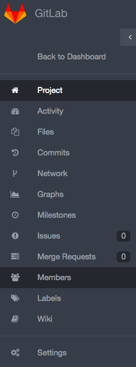
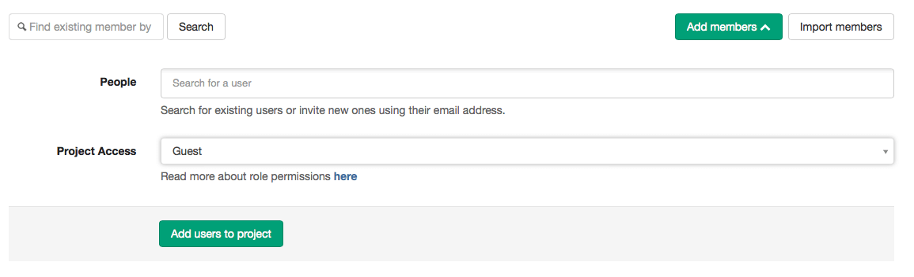

# Project users

You can manage the groups and users and their access levels in all of your projects. You can also personalize the access level you give each user, per project.

Here's how to add or import users to your projects.

You should have 'master' or 'owner' permissions to add or import a new user
to your project.

To add or import a user, go to your project and click on "Members" on the left side of your screen:

Select "Add members" or "Import members" on the right side of your screen:

If you are adding a user, select the user and the [permission level](doc/permissions/permissions.md) that you'd like to
give the user:

If you are importing a user, follow the steps to select the project where you'd like to import the user from:

