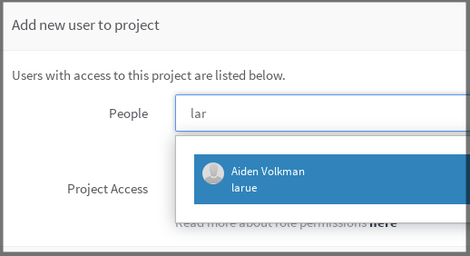
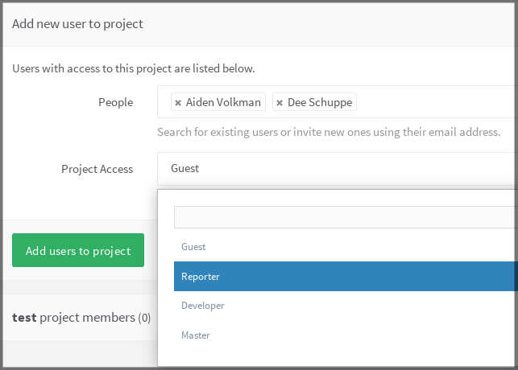
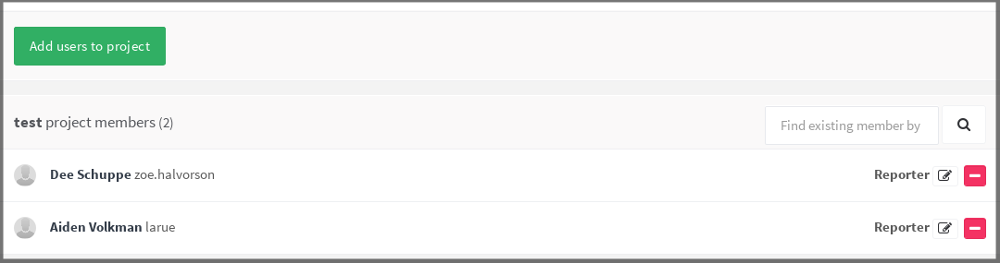
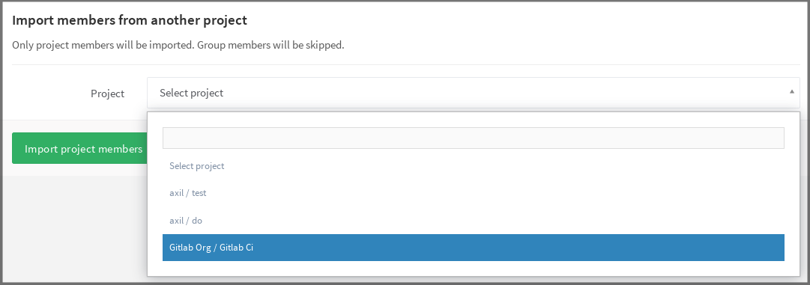
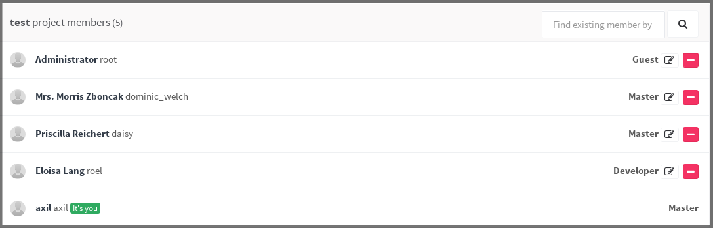
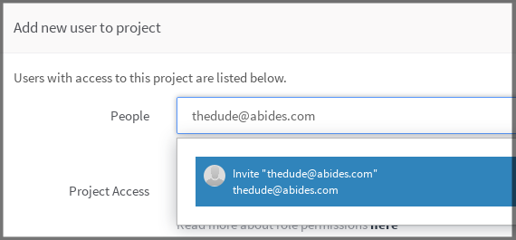
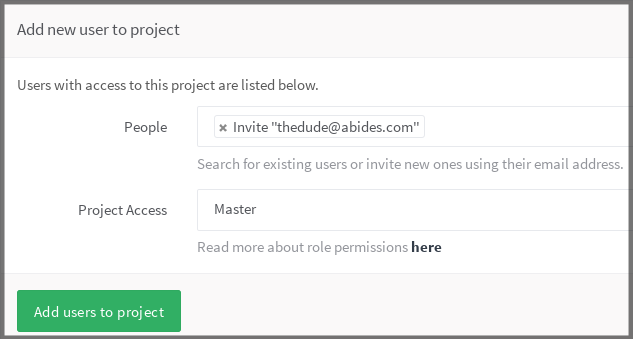
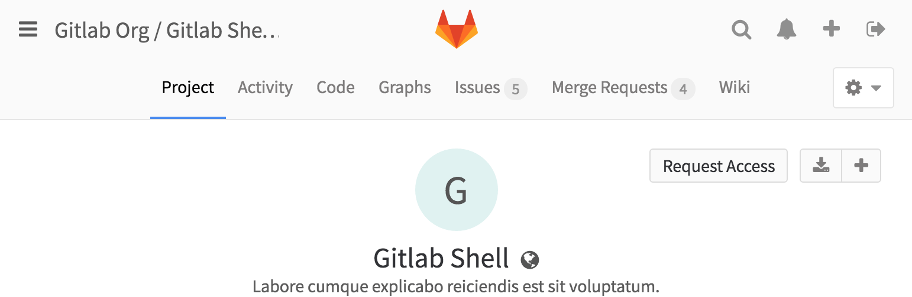
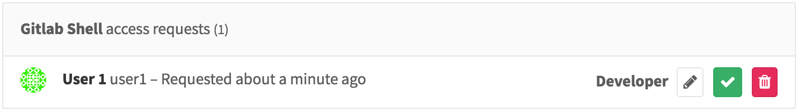
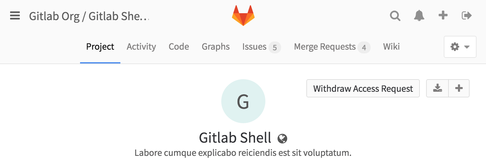

# Project users

You can manage the groups and users and their access levels in all of your
projects. You can also personalize the access level you give each user,
per-project.

You should have `master` or `owner` permissions to add or import a new user
to your project.

The first step to add or import a user, go to your project and click on
**Members** in the drop-down menu on the right side of your screen.

---

## Add a user

Right next to **People**, start typing the name or username of the user you
want to add.

---

Select the user and the [permission level](../../user/permissions.md)
that you'd like to give the user. Note that you can select more than one user.

---

Once done, hit **Add users to project** and they will be immediately added to
your project with the permissions you gave them above.

---

From there on, you can either remove an existing user or change their access
level to the project.

## Import users from another project

You can import another project's users in your own project by hitting the
**Import members** button on the upper right corner of the **Members** menu.

In the dropdown menu, you can see only the projects you are Master on.

---

Select the one you want and hit **Import project members**. A flash message
notifying you that the import was successful will appear, and the new members
are now in the project's members list. Notice that the permissions that they
had on the project you imported from are retained.

---

## Invite people using their e-mail address

If a user you want to give access to doesn't have an account on your GitLab
instance, you can invite them just by typing their e-mail address in the
user search field.

---

As you can imagine, you can mix inviting multiple people and adding existing
GitLab users to the project.

---

Once done, hit **Add users to project** and watch that there is a new member
with the e-mail address we used above. From there on, you can resend the
invitation, change their access level or even delete them.

---

Once the user accepts the invitation, they will be prompted to create a new
GitLab account using the same e-mail address the invitation was sent to.

## Request access to a project

As a project owner you can enable or disable non members to request access to
your project. Go to the project settings and click on **Allow users to request access**.

As a user, you can request to be a member of a project. Go to the project you'd
like to be a member of, and click the **Request Access** button on the right
side of your screen.

---

Project owners & masters will be notified of your request and will be able to approve or
decline it on the members page.

---

If you change your mind before your request is approved, just click the
**Withdraw Access Request** button.

