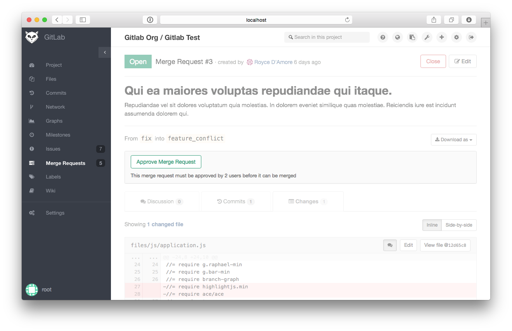

# Approval for merge requests

Usually you accept merge request if it is ready and reviewed. But in certain 
cases you want to be sure that every merge request will be reviewed by several 
people before it gets merged. You can use GitLab approve feature for enforcing such 
workflow. To enable it you should go to project settings page and set 
"Approvals required" field to numeric value. For example if you set it to number 3 
that means each merge request should receive 3 approves from different people 
before it can be merged via user interface.

After you set approves value you can see on merge request page "Approve" button
instead of "Accept" one. As soon as merge request get enough approvals it will 
be available for merge with user interface.

