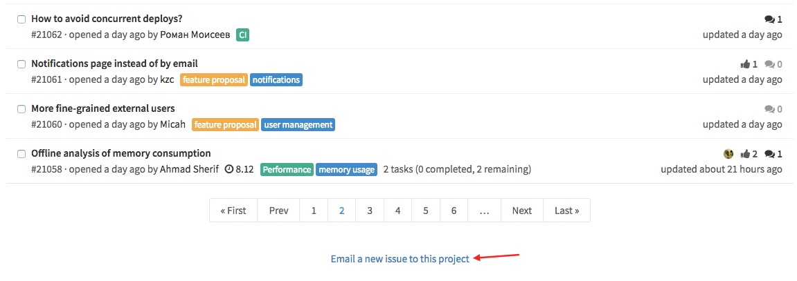
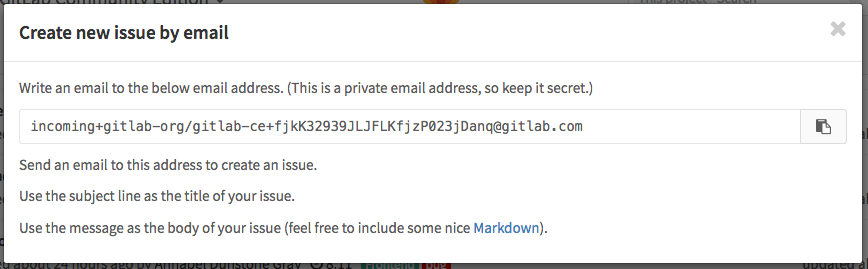
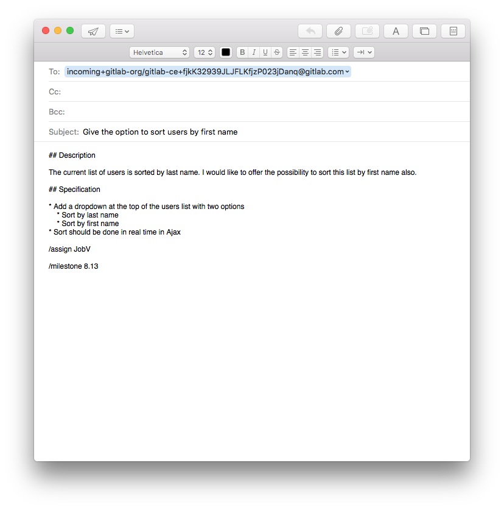

# Create an issue by email

>**Note:**
Introduced in GitLab 8.11.

You can create a new issue by email. In your project, at the bottom of the
Issues list, locate the `Email a new issue to this project` link.

This link opens a popup containing instructions on how to create an issue by
email.

The email address is unique to the project and to you, so GitLab can properly
identify you as the author of the issue.

The subject line of your email will be the title of the issue, whereas the
message will be the body of your issue. You can use markdown in your email to
format the message, as well as [slash commands](slash_commands.md).

