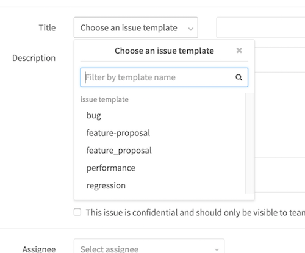

# Description templates

Description templates allow you to define context-specific templates for issue and merge request description fields for your project. When in use, users that create a new issue or merge request can select a description template to help them communicate with other contributors effectively.

Every GitLab project can define its own set of description templates as they are added to the root directory of a GitLab project's repository.

Description templates are written in markdown _(`.md`)_ and stored in your projects repository under the `/.gitlab/issue_templates/` and `/.gitlab/merge_request_templates/` directories.

_Example:_
`/.gitlab/issue_templates/bug.md` will enable the `bug` dropdown option for new issues. When `bug` is selected, the content from the `bug.md` template file will be copied to the issue description field.
