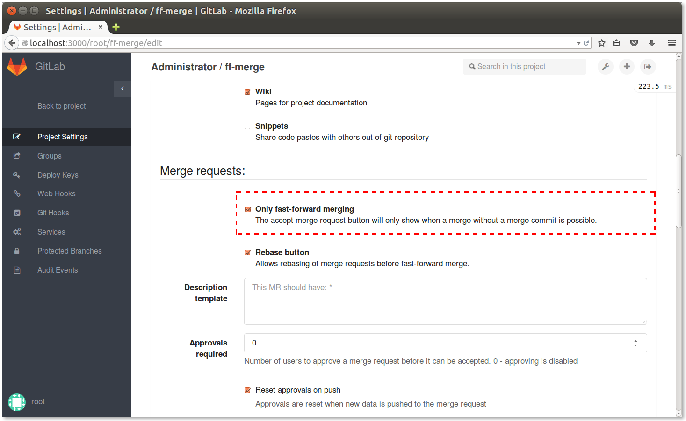

# Fast-forward merge

GitLab Enterprise Edition offers a way to accept merge requests without creating merge commits.
If you prefer a linear git history, this might be a good feature for you.
You can configure this on a per-project basis by navigating to the project settings page and selecting the **Only fast-forward merging** checkbox.

Now when you visit the merge request page, you will be able to accept it only if a fast-forward merge is possible.
If the target branch is ahead of the source branch, you need to rebase the source branch before you will be able to do a fast-forward merge.

For simple rebase operations, you can use the [Rebase before merge](rebase_before_merge.md) feature.
