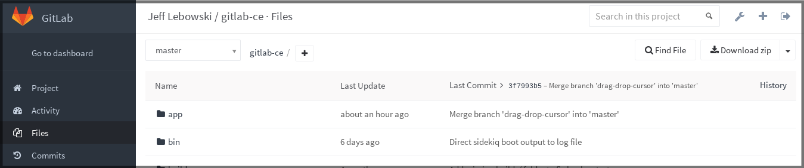
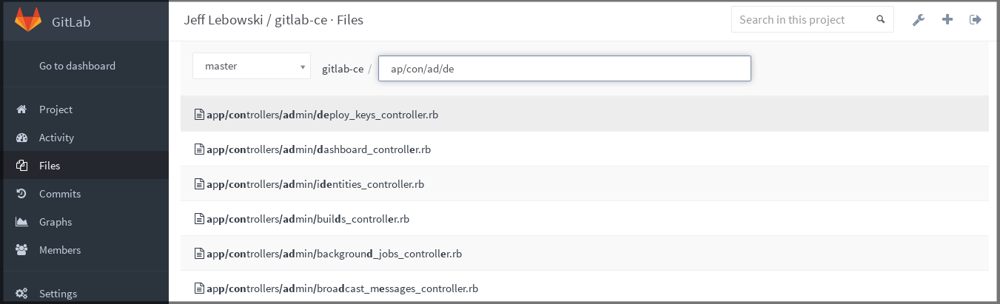

# File finder

> [Introduced][gh-9889] in GitLab 8.4.

---

The file finder feature allows you to quickly shortcut your way when you are
searching for a file in a repository using the GitLab UI.

You can find the **Find File** button when in the **Files** section of a
project.

---

For those who prefer to keep their fingers on the keyboard, there is a
[shortcut button](shortcuts.md) as well, which you can invoke from _anywhere_
in a project.

Press `t` to launch the File search function when in **Issues**,
**Merge requests**, **Milestones**, even the project's settings.

Start typing what you are searching for and watch the magic happen. With the
up/down arrows, you go up and down the results, with `Esc` you close the search
and go back to **Files**.

## How it works

The File finder feature is powered by the [Fuzzy filter] library.

It implements a fuzzy search with highlight, and tries to provide intuitive
results by recognizing patterns that people use while searching.

For example, consider the [GitLab CE repository][ce] and that we want to open
the `app/controllers/admin/deploy_keys_controller.rb` file.

Using fuzzy search, we start by typing letters that get us closer to the file.

**Protip:** To narrow down your search, include `/` in your search terms.

[gh-9889]: https://github.com/gitlabhq/gitlabhq/pull/9889 "File finder pull request"
[fuzzy filter]: https://github.com/jeancroy/fuzzaldrin-plus "fuzzaldrin-plus on GitHub"
[ce]: https://gitlab.com/gitlab-org/gitlab-ce/tree/master "GitLab CE repository"
