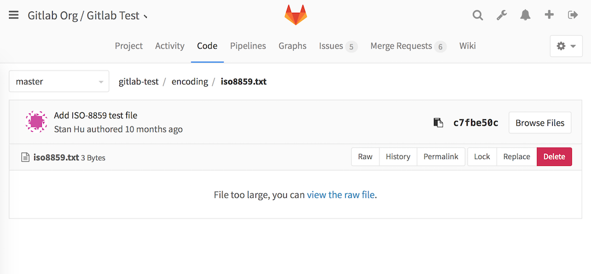
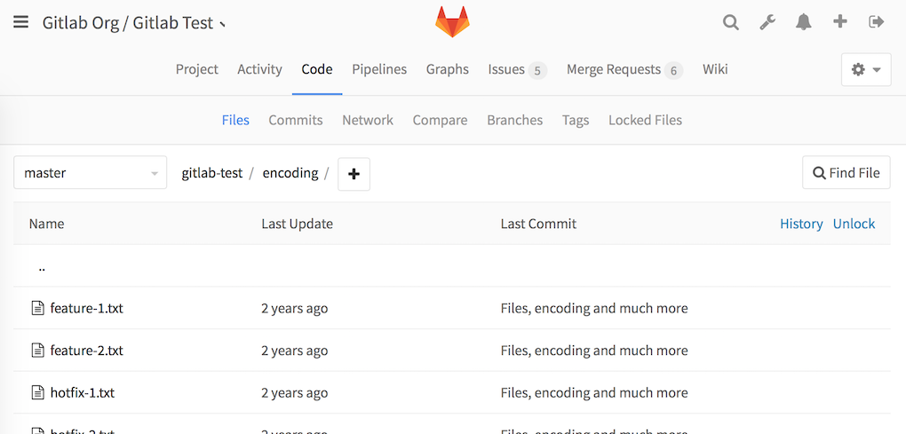
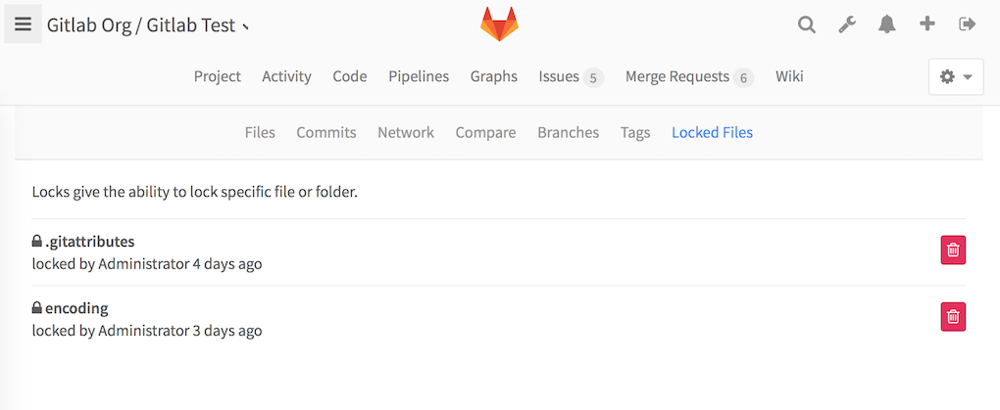

# File Lock

>**Note:**
This feature was [introduced][ee-440] in GitLab 8.9.

---

GitLab enables us to lock any file or path in repository tree. If you have a lock
then you are the only one who can push changes to the repository where locked objects are changed.
Locks can be created by any person who has access to push the code; i.e., developer and higher level.
The user with master permissions level can remove any lock, no matter who is the author of the lock.

## Locking

To lock any file or folder open it in GitLab Code viewer and you will see appropriate link or button

---

## Viewing/Managing existing locks

To view or manage every existing lock go to the **Project > Code > Locked Files** section.

---
## License note

To activate this feature you have to have a license with the "File Lock" option enabled.

---

[ee-440]: https://gitlab.com/gitlab-org/gitlab-ee/merge_requests/440 "File Lock"
