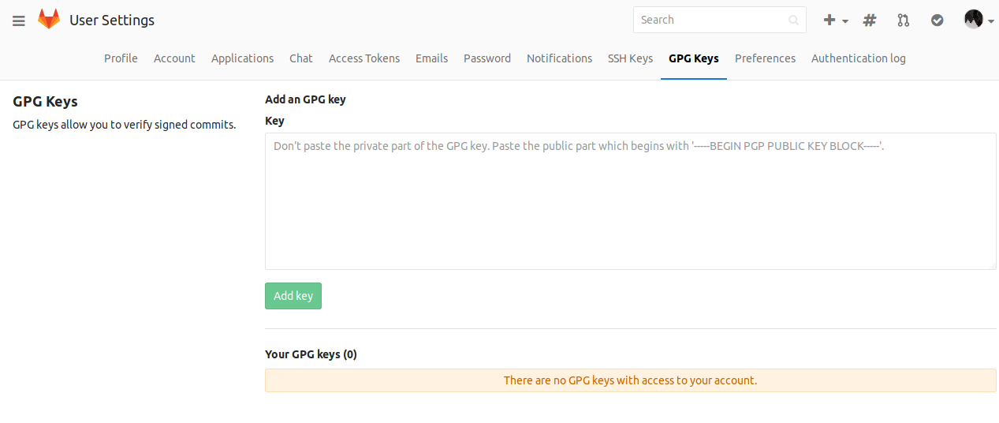
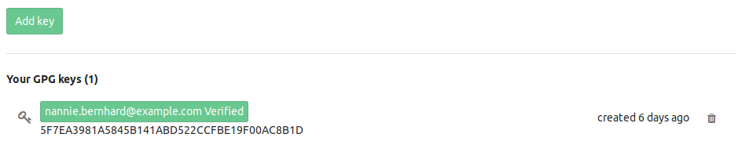
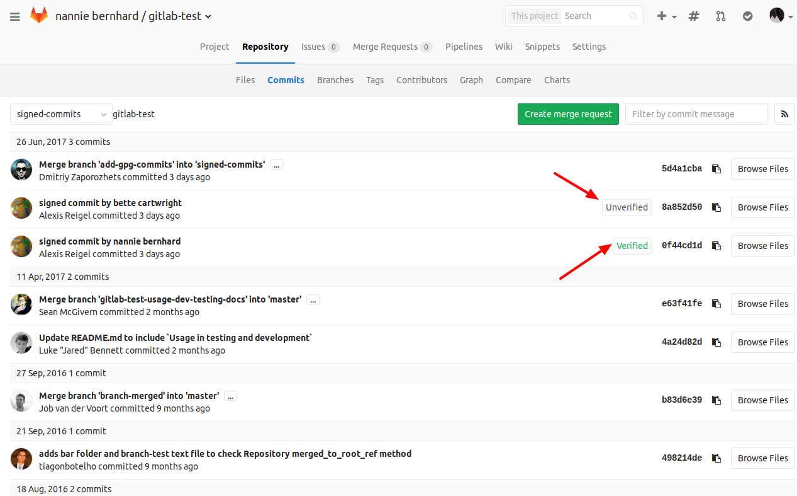
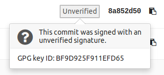

# Signing commits with GPG

## Getting started

- [Git Tools - Signing Your Work](https://git-scm.com/book/en/v2/Git-Tools-Signing-Your-Work)

## How GitLab handles GPG

GitLab uses its own keyring to verify the GPG signature. It does not access any
public key server.

In order to have a commit verified on GitLab the corresponding public key needs
to be uploaded to GitLab.

For a signature to be verified two prerequisites need to be met:

1. The public key needs to be added to GitLab
1. One of the emails in the GPG key matches your **primary** email

## Add a GPG key

1. On the upper right corner, click on your avatar and go to your **Settings**.

    

1. Navigate to the **GPG keys** tab.

    

1. Paste your **public** key in the 'Key' box.

    

1. Finally, click on **Add key** to add it to GitLab. You will be able to see
   its fingerprint, the corresponding email address and creation date.

    

>**Note:**
Once you add a key, you cannot edit it, only remove it. In case the paste
didn't work, you will have to remove the offending key and re-add it.

## Verifying commits

1. Within a project navigate to the **Commits** tag. Signed commits will show a
   badge containing either "Verified" or "Unverified", depending on the
   verification status of the GPG signature.

    

1. By clicking on the GPG badge details of the signature are displayed.

    

    
