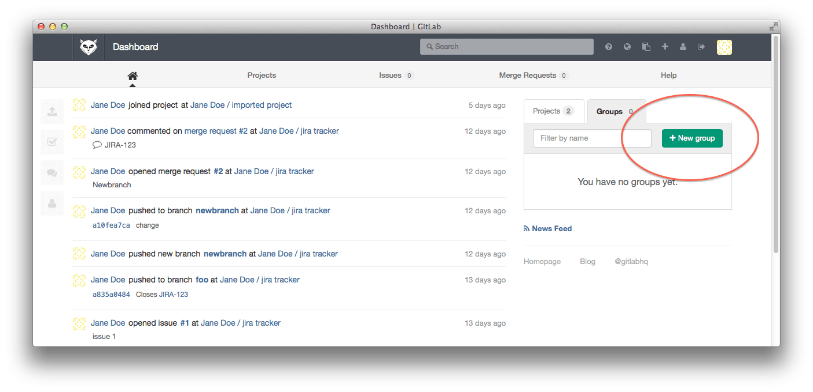
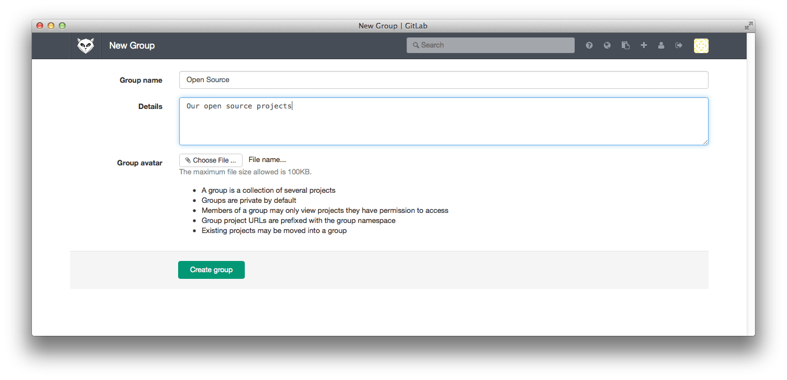
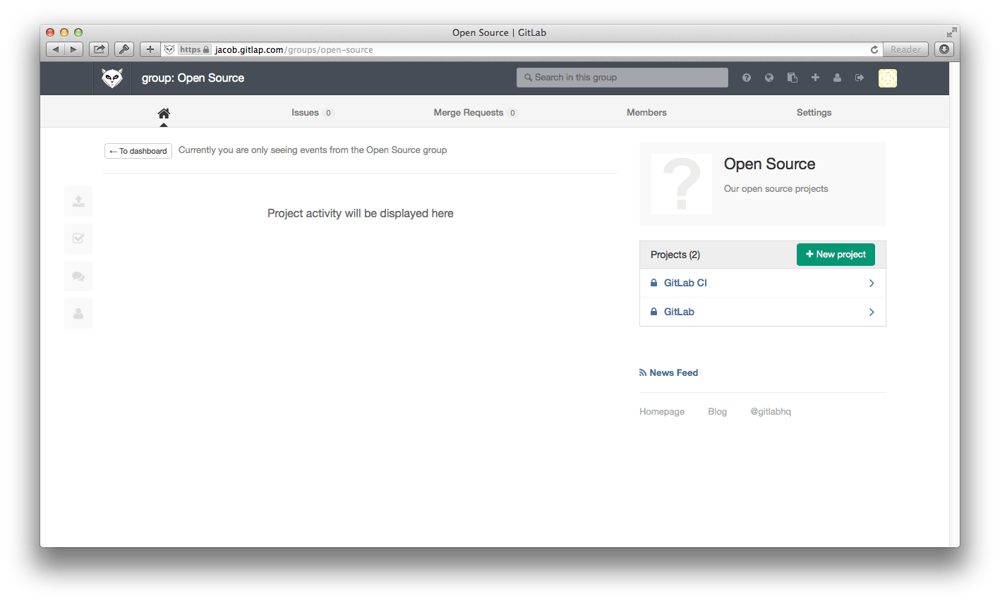
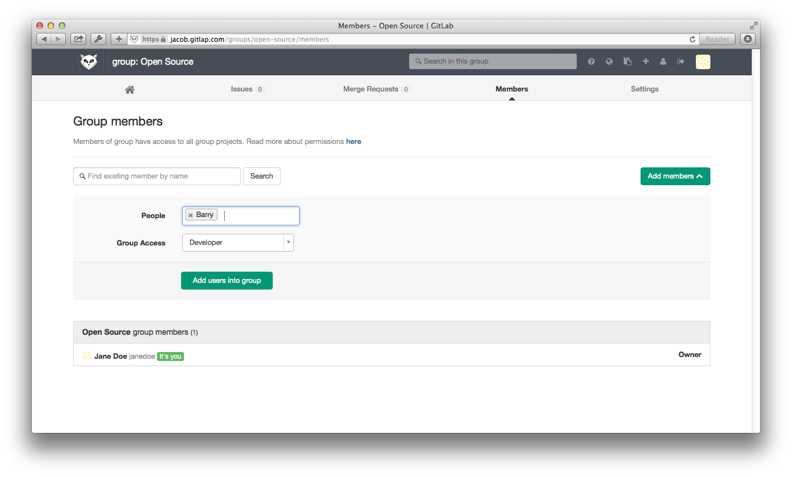
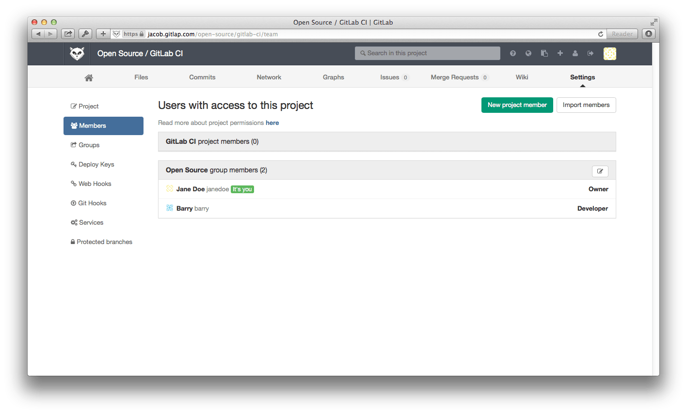
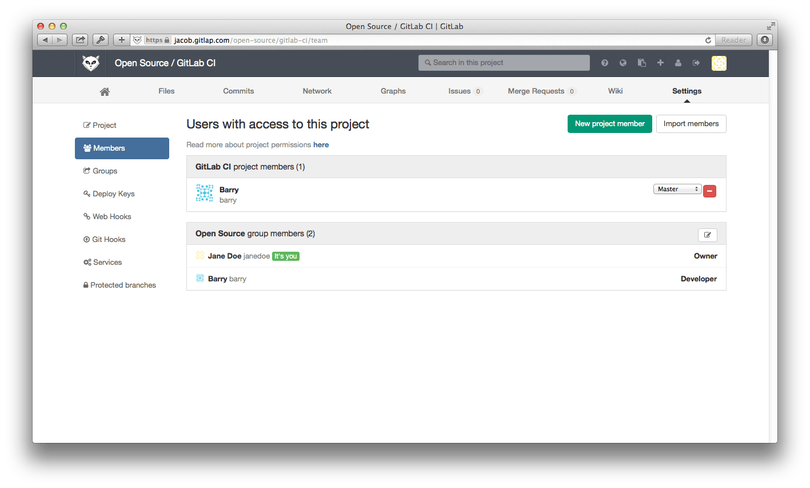
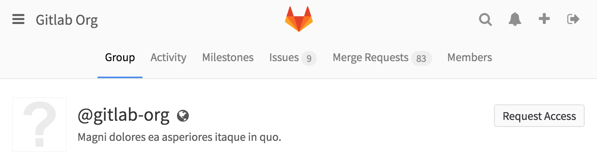
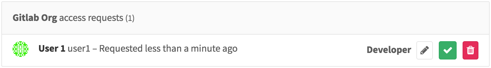
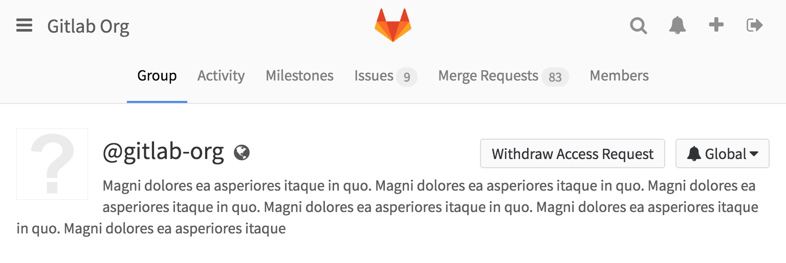

# GitLab Groups

GitLab groups allow you to group projects into directories and give users to several projects at once.

When you create a new project in GitLab, the default namespace for the project is the personal namespace associated with your GitLab user.
In this document we will see how to create groups, put projects in groups and manage who can access the projects in a group.

## Creating groups

You can create a group by going to the 'Groups' tab of the GitLab dashboard and clicking the 'New group' button.



Next, enter the name (required) and the optional description and group avatar.



When your group has been created you are presented with the group dashboard feed, which will be empty.


You can use the 'New project' button to add a project to the new group.

## Transferring an existing project into a group

You can transfer an existing project into a group you own from the project settings page.
First scroll down to the 'Dangerous settings' and click 'Show them to me'.
Now you can pick any of the groups you manage as the new namespace for the group.


GitLab administrators can use the admin interface to move any project to any namespace if needed.

## Adding users to a group

One of the benefits of putting multiple projects in one group is that you can give a user to access to all projects in the group with one action.

Suppose we have a group with two projects.



On the 'Group Members' page we can now add a new user Barry to the group.



Now because Barry is a 'Developer' member of the 'Open Source' group, he automatically gets 'Developer' access to all projects in the 'Open Source' group.



If necessary, you can increase the access level of an individual user for a specific project, by adding them as a Member to the project.



## Requesting access to a group

As a group owner you can enable or disable non members to request access to
your group. Go to the group settings and click on **Allow users to request access**.

As a user, you can request to be a member of a group. Go to the group you'd
like to be a member of, and click the **Request Access** button on the right
side of your screen.



---

Group owners & masters will be notified of your request and will be able to approve or
decline it on the members page.



---

If you change your mind before your request is approved, just click the
**Withdraw Access Request** button.



## Managing group memberships via LDAP

In GitLab Enterprise Edition it is possible to manage GitLab group memberships using LDAP groups.
See [the GitLab Enterprise Edition documentation](http://docs.gitlab.com/ee/integration/ldap.html) for more information.

## Allowing only admins to create groups

By default, any GitLab user can create new groups.
This ability can be disabled for individual users from the admin panel.
It is also possible to configure GitLab so that new users default to not being able to create groups:

```
# For omnibus-gitlab, put the following in /etc/gitlab/gitlab.rb
gitlab_rails['gitlab_default_can_create_group'] = false

# For installations from source, uncomment the 'default_can_create_group'
# line in /home/git/gitlab/config/gitlab.yml
```
