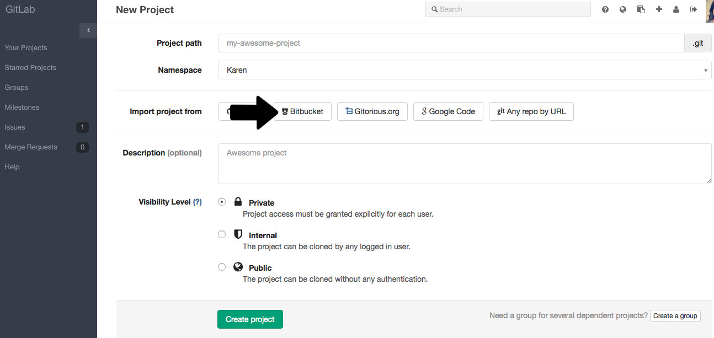
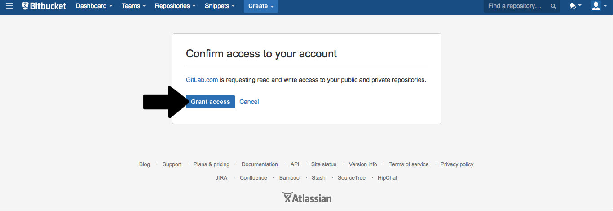
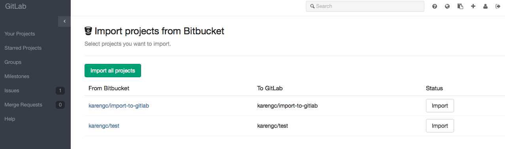

# Import your project from Bitbucket to GitLab

It takes just a few steps to import your existing Bitbucket projects to GitLab. But keep in mind that it is possible only if Bitbucket support is enabled on your GitLab instance. You can read more about Bitbucket support [here](doc/integration/bitbucket.md).

1. Sign in to GitLab.com and go to your dashboard

2. Click on "New project"

3. Click on the "Bitbucket" button

4. Grant GitLab access to your Bitbucket account

5. Click on the projects that you'd like to import or "Import all projects"

A new GitLab project will be created with your imported data.
