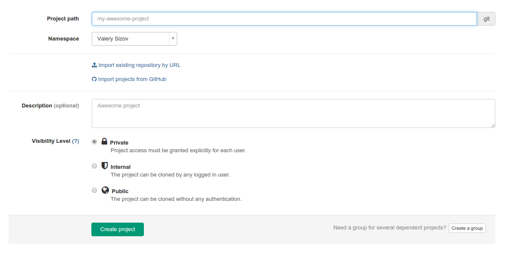

# Project importing from GitHub to GitLab

You can import your existing GitHub projects to GitLab. But keep in mind that it is possible only if
GitHub support is enabled on your GitLab instance. You can read more about GitHub support [here](http://doc.gitlab.com/ce/integration/github.html)
To get to the importer page you need to go to "New project" page.

 

Click on the "Import project from GitHub" link and you will be redirected to GitHub for permission to access your projects. After accepting, you'll be automatically redirected to the importer.

To import a project, you can simple click "Add". The importer will import your repository and issues. Once the importer is done, a new GitLab project will be created with your imported data.