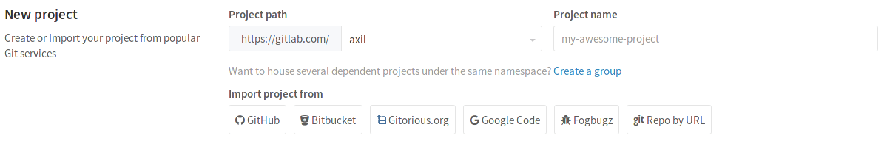
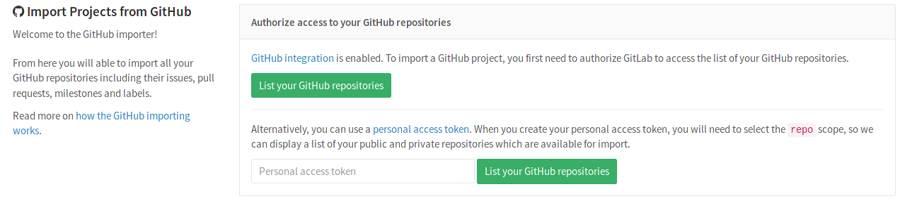
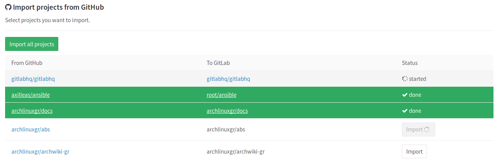

# Import your project from GitHub to GitLab

Import your projects from GitHub to GitLab with minimal effort.

## Overview

>**Note:**
If you are an administrator you can enable the [GitHub integration][gh-import]
in your GitLab instance sitewide. This configuration is optional, users will be
able import their GitHub repositories with a [personal access token][gh-token].

- At its current state, GitHub importer can import:
  - the repository description (GitLab 7.7+)
  - the Git repository data (GitLab 7.7+)
  - the issues (GitLab 7.7+)
  - the pull requests (GitLab 8.4+)
  - the wiki pages (GitLab 8.4+)
  - the milestones (GitLab 8.7+)
  - the labels (GitLab 8.7+)
  - the release note descriptions (GitLab 8.12+)
- References to pull requests and issues are preserved (GitLab 8.7+)
- Repository public access is retained. If a repository is private in GitHub
  it will be created as private in GitLab as well.

## How it works

When issues/pull requests are being imported, the GitHub importer tries to find
the GitHub author/assignee in GitLab's database using the GitHub ID. For this
to work, the GitHub author/assignee should have signed in beforehand in GitLab
and [**associated their GitHub account**][social sign-in]. If the user is not
found in GitLab's database, the project creator (most of the times the current
user that started the import process) is set as the author, but a reference on
the issue about the original GitHub author is kept.

The importer will create any new namespaces (groups) if they don't exist or in
the case the namespace is taken, the repository will be imported under the user's
namespace that started the import process.

## Importing your GitHub repositories

The importer page is visible when you create a new project.

Click on the **GitHub** link and the import authorization process will start.
There are two ways to authorize access to your GitHub repositories:

1. [Using the GitHub integration][gh-integration] (if it's enabled by your
   GitLab administrator). This is the preferred way as it's possible to
   preserve the GitHub authors/assignees. Read more in the [How it works](#how-it-works)
   section.
1. [Using a personal access token][gh-token] provided by GitHub.

### Authorize access to your repositories using the GitHub integration

If the [GitHub integration][gh-import] is enabled by your GitLab administrator,
you can use it instead of the personal access token.

1. First you may want to connect your GitHub account to GitLab in order for
   the username mapping to be correct. Follow the [social sign-in] documentation
   on how to do so.
1. Once you connect GitHub, click the **List your GitHub repositories** button
   and you will be redirected to GitHub for permission to access your projects.
1. After accepting, you'll be automatically redirected to the importer.

You can now go on and [select which repositories to import](#select-which-repositories-to-import).

### Authorize access to your repositories using a personal access token

>**Note:**
For a proper author/assignee mapping for issues and pull requests, the
[GitHub integration][gh-integration] should be used instead of the
[personal access token][gh-token]. If the GitHub integration is enabled by your
GitLab administrator, it should be the preferred method to import your repositories.
Read more in the [How it works](#how-it-works) section.

If you are not using the GitHub integration, you can still perform a one-off
authorization with GitHub to grant GitLab access your repositories:

1. Go to <https://github.com/settings/tokens/new>.
1. Enter a token description.
1. Check the `repo` scope.
1. Click **Generate token**.
1. Copy the token hash.
1. Go back to GitLab and provide the token to the GitHub importer.
1. Hit the **List your GitHub repositories** button and wait while GitLab reads
   your repositories' information. Once done, you'll be taken to the importer
   page to select the repositories to import.

### Select which repositories to import

After you've authorized access to your GitHub repositories, you will be
redirected to the GitHub importer page.

From there, you can see the import statuses of your GitHub repositories.

- Those that are being imported will show a _started_ status,
- those already successfully imported will be green with a _done_ status,
- whereas those that are not yet imported will have an **Import** button on the
  right side of the table.

If you want, you can import all your GitHub projects in one go by hitting
**Import all projects** in the upper left corner.

---

You can also choose a different name for the project and a different namespace,
if you have the privileges to do so.

[gh-import]: ../../integration/github.md "GitHub integration"
[new-project]: ../../gitlab-basics/create-project.md "How to create a new project in GitLab"
[gh-integration]: #authorize-access-to-your-repositories-using-the-github-integration
[gh-token]: #authorize-access-to-your-repositories-using-a-personal-access-token
[social sign-in]: ../../profile/account/social_sign_in.md
