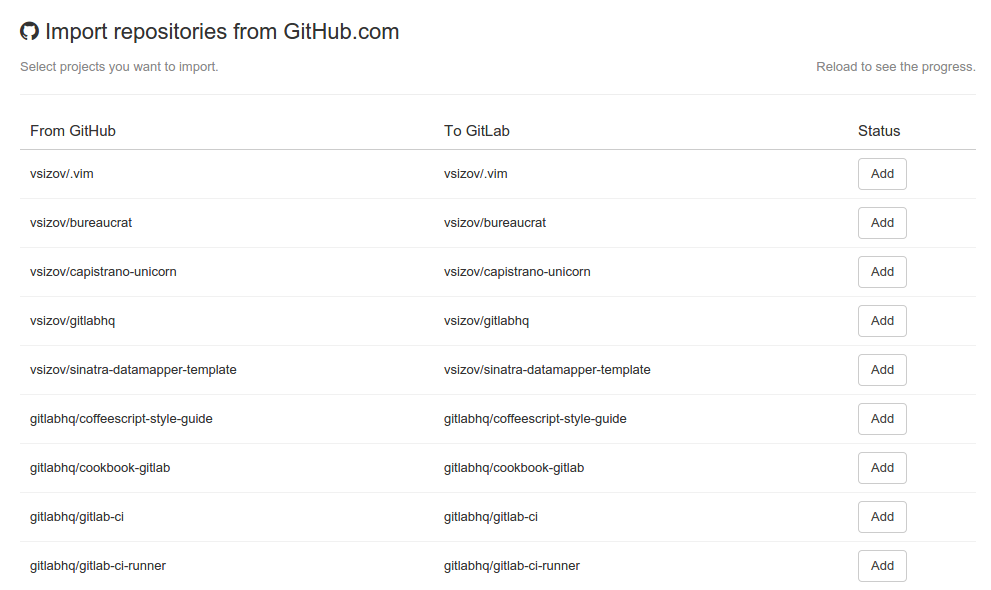

# Import your project from GitHub to GitLab

It takes just a couple of steps to import your existing GitHub projects to GitLab. Keep in mind that it is possible only if
GitHub support is enabled on your GitLab instance. You can read more about GitHub support [here](http://doc.gitlab.com/ce/integration/github.html)

If you want to import from a GitHub Enterprise instance, you need to use GitLab Enterprise; please see the [EE docs for the GitHub integration](http://doc.gitlab.com/ee/integration/github.html).

* Sign in to GitLab.com and go to your dashboard.
* To get to the importer page, you need to go to the "New project" page.

* Click on the "Import project from GitHub" link and you will be redirected to GitHub for permission to access your projects. After accepting, you'll be automatically redirected to the importer.

* To import a project, you can simple click "Add". The importer will import your repository and issues. Once the importer is done, a new GitLab project will be created with your imported data.

### Note
When you import your projects from GitHub, it is not possible to keep your labels and milestones. We are working on improving this in the near future.
