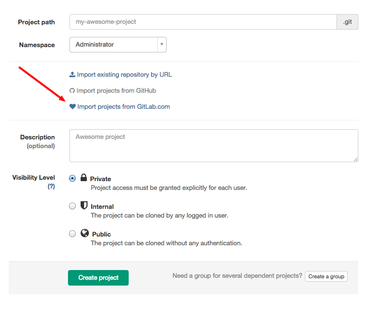
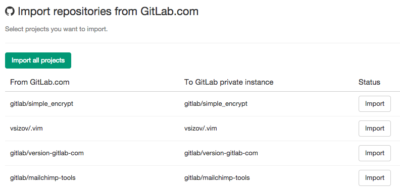

# Project importing from GitLab.com to your private GitLab instance

You can import your existing GitLab.com projects to your GitLab instance. But keep in mind that it is possible only if
GitLab support is enabled on your GitLab instance. 
You can read more about GitLab support [here](http://docs.gitlab.com/ce/integration/gitlab.html)
To get to the importer page you need to go to "New project" page.

Click on the "Import projects from GitLab.com" link and you will be redirected to GitLab.com
for permission to access your projects. After accepting, you'll be automatically redirected to the importer.

To import a project, you can simple click "Import". The importer will import your repository and issues. 
Once the importer is done, a new GitLab project will be created with your imported data.