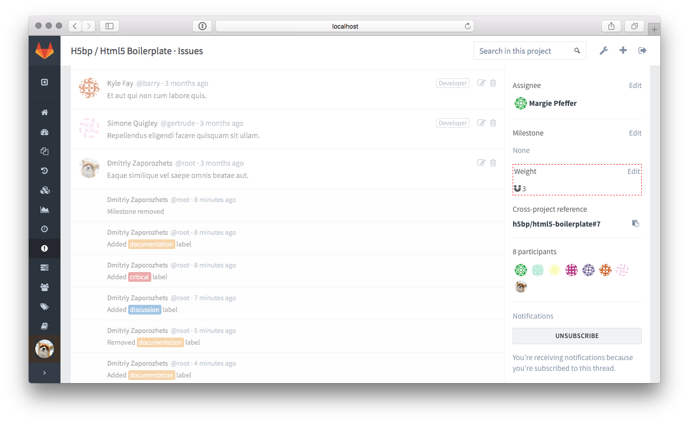

# Issue Weight **[STARTER]**

> [Introduced](https://gitlab.com/gitlab-org/gitlab-ee/merge_requests/76)
in [GitLab Starter](https://about.gitlab.com/products/) 8.3.

When you have a lot of issues, it can be hard to get an overview.
By adding a weight to each issue, you can get a better idea of how much time,
value or complexity a given issue has or will cost.

You can set the weight of an issue during its creation, by simply changing the
value in the dropdown menu. You can set it to a numeric value from 1 to 9.

This value will appear on the right sidebar of an individual issue, as well as
in the issues page next to a distinctive balance scale icon.

As an added bonus, you can see the total sum of all issues on the milestone page.

