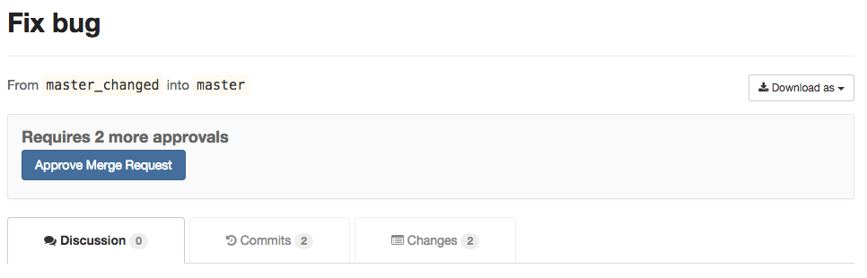
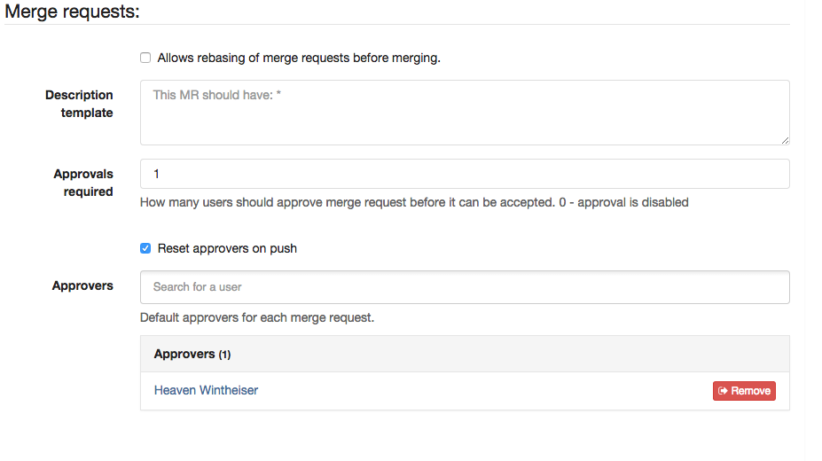
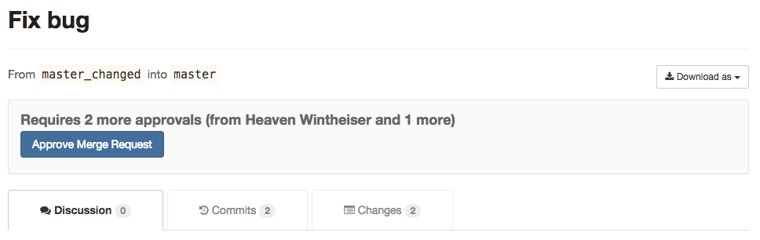
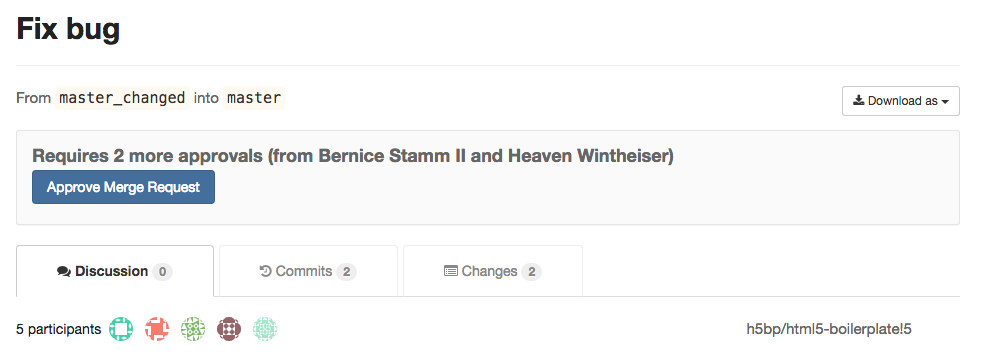
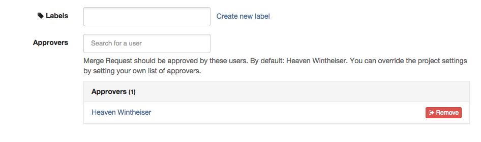

# Merge Request Approvals

If you want to make sure every merge request is approved by one or more
people, you can enforce this workflow by using merge request approvals.
Merge request approvals allow you to set the number of necessary approvals
and predefine a list of approvers that will need to approve every
merge request in a project.

## Configuring Approvals

You can configure the approvals in the project settings, under merge requests.

To enable it, set **Approvals required** to 1 or higher.

### Approvals Required

This sets the amount of approvals required before being able to merge a merge request.
At 0, this disables the feature. Any value above requires that amount of different
users to approve the merge request.

### Reset approvals on push

With this setting turned on, approvals are reset when a new push
is done to the merge request branch.

Turn "Reset approvals on push" off if you want approvals to persist,
independent of changes to the merge request.

### Approvers

At approvers you can define the default set of users that need to approve a
merge request. The author of a merge request cannot be set as an approver for
that merge request.

If there are more approvers than required approvals, any subset of these users
can approve the merge request.

If there are less approvers than required approvals, all the set approvers plus
any other user(s) need to approve the merge request before being able to merge it.

If the approvers are equal to the amount of required approvals, all the approvers are
required to approve merge requests.

Note that approvers can be changed during merge request creation.

## Using Approvals

After configuring Approvals, you will see the following during merge request creation.

You can change the default set of approvers and the amount of required approvals
before creating the merge request. The amount of required approvals, if changed,
must be greater than the default set at the project level. This ensures that
you're not forced to adjust settings when someone is unavailable for approval,
yet the process is still enforced.

To approve a merge request, simply press the button.

