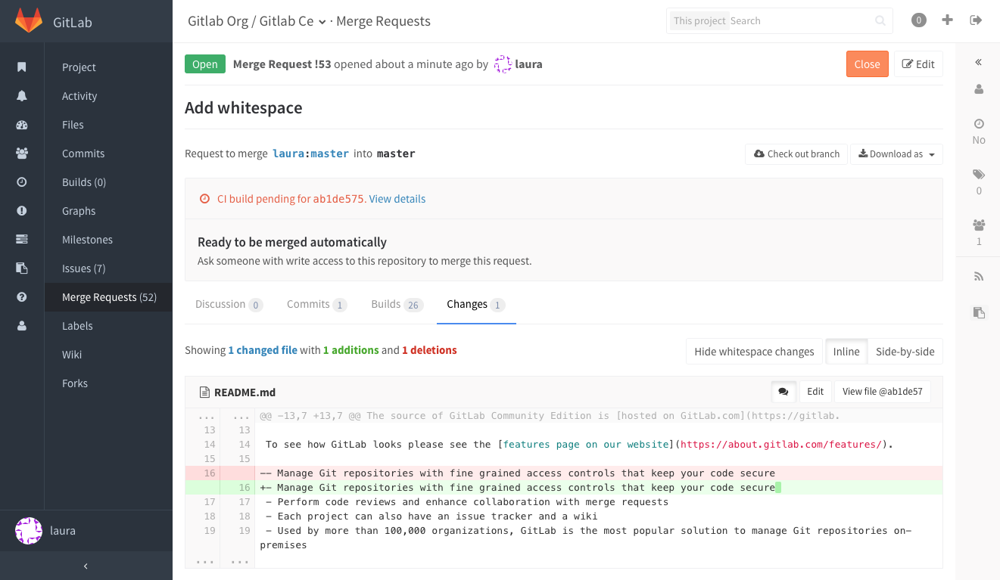
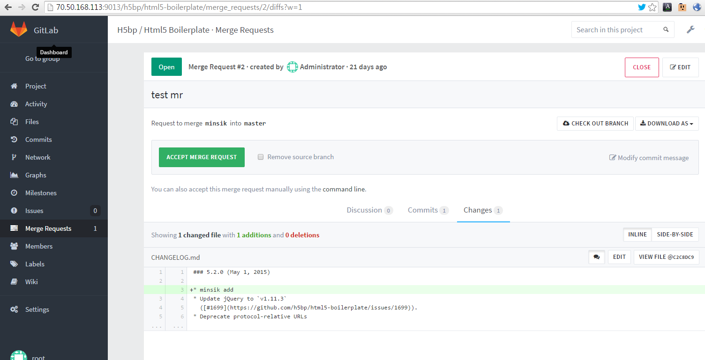
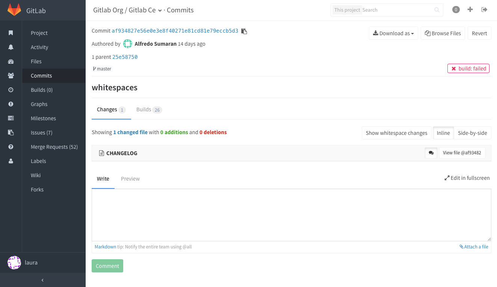

# Merge Requests

Merge requests allow you to exchange changes you made to source code

## Checkout merge requests locally

Locate the section for your GitLab remote in the `.git/config` file. It looks like this:

```
[remote "origin"]
  url = https://gitlab.com/gitlab-org/gitlab-ce.git
  fetch = +refs/heads/*:refs/remotes/origin/*
```

Now add the line `fetch = +refs/merge-requests/*/head:refs/remotes/origin/merge-requests/*` to this section. 

It should looks like this: 

```
[remote "origin"]
  url = https://gitlab.com/gitlab-org/gitlab-ce.git
  fetch = +refs/heads/*:refs/remotes/origin/*
  fetch = +refs/merge-requests/*/head:refs/remotes/origin/merge-requests/*
```

Now you can fetch all the merge requests requests:

```
$ git fetch origin
From https://gitlab.com/gitlab-org/gitlab-ce.git
 * [new ref]         refs/merge-requests/1/head -> origin/merge-requests/1
 * [new ref]         refs/merge-requests/2/head -> origin/merge-requests/2
...
```

To check out a particular merge request:

```
$ git checkout origin/merge-requests/1
```

## Ignore whitespace changes in Merge Request diff view



It you add `w=1` option to URL, you can see diff without whitespace changes.



It is also working on commits compare view.


