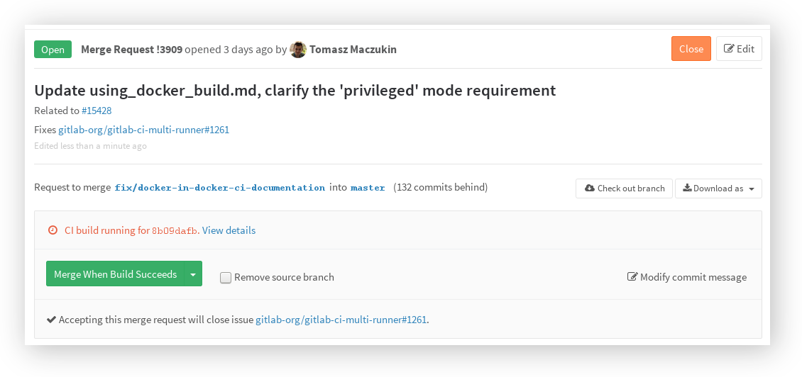
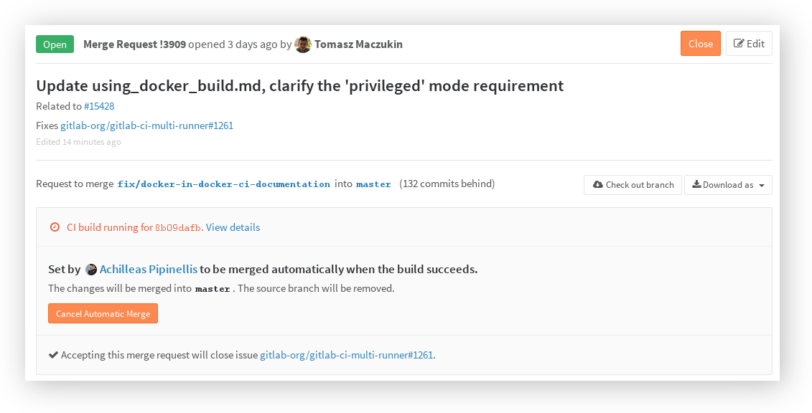
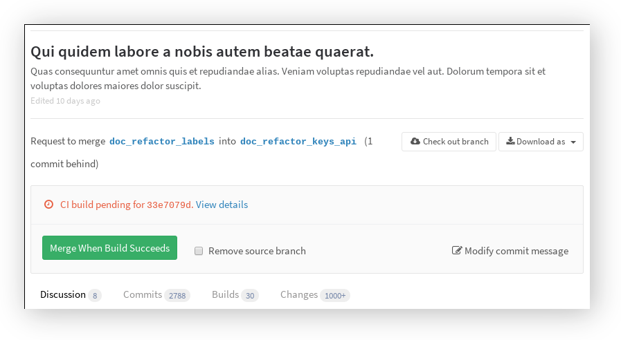
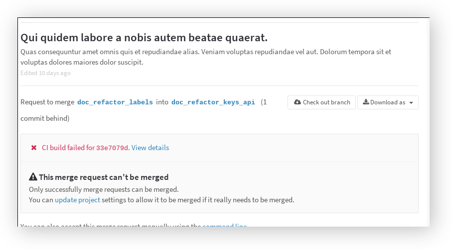

# Merge When Build Succeeds

>**Note:**
This feature was [introduced][ce-1729] in GitLab 8.3.

When reviewing a merge request that looks ready to merge but still has one or
more CI builds running, you can set it to be merged automatically when all
builds succeed. This way, you don't have to wait for the builds to finish and
remember to merge the request manually.

---

When you hit the "Merge When Build Succeeds" button, the status of the merge
request will be updated to represent the impending merge. If you cannot wait
for the build to succeed and want to merge immediately, this option is available
in the dropdown menu on the right of the main button.

Both team developers and the author of the merge request have the option to
cancel the automatic merge if they find a reason why it shouldn't be merged
after all.

---

When the build succeeds, the merge request will automatically be merged. When
the build fails, the author gets a chance to retry any failed builds, or to
push new commits to fix the failure.

When the builds are retried and succeed on the second try, the merge request
will automatically be merged after all.

In case new commits are pushed while the builds are still running, the automatic
merge is automatically canceled to allow the new changes to be reviewed.

## Only allow merge requests to be merged when the build succeeds

>**Note:**
This feature was [introduced][ce-3828] in GitLab 8.8.

To avoid accidental merges when the builds are failing, you have the option to
restrict merge requests from being merged when the builds have failed.
This option can be set at a project level, navigating to your project's
**Settings** under the "Merge requests" section.

When reviewing a merge request, if CI is running the user will only be able to merge it when success

When reviewing a merge request, if CI build failed the user won't be able to merge it.

[ce-1729]: https://gitlab.com/gitlab-org/gitlab-ce/merge_requests/1729
[ce-3828]: https://gitlab.com/gitlab-org/gitlab-ce/merge_requests/3828
