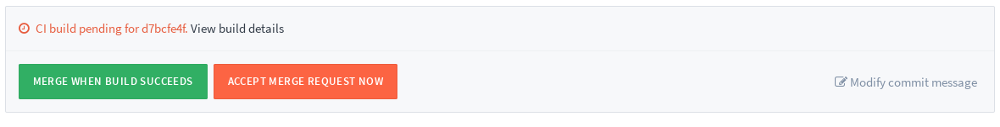
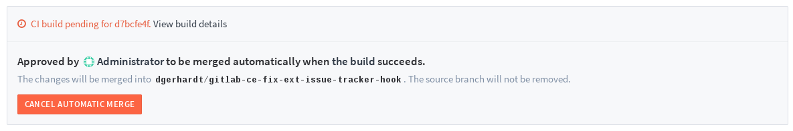

# Merge When Build Succeeds

Select a Merge Request to be merged if the build succeeds so the user does not have to wait for the build to finish and revisit the Merge Request to merge it after the build is done.

## Enabling for a Merge Request

Given an active build for a Merge Request, thus pending or running, a `Merge When Build Succeeds` button will appear to any user which can merge it. Once clicked, it ensures this merge request is merged when the build is successful.
When clicking the button, the merge parameters are also saved to allow the merge user to edit the commit message and remove the source branch if he can remove that branch.

When this feature is enabled, a message will appear to notify other users. Also a note is posted on the thread.

## Canceling

The automatic merge can be disabled by clicking the `Cancel Automatic Merge` button, or when a new commit is added to the Merge Request. In the former case a note is posted. In the latter case a user able to merge can enable the feature again.

A failed build does not reset the automatic build so a build can be retried.
