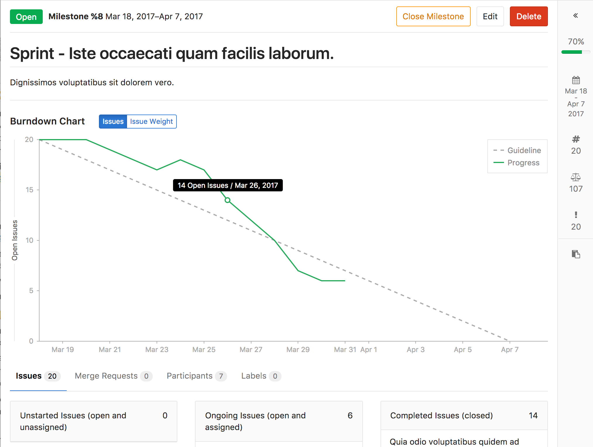

# Milestones

Milestones allow you to organize issues and merge requests into a cohesive group, optionally setting a due date.
A common use is keeping track of an upcoming software version. Milestones are created per-project.

## Groups and milestones

You can create a milestone for several projects in the same group simultaneously.
On the group's milestones page, you will be able to see the status of that milestone across all of the selected projects.

## Special milestone filters

In addition to the milestones that exist in the project or group, there are some
special options available when filtering by milestone:

* **No Milestone** - only show issues or merge requests without a milestone.
* **Upcoming** - show issues or merge request that belong to the next open
  milestone with a due date, by project. (For example: if project A has
  milestone v1 due in three days, and project B has milestone v2 due in a week,
  then this will show issues or merge requests from milestone v1 in project A
  and milestone v2 in project B.)
* **Started** - show issues or merge requests from any milestone with a start
  date less than today. Note that this can return results from several
  milestones in the same project.

## Burndown (EE-Only)

A burndown chart is available for every project milestone that has a set start date and a set due date. It is located on the project milestone page. It indicates project progress throughout that milestone (for issues that have that milestone assigned to it). In particular, it shows how many issues were or are still open for a given day in the milestone period. Since GitLab only tracks when an issue was last closed (and not its full history) the chart assumes that issue was open on days prior to that date. Reopened issues are considered as open on one day after it was closed. The burndown chart can also be toggled to display the cumulative open issue weight for a given day. When using this feature, make sure your weights have been properly assigned, since an open issue with no weight adds zero to the cumulative value.

Closed or reopened issues prior to GitLab 9.1 version won't have a `closed_at` value, so burndown considers it as closed on the milestone `start_date`. In that case a warning will be displayed.

