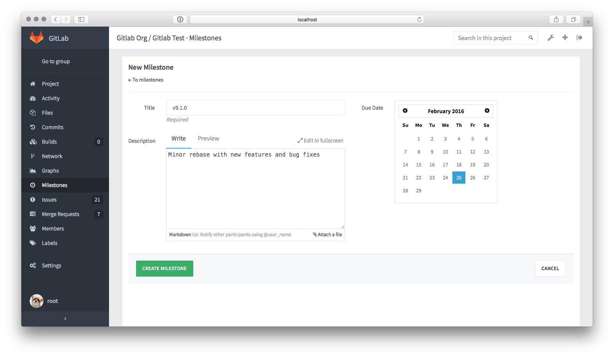

# Milestones

Milestones allow you to organize issues and merge requests into a cohesive group, optionally setting a due date. 
A common use is keeping track of an upcoming software version. Milestones are created per-project.

## Groups and milestones

You can create a milestone for several projects in the same group simultaneously. 
On the group's milestones page, you will be able to see the status of that milestone across all of the selected projects.

