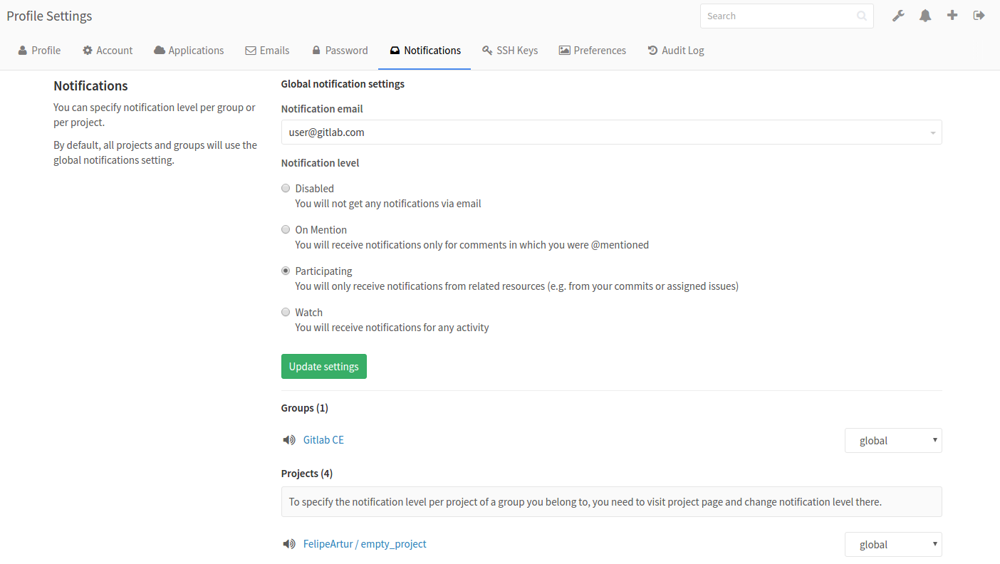

# GitLab Notifications

GitLab has notifications system in place to notify a user of events important for the workflow.

## Notification settings

Under user profile page you can find the notification settings.

Notification settings are divided into three groups:

* Global Settings
* Group Settings
* Project Settings

Each of these settings have levels of notification:

* Disabled - turns off notifications
* Participating - receive notifications from related resources
* Watch - receive notifications from projects or groups user is a member of
* Global - notifications as set at the global settings

#### Global Settings

Global Settings are at the bottom of the hierarchy.
Any setting set here will be overriden by a setting at the group or a project level.

Group or Project settings can use `global` notification setting which will then use
anything that is set at Global Settings.

#### Group Settings

Group Settings are taking presedence over Global Settings but are on a level below Project Settings.
This means that you can set a different level of notifications per group while still being able
to have a finer level setting per project.
Organization like this is suitable for users that belong to different groups but don't have the
same need for being notified for every group they are member of.

#### Project Settings

Project Settings are at the top level and any setting placed at this level will take presedence of any
other setting.
This is suitable for users that have different needs for notifications per project basis.

## Notification events

Below is the table of events users can be notified of:

| Event                        | Sent to                                                           | Settings level               |
|------------------------------|-------------------------------------------------------------------|------------------------------|
| New SSH key added            | User                                                              | Security email, always sent. |
| New email added              | User                                                              | Security email, always sent. |
| New user created             | User                                                              | Sent on user creation, except for omniauth (LDAP)|
| New issue created            | Issue assignee [1], project members [2]                           | [1] not disabled, [2] higher than participating |
| User added to project        | User                                                              | Sent when user is added to project |
| Project access level changed | User                                                              | Sent when user project access level is changed |
| User added to group          | User                                                              | Sent when user is added to group |
| Project moved                | Project members [1]                                               | [1] not disabled |
| Group access level changed   | User                                                              | Sent when user group access level is changed |
| Close issue                  | Issue author [1], issue assignee [2], project members [3]         | [1] [2] not disabled, [3] higher than participating |
| Reassign issue               | New issue assignee [1], old issue assignee [2]                    | [1] [2] not disabled |
| Reopen issue                 | Project members [1]                                               | [1] higher than participating |
| New merge request            | MR assignee [1]                                                   | [1] not disabled |
| Reassign merge request       | New MR assignee [1], old MR assignee [2]                          | [1] [2] not disabled |
| Close merge request          | MR author [1], MR assignee [2], project members [3]               | [1] [2] not disabled, [3] higher than participating |
| Reopen merge request         | Project members [1]                                               | [1] higher than participating |
| Merge merge request          | MR author [1], MR assignee [2], project members [3]               | [1] [2] not disabled, [3] higher than participating |
| New comment                  | Mentioned users [1], users participating [2], project members [3] | [1] [2] not disabled, [3] higher than participating |

