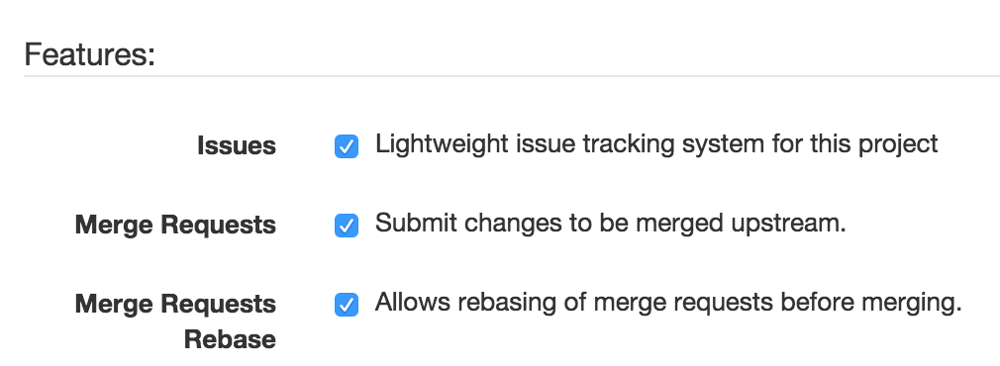
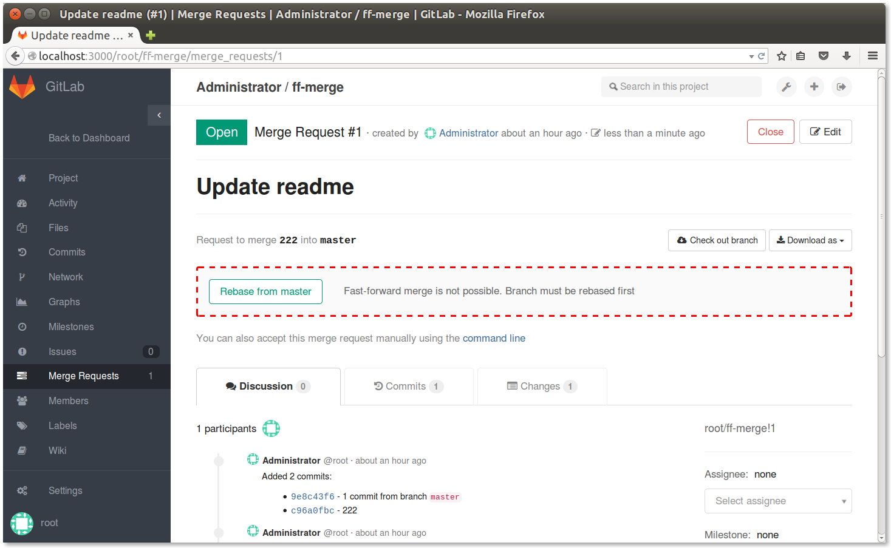

# Rebase before merge

GitLab Enterprise Edition offers a way to rebase the source branch of a merge request.
This feature is part of the [Fast-forward merge](ff_merge.md) feature.
It allows you to rebase the source branch of a merge request in order to perform a fast-forward merge.

You can configure this on a per-project basis by navigating to the project settings page and selecting the **Rebase button** checkbox.
This checkbox is visible only if you have the **Only fast-forward merging** checkbox enabled.

Now, if a fast-forward merge requires a rebase, you will see a button to perform a rebase:

GitLab will attempt to rebase the source branch. If the rebase succeeds you will see an **Accept merge request** button.
If a clean rebase is not possible, you will need to rebase manually.
Rebasing may require some conflicts to be resolved manually.
