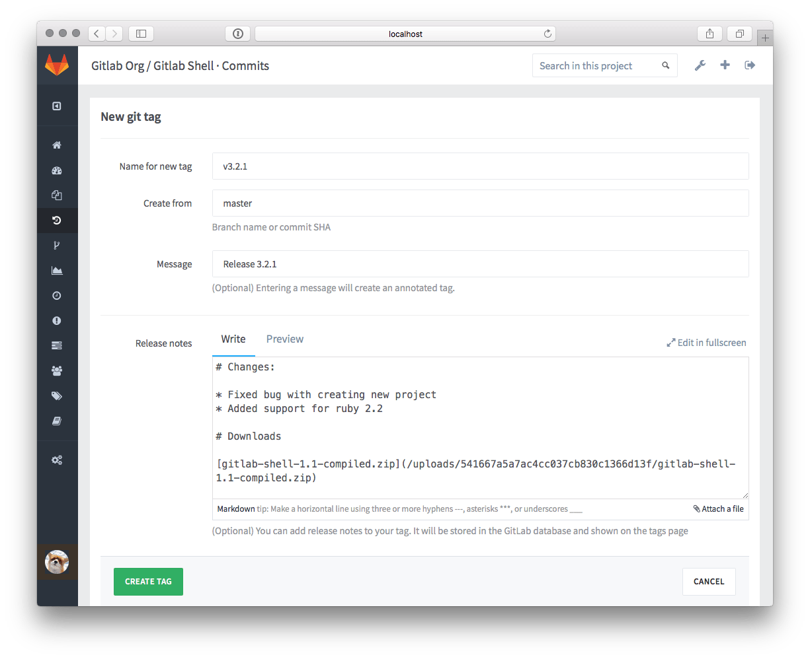
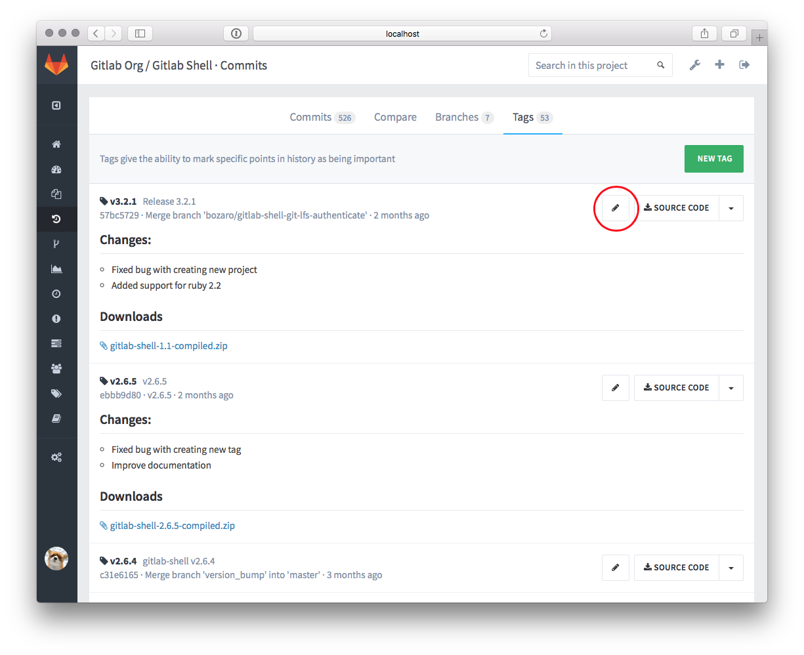

# Releases

You can turn any git tag into a release, by adding a note to it.
Release notes behave like any other markdown form in GitLab so you can write text and drag-n-drop files to it.
Release notes are stored in the database of GitLab. 

There are several ways to add release notes: 

* In the interface, when you create a new git tag with GitLab
* In the interface, by adding a note to an existing git tag
* with the GitLab API

## New tag page with release notes text area

## Tags page with button to add or edit release notes for existing git tag

