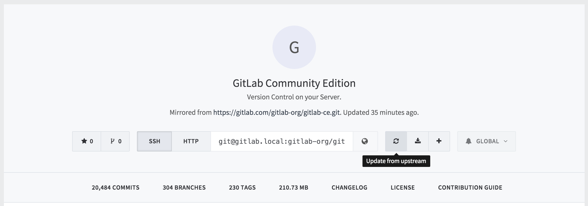
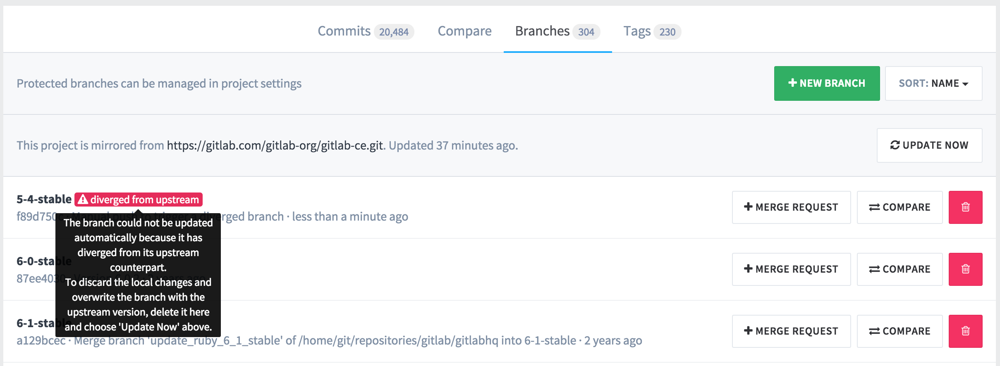
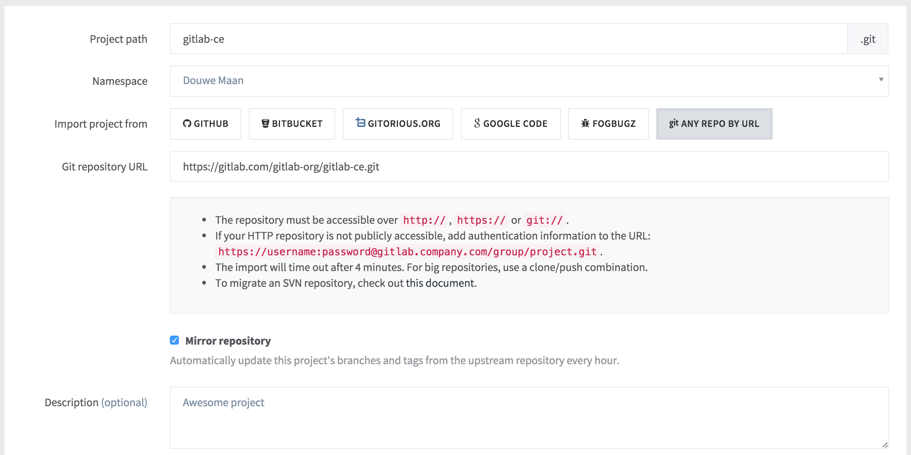
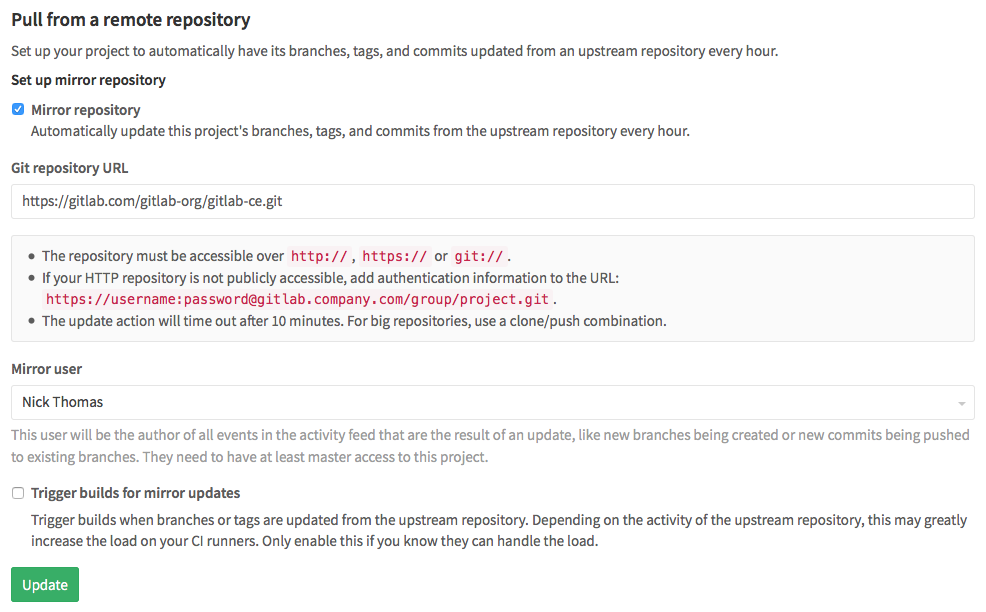

# Repository Mirroring

You can set up a project to automatically have its branches, tags, and commits updated from an upstream repository.
This is useful when a repository you're interested in is located on a different server, and you want to be able to browse its content and its activity using the familiar GitLab interface.

Mirror repositories are updated every hour, and all new branches, tags, and commits will be visible in the project's activity feed. Users with at least developer access to the project can also force an immediate update.

Since the repository on GitLab functions as a mirror of the upstream repository, you are advised not to push commits directly to the repository on GitLab. Instead, any commits should be pushed to the upstream repository, and will end up in the GitLab repository automatically within an hour, or when a forced update is initiated.

If you do manually update a branch in the GitLab repository, the branch will become diverged from upstream, and GitLab will no longer automatically update this branch to prevent any changes from being lost.

## Set it up

### New projects

When creating a new project, you can enable Repository Mirroring when you choose to import the repository from "Any repo by URL".

### Existing projects

For existing projects, you can set up Repository Mirroring by navigating to Project Settings &gt; Repository Mirroring.

