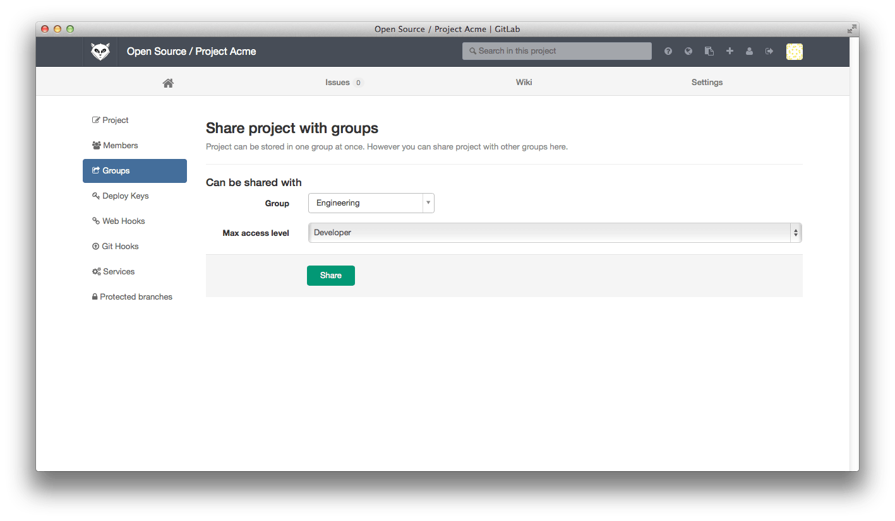
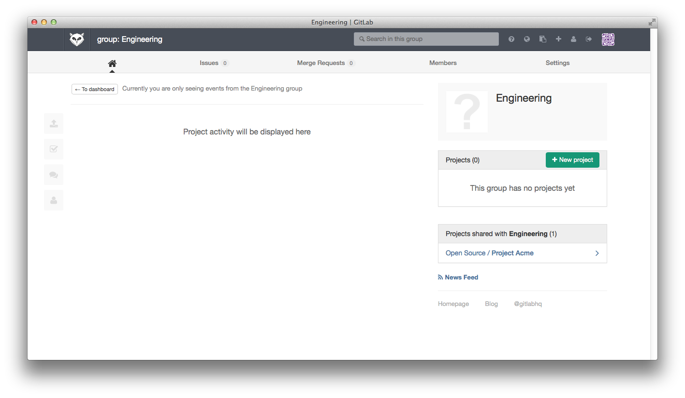
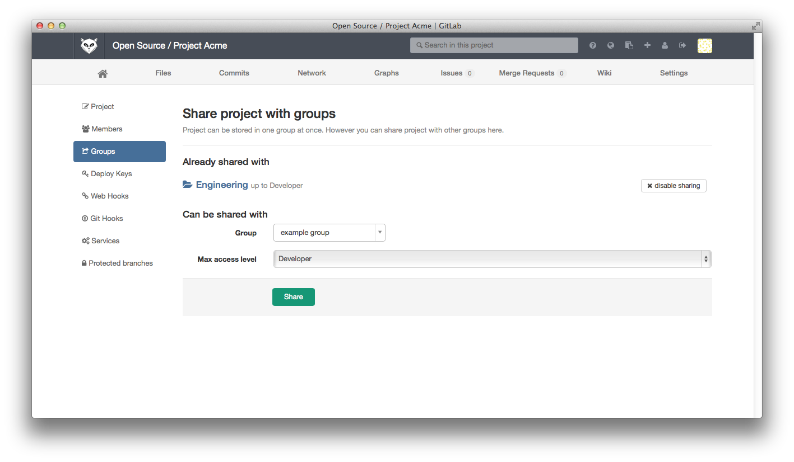

# Share Projects with other Groups

You can share projects with other groups. This makes it possible to add a group of users
to a project with a single action.

## Groups as collections of users

Groups are used primarily to [create collections of projects](groups.md), but you can also
take advantage of the fact that groups define collections of _users_, namely the group
members.

## Sharing a project with a group of users

The primary mechanism to give a group of users, say 'Engineering', access to a project,
say 'Project Acme', in GitLab is to make the 'Engineering' group the owner of 'Project
Acme'.  But what if 'Project Acme' already belongs to another group, say 'Open Source'?
This is where the group sharing feature can be of use.

To share 'Project Acme' with the 'Engineering' group, go to the project settings page for 'Project Acme' and use the left navigation menu to go to the 'Groups' section.

Now you can add the 'Engineering' group with the maximum access level of your choice.
After sharing 'Project Acme' with 'Engineering', the project is listed on the group dashboard.

## Maximum access level

In the screenshot above, the maximum access level of 'Developer' for members from 'Engineering' means that users with higher access levels in 'Engineering' ('Master' or 'Owner') will only have 'Developer' access to 'Project Acme'.
