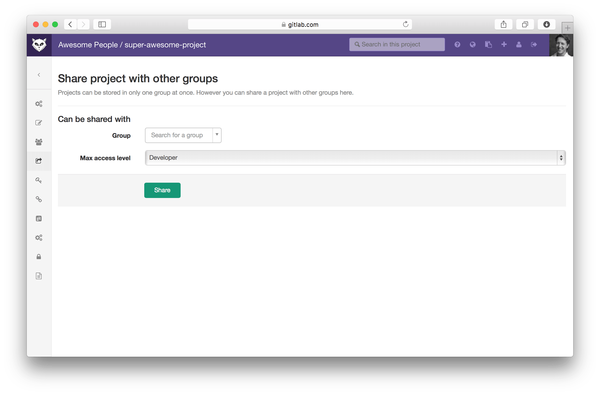

# Sharing a project with a group

If you want to share a single project in a group with another group,
you can do so easily. By setting the permission you can quickly
give a select group of users access to a project in a restricted manner.

In a project go to the project settings -> groups.

Now you can select a group that you want to share this project with and with
which maximum access level. Users in that group are able to access this project
with their set group access level, up to the maximum level that you've set.

