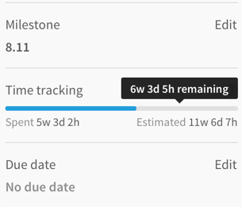
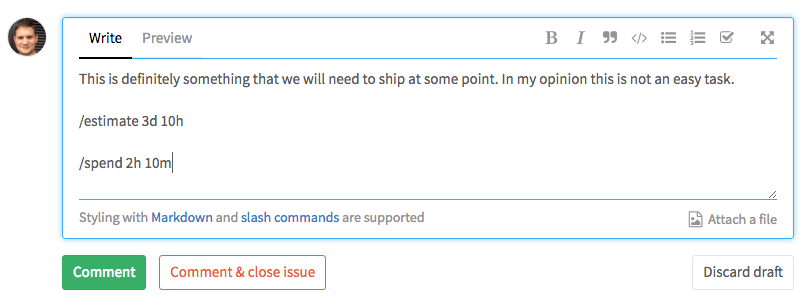

# Time Tracking

> Introduced in GitLab 8.14.

Time Tracking allows you to track estimates and time spent on issues and merge
requests within GitLab.

## Overview

Time Tracking lets you:

- Record the time spent working on an issue or a merge request.
- Add an estimate of the amount of time needed to complete an issue or a merge
  request.

You don't have to indicate an estimate to enter the time spent, and vice versa.

Data about time tracking is shown on the issue/merge request sidebar, as shown
below.

## How to enter data

Time Tracking uses two [quick actions] that GitLab introduced with this new
feature: `/spend` and `/estimate`.

Quick actions can be used in the body of an issue or a merge request, but also
in a comment in both an issue or a merge request.

Below is an example of how you can use those new quick actions inside a comment.

Adding time entries (time spent or estimates) is limited to project members.

### Estimates

To enter an estimate, write `/estimate`, followed by the time. For example, if
you need to enter an estimate of 3 days, 5 hours and 10 minutes, you would write
`/estimate 3d 5h 10m`. Time units that we support are listed at the bottom of
this help page.

Every time you enter a new time estimate, any previous time estimates will be
overridden by this new value. There should only be one valid estimate in an
issue or a merge request.

To remove an estimation entirely, use `/remove_estimate`.

### Time spent

To enter a time spent, use `/spend 3d 5h 10m`.

Every new time spent entry will be added to the current total time spent for the
issue or the merge request.

You can remove time by entering a negative amount: `/spend -3d` will remove 3
days from the total time spent. You can't go below 0 minutes of time spent,
so GitLab will automatically reset the time spent if you remove a larger amount
of time compared to the time that was entered already.

To remove all the time spent at once, use `/remove_time_spent`.

## Configuration

The following time units are available:

- months (mo)
- weeks (w)
- days (d)
- hours (h)
- minutes (m)

Default conversion rates are 1mo = 4w, 1w = 5d and 1d = 8h.

### Limit displayed units to hours

> Introduced in GitLab 12.0.

The display of time units can be limited to hours through the option in **Admin Area > Settings > Preferences** under 'Localization'.

With this option enabled, `75h` is displayed instead of `1w 4d 3h`.

## Other interesting links

- [Time Tracking landing page on about.gitlab.com](https://about.gitlab.com/solutions/time-tracking/)

[quick actions]: ../user/project/quick_actions.md
