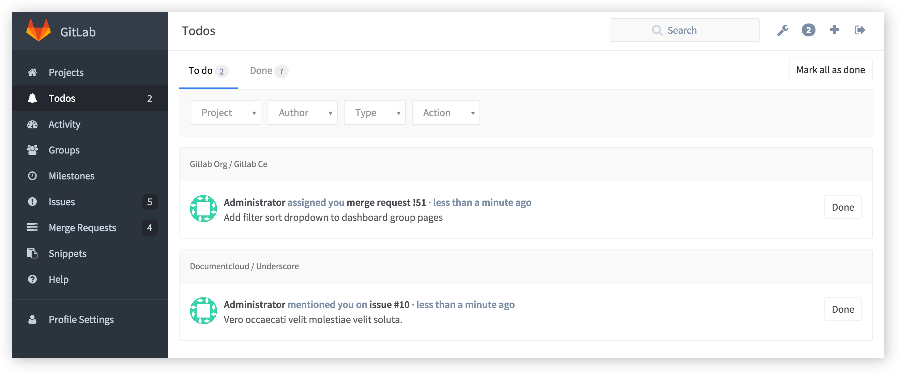
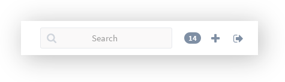
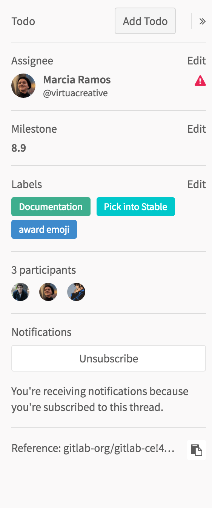
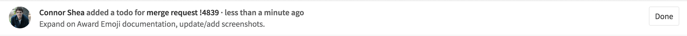
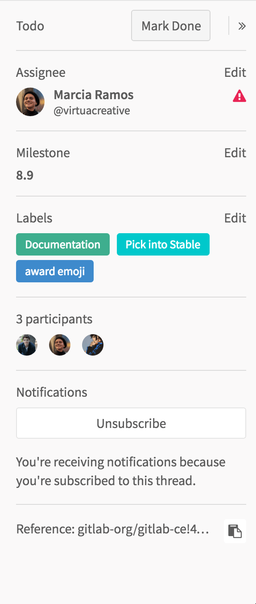

# GitLab Todos

> [Introduced][ce-2817] in GitLab 8.5.

When you log into GitLab, you normally want to see where you should spend your
time and take some action, or what you need to keep an eye on. All without the
mess of a huge pile of e-mail notifications. GitLab is where you do your work,
so being able to get started quickly is very important.

Todos is a chronological list of to-dos that are waiting for your input, all
in a simple dashboard.

---

You can quickly access the Todos dashboard using the bell icon next to the
search bar in the upper right corner. The number in blue is the number of Todos
you still have open.

## What triggers a Todo

A Todo appears in your Todos dashboard when:

- an issue or merge request is assigned to you
- you are `@mentioned` in an issue or merge request, be it the description of
  the issue/merge request or in a comment

>**Note:** Commenting on a commit will _not_ trigger a Todo.

### Manually creating a Todo

You can also add an issue or merge request to your Todos dashboard by clicking
the "Add Todo" button in the issue or merge request sidebar.

## Marking a Todo as done

Any action to the corresponding issue or merge request will mark your Todo as
**Done**. Actions that dismiss Todos include:

- changing the assignee
- changing the milestone
- adding/removing a label
- commenting on the issue

---

Todos are personal, and they're only marked as done if the action is coming from
you. If you close the issue or merge request, your Todo will automatically
be marked as done.

If someone else closes, merges, or takes action on the issue or merge
request, your Todo will remain pending. This prevents other users from closing issues without you being notified.

There is just one Todo per issue or merge request, so mentioning a user a
hundred times in an issue will only trigger one Todo.

---

If no action is needed, you can manually mark the Todo as done by clicking the
corresponding **Done** button, and it will disappear from your Todo list.

A Todo can also be marked as done from the issue or merge request sidebar using
the "Mark Done" button.

You can mark all your Todos as done at once by clicking on the **Mark all as
done** button.

## Filtering your Todos

There are four kinds of filters you can use on your Todos dashboard.

| Filter  | Description |
| ------- | ----------- |
| Project | Filter by project |
| Author  | Filter by the author that triggered the Todo |
| Type    | Filter by issue or merge request |
| Action  | Filter by the action that triggered the Todo (Assigned or Mentioned)|

You can also filter by more than one of these at the same time.

[ce-2817]: https://gitlab.com/gitlab-org/gitlab-ce/merge_requests/2817
